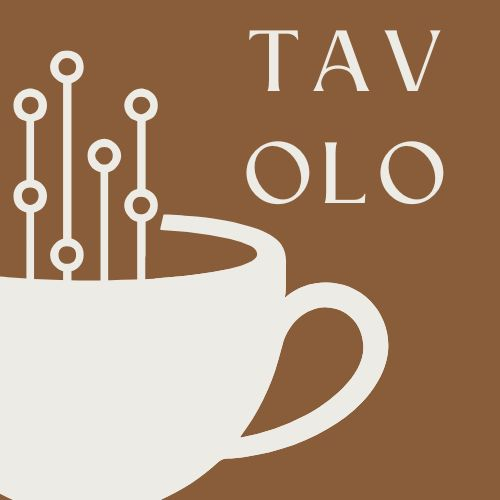
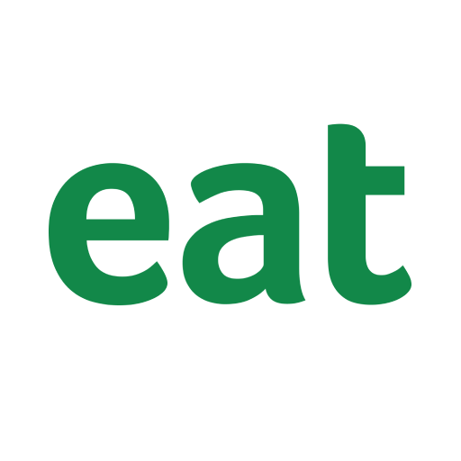

    <h3>Universidad Peruana de Ciencias Aplicadas</h3>
    </img> 
    <strong>Ingeniería de Software - 7mo Ciclo</strong> 
    <strong>Desarrollo de Soluciones IOT</strong> 
    <strong>1ASI0572</strong> 
    <strong>Profesor: Marco Antonio León Baca</strong> 
     <strong>Report</strong> 
     <strong>Tavolo</strong> 
    <!--<strong>name startup</strong>-->

<h3> Team Members: </h3>

| Member                              |    Code    |
| :---------------------------------- | :--------: |
| Baldeon Fabian, Aldo Alberto        | u202122633 |
| Cama Salvatierra, Jimena Tamara     | u202210778 |
| Castillo Castillo, Jair Alexander   | u202211390 |
| La Torre Valle, Franz Jair          | u202012378 |
| Quezada Portalatino, Barbara Susana | u202211800 |

<h3 align="center">Abril, 2025</h3>

  

## Registro de Versiones del Informe

El objetivo de esta sección es resumir las modificaciones relevantes que se realizan al informe durante el ciclo de vida del proyecto. Esta sección inicia en una página nueva e incluye un cuadro con la siguiente estructura:

<table>
  <thead>
    <tr>
      <th>Versión</th>
      <th>Fecha</th>
      <th>Autor</th>
      <th>Descripción de modificación</th>
    </tr>
  </thead>
  <tbody>
    <tr>
      <td>0.1</td>
      <td>-</td>
      <td>-</td>
      <td>-</td>
    </tr>
    
  </tbody>
</table>

# Capítulo II: Requirements Elicitation & Analysis
## 2.1. Competidores
Algunos de los competidores a los que Tavolo podría enfrentarse son:
<ul>
    <li>
        <b>Eat App: </b>Plataforma de gestión de reservas y mesas que permite a los restaurantes automatizar la asignación de mesas, mejorar la experiencia del cliente y analizar datos de comportamiento. Eat App se destaca por su CRM integrado y herramientas de marketing, aunque su sistema depende de reservas manuales y no detecta la ocupación en tiempo real.
    </li>
    <li>
        <b>OpenTable: </b>Uno de los líderes globales en reservas en línea para restaurantes. Ofrece una experiencia fluida para los usuarios al permitir reservas anticipadas y gestionar la disponibilidad de mesas. Sin embargo, su enfoque está más orientado a restaurantes formales y no cuenta con integración de sensores ni monitoreo automático de mesas.
    </li>
    <li>
        <b>Waitlist Me: </b>Aplicación que digitaliza la lista de espera tradicional, permitiendo a los clientes apuntarse desde sus teléfonos y recibir notificaciones cuando su mesa esté lista. Aunque mejora la organización y reduce aglomeraciones, depende de la actualización manual por parte del personal y no ofrece información en tiempo real sobre la ocupación real del local.
    </li>
</ul>

### 2.1.1. Análisis competitivo

<table><tr><th colspan="16" valign="top"><b>Competitive Analysis Landscape</b></th></tr>
<tr><td colspan="9" valign="top">¿Por qué llevar a cabo este análisis?  </td><td colspan="7" valign="top">Este análisis se lleva a cabo para poder investigar, analizar y comparar el comportamiento de los competidores directos o indirectos en el mercado.</td></tr>
<tr><td colspan="6" valign="top">
<b>Nombre</b>

</td><td colspan="3" valign="top"><b>Tavolo</b></td><td colspan="3" valign="top"><b>Eat App</b></td><td colspan="3" valign="top"><b>OpenTable</b></td><td valign="top"><b>Waitlist Me</b></td></tr>
<tr><td colspan="6" valign="top"><b>Logo</b> </td><td colspan="3" valign="top"></td><td colspan="3" valign="top"></td><td colspan="3" valign="top"><td valign="top"></tr>
<tr><td colspan="3" rowspan="4" valign="top"><b>Perfil</b></td><td colspan="3" rowspan="2" valign="top"><b>Overview</b></td><td colspan="3" rowspan="2" valign="top">Es una solución tecnológica integral basada en IoT, diseñada específicamente para cafeterías. Utiliza sensores de peso para detectar automáticamente la ocupación de mesas y actualiza esta información cada 10 segundos en una app web y móvil. El sistema también ofrece una interfaz administrativa para la sede, facilitando la gestión del flujo de comensales y mejorando la rotación de mesas.</td><td colspan="3" rowspan="2" valign="top">Es una plataforma de gestión de restaurantes basada en la nube que permite manejar reservas, asignación de mesas, datos de clientes y campañas de marketing automatizadas. Su enfoque está en ofrecer una experiencia completa para restaurantes que desean profesionalizar la relación con sus clientes, utilizando herramientas de CRM, reportes y análisis de comportamiento.</td><td colspan="3" rowspan="2" valign="top">Es una de las plataformas más reconocidas a nivel mundial para reservas en restaurantes. Los usuarios pueden buscar establecimientos, ver disponibilidad en tiempo real, leer reseñas y reservar directamente desde la app o el sitio web. También ofrece herramientas para los restaurantes, aunque su enfoque principal está en mejorar la experiencia del comensal antes de llegar al lugar.</td><td rowspan="2" valign="top">Es una solución que digitaliza el proceso de espera en locales físicos, como restaurantes, cafeterías y tiendas. Los clientes pueden apuntarse a una lista desde sus dispositivos y reciben notificaciones cuando su turno se acerca. También permite al staff gestionar el flujo de clientes de forma más organizada, aunque depende de la intervención manual.</td></tr>
<tr></tr>
<tr><td colspan="3" rowspan="2" valign="top"><b>Ventaja competitiva ¿Qué valor ofrece a los clientes?</b></td><td colspan="3" rowspan="2" valign="top">Brinda información precisa y en tiempo real sobre la disponibilidad de mesas, ayudando a evitar esperas y optimizando su visita desde antes de llegar al local.</td><td colspan="3" rowspan="2" valign="top">Permite reservar mesas de forma sencilla y recibir un servicio más personalizado, gracias al uso de datos históricos y preferencias del cliente.</td><td colspan="3" rowspan="2" valign="top">Facilita la reserva anticipada en restaurantes de forma rápida y confiable, brindando acceso a una amplia variedad de opciones en una sola plataforma.</td><td rowspan="2" valign="top">Reduce la incertidumbre y el tiempo de espera físico, al permitirles ocupar su tiempo libremente mientras esperan su turno.</td></tr>
<tr></tr>
<tr><td colspan="3" rowspan="2" valign="top"><b>Perfil de Marketing</b></td><td colspan="3" valign="top"><b>Mercado objetivo</b></td><td colspan="3" valign="top">Cafeterías que buscan innovar en la gestión de mesas y mejorar la experiencia del cliente mediante tecnología avanzada.</td><td colspan="3" valign="top">Restaurantes que buscan mejorar su gestión de reservas y la experiencia del cliente. Su mercado abarca desde pequeños establecimientos hasta grandes cadenas hoteleras y restaurantes de alta gama.</td><td colspan="3" valign="top">Gama de restaurantes, desde pequeños locales hasta grandes cadenas internacionales, que buscan gestionar reservas en línea y mejorar la experiencia del cliente.</td><td valign="top">Restaurantes, cafeterías y otros establecimientos de servicio rápido que buscan gestionar eficientemente las listas de espera y mejorar la experiencia del cliente.</td></tr>
<tr><td colspan="3" valign="top"><b>Estrategias de Marketing</b></td><td colspan="3" valign="top">
Demostraciones en vivo.

Alianzas estratégicas.

Publicidad en redes sociales.

Marketing de contenidos.
</td><td colspan="3" valign="top">
Optimización de motores de búsqueda.

Publicidad de pago por clic.

Alianzas estratégicas.
</td><td colspan="3" valign="top">
Publicidad y promoción.

Análisis de datos.

Segmentación de clientes.
</td><td valign="top">
Pruebas gratuitas y demostraciones.

Testimonios y reseñas.

</td></tr>
<tr><td colspan="3" rowspan="3" valign="top"><b>Perfil de producto</b></td><td colspan="3" valign="top"><b>Productos y Servicios</b></td><td colspan="3" valign="top">Solución basada en IoT que utiliza sensores de peso para detectar la ocupación de las mesas en tiempo real. Esta información se refleja automáticamente en una app web y móvil, permitiendo a los comensales ver la disponibilidad de mesas antes de llegar. Además, incluye una interfaz administrativa para la gestión del flujo de comensales y optimización de la rotación de mesas.</td><td colspan="3" valign="top">Proporciona un sistema de reservas en línea, un CRM para gestionar relaciones con los clientes, herramientas de marketing automatizado, análisis de datos y reportes detallados, así como la integración con otros sistemas de restaurante como POS (punto de venta) y plataformas de pago.</td><td colspan="3" valign="top">Ofrece a los restaurantes herramientas para gestionar la disponibilidad de mesas, realizar reservas, y personalizar la experiencia del cliente. También proporciona servicios de marketing y publicidad, herramientas de CRM y análisis detallados del rendimiento del restaurante, como la ocupación y los tiempos de espera.</td><td valign="top">Ofrece una solución digital para gestionar las listas de espera en tiempo real. Los restaurantes pueden asignar mesas y notificar a los clientes mediante SMS o la app cuando su mesa esté lista. Además, la plataforma ofrece análisis sobre los tiempos de espera y la rotación de mesas para mejorar la eficiencia del establecimiento.</td></tr>
<tr><td colspan="3" valign="top"><b>Precios y Costos</b></td><td colspan="3" valign="top">Ofrece un modelo de suscripción mensual, con precios que varían según el número de mesas y funcionalidades requeridas. A diferencia de sus competidores, no cobra comisiones por cada reserva, lo que lo convierte en una opción más rentable a largo plazo. Puede haber un costo inicial por la instalación de los sensores.</td><td colspan="3" valign="top">Sigue un modelo de suscripción mensual, con precios que empiezan desde $99 por mes dependiendo del tamaño del restaurante y las funcionalidades necesarias. Además, en algunos casos, cobran comisiones por cada reserva realizada a través de la plataforma.</td><td colspan="3" valign="top">Opera con un modelo basado en suscripción mensual, cuyo precio inicial ronda los $39 por mes. Además, cobra una comisión por cada reserva realizada a través de la plataforma, que varía entre el 1% y el 5%. También puede haber costos adicionales por servicios de promoción o características premium.</td><td valign="top">Opera con un modelo de suscripción mensual, comenzando desde $29 al mes para restaurantes pequeños. No cobra comisiones por reserva, lo que lo hace una opción más accesible en términos de costos continuos. Los precios varían según el tamaño del restaurante y las funcionalidades adicionales requeridas.</td></tr>
<tr><td colspan="3" valign="top"><b>Canales de distribución</b></td><td colspan="3" valign="top">
- Página web

- Aplicaciones móviles en dispositivos iOS y Android.

</td><td colspan="3" valign="top">
- Página web

- Aplicaciones móviles en dispositivos iOS y Android.
</td><td colspan="3" valign="top">
- Página web

- Aplicaciones móviles en dispositivos iOS y Android.
</td><td valign="top">
- Página web

- Aplicaciones móviles en dispositivos iOS y Android.
</td></tr>
<tr><td colspan="3" rowspan="4" valign="top"><b>Análisis FODA</b></td><td colspan="3" valign="top"><b>Fortalezas</b></td><td colspan="3" valign="top">
- Detección automática de ocupación en tiempo real.

- App ligera, actualizaciones rápidas (cada 10 segundos).

- Instalación simple sin técnicos.
</td><td colspan="3" valign="top">
- Plataforma integral con CRM y analítica.

- Buena integración con otros sistemas.

- Funciona en móviles y tablets.
</td><td colspan="3" valign="top">
- Marca reconocida globalmente.

- Gran base de usuarios y restaurantes.

- Interfaz amigable para el cliente.
</td><td valign="top">
- Fácil de usar y configurar.

- Económico y accesible.

- Sin comisiones por cliente.
</td></tr>
<tr><td colspan="3" valign="top"><b>Debilidades</b></td><td colspan="3" valign="top">
- Requiere hardware (sensores).

- Etapa temprana de adopción y posicionamiento.
</td><td colspan="3" valign="top">
- No detecta ocupación en tiempo real.

- Costos altos para pequeños restaurantes.
</td><td colspan="3" valign="top">
- Comisiones por reserva.

- Menor personalización para negocios pequeños.
</td><td valign="top">
- Dependencia del ingreso manual del personal.

- Sin monitoreo físico de mesas.
</td></tr>
<tr><td colspan="3" valign="top"><b>Oportunidades</b></td><td colspan="3" valign="top">
- Escalamiento a grandes cadenas de cafeterías.

- Expansión hacia restaurantes u hoteles.
</td><td colspan="3" valign="top">
- Expansión en mercados emergentes.

- Alianzas con grandes cadenas.
</td><td colspan="3" valign="top">
- Ampliar servicios para cafeterías o locales pequeños.

- Integración con experiencias gastronómicas.
</td><td valign="top">
- Penetrar en mercados de comida rápida y cafeterías.

- Mejora con inteligencia artificial.
</td></tr>
<tr><td colspan="3" valign="top"><b>Amenazas</b></td><td colspan="3" valign="top">
- Copia del modelo por grandes competidores.

- Desconfianza inicial por ser una tecnología emergente.
</td><td colspan="3" valign="top">
- Competencia con soluciones más automatizadas.

- Cambios en las tecnologías de reservas.
</td><td colspan="3" valign="top">
- Nuevas plataformas sin comisiones.

- Desintermediación (restaurantes que prefieren sistemas propios).
</td><td valign="top">
- Soluciones con detección automática.

- Apps integrales que lo superen en funcionalidades.
</td></tr>
</table>

### 2.1.2. Estrategias y tácticas frente a competidores

Hemos empleado un análisis FODA para identificar las posibilidades y desafíos en el mercado, así como para evaluar nuestras fortalezas y debilidades internas. Esta metodología nos ha permitido concebir estrategias y tácticas que se ajusten de manera coherente a nuestro entorno y a los recursos disponibles.

**Estrategia de diferenciación tecnológica:**

La principal estrategia de Tavolo es posicionarse como una solución única en el mercado al incorporar tecnología IoT para detectar en tiempo real la ocupación de mesas, eliminando por completo la necesidad de intervención humana o registro manual. Esto permite ofrecer al cliente final información confiable y constante, algo que sus competidores no alcanzan con precisión.

**Estrategia de enfoque de nicho en cafeterías:**

Otra estrategia clave es enfocarse en un nicho específico y muy definido: las cafeterías. A diferencia de otras plataformas que buscan abarcar todo tipo de restaurantes, Tavolo se especializa en un entorno donde la rotación rápida, la autogestión y la simplicidad son fundamentales. En línea con esto, la táctica es desarrollar un lenguaje de marca, interfaz y funcionalidades adaptadas a este tipo de negocio, además de lanzar campañas dirigidas a franquicias de cafeterías o locales independientes que no requieren una infraestructura compleja, pero sí soluciones eficientes.

**Estrategia de escalabilidad y fácil instalación:**

Pensando en el crecimiento, Tavolo adopta una estrategia de escalabilidad técnica, diseñando un sistema que puede instalarse sin necesidad de personal técnico, en menos de una hora, lo que facilita su expansión sin altos costos logísticos. Como táctica, se crean tutoriales paso a paso, videos cortos y documentación visual clara que permiten a cualquier miembro del personal ejecutar la instalación.

**Estrategia de posicionamiento de marca y educación del mercado:**

Tavolo impulsa una estrategia de posicionamiento de marca basada en innovación y liderazgo de pensamiento en el sector horeca. La táctica principal para esto es la generación de contenido educativo (blogs, infografías, webinars) que informan sobre la importancia del monitoreo en tiempo real, las pérdidas por esperas largas y cómo la tecnología puede resolverlo, posicionando a Tavolo como referente en soluciones inteligentes para la industria.

## 2.2. Entrevistas
### 2.2.1. Diseño de entrevistas

### Propietarios de cafeterías

**Preguntas de presentación:**

1. ¿Podrías indicarnos tu nombre y el de tu cafetería?
2. ¿Qué puesto ocupas dentro de la empresa?
3. ¿Desde cuándo está funcionando tu cafetería?

**Propósito:** Queremos entender tus necesidades y retos para mejorar la gestión del aforo en tu cafetería.

**Entrevista:**

1. ¿Cómo gestionas actualmente las reservas y la disponibilidad de mesas?
2. ¿Qué problemas enfrentas con el tiempo de espera de los clientes?
3. ¿Estarías interesado en una solución tecnológica para gestionar las mesas en tiempo real?
4. ¿Qué características consideras más importantes en una plataforma de gestión de aforo?
5. ¿Qué tan importante es para ti la facilidad de instalación y el soporte técnico?
6. ¿Cómo crees que la tecnología puede mejorar la experiencia del cliente y optimizar la operación de tu cafetería?
7. ¿Algo más que te gustaría agregar sobre tus necesidades o expectativas?

### Clientes de establecimiento

**Preguntas de presentación:**

1. ¿Podrías indicarnos tu nombre?
2. ¿Con qué frecuencia sueles visitar cafeterías?
3. ¿Qué tipo de cafeterías prefieres (por ejemplo, locales, cadenas, cafeterías gourmet)?

**Propósito:** Queremos conocer tu experiencia como cliente en cafeterías y cómo la tecnología podría mejorarla.

**Entrevista:**

1. ¿Cómo sueles consultar la disponibilidad de mesas antes de ir a una cafetería?
2. ¿Qué tan importante es para ti poder hacer reservas online para evitar esperas?
3. ¿Te gustaría ver la disponibilidad de mesas en tiempo real a través de una app?
4. ¿Qué características debería tener una app de cafetería para que la uses con frecuencia?
5. ¿Cómo valoras la rapidez y facilidad de uso de una aplicación para gestionar tu experiencia en la cafetería?
6. ¿Algo más que consideras importante para mejorar tu experiencia como cliente?

### 2.2.2. Registro de entrevistas
### Propietarios de cafeterías

### Clientes de establecimiento

### 2.2.3. Análisis de entrevistas
### Propietarios de cafeterías

### Clientes de establecimiento
