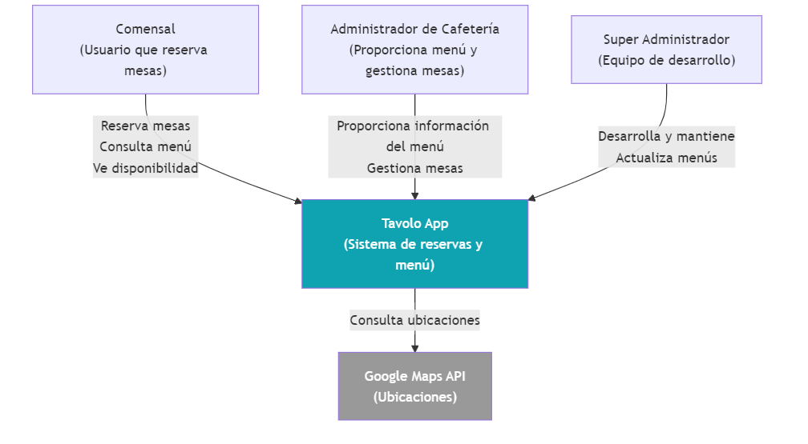
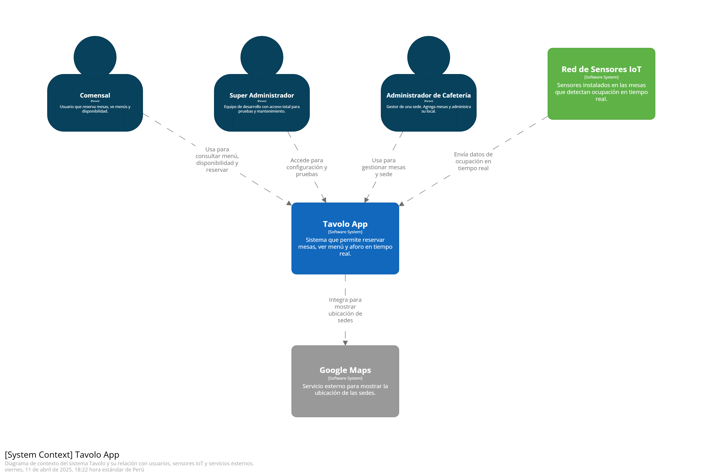
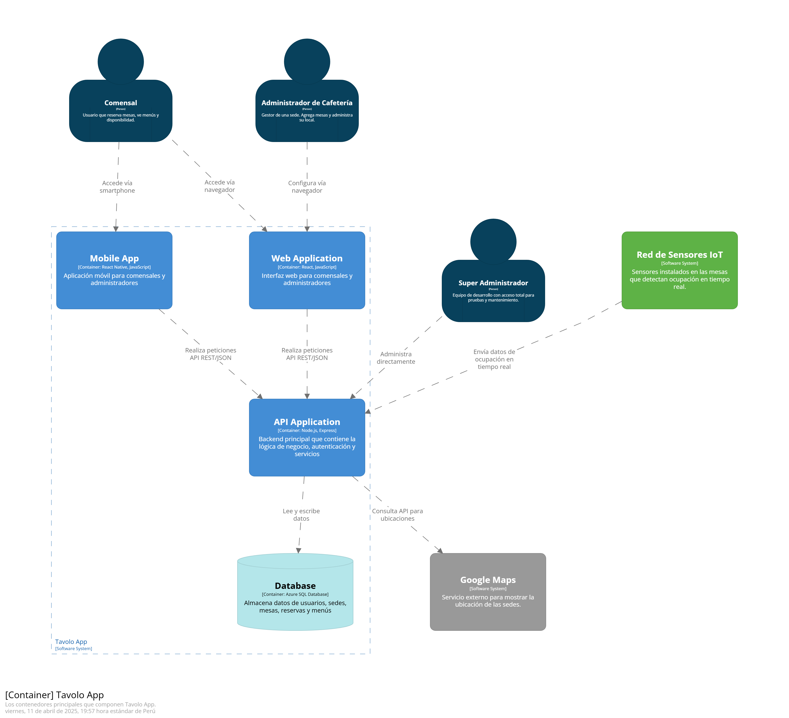
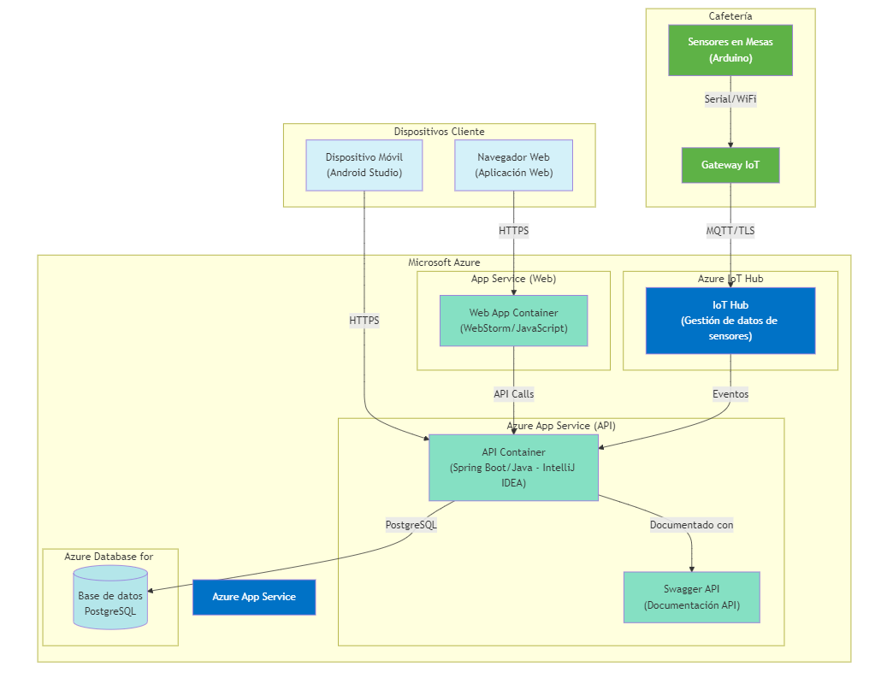

    <h3>Universidad Peruana de Ciencias Aplicadas</h3>
    </img> 
    <strong>Ingeniería de Software - 7mo Ciclo</strong> 
    <strong>Desarrollo de Soluciones IOT</strong> 
    <strong>1ASI0572</strong> 
    <strong>Profesor: Marco Antonio León Baca</strong> 
     <strong>Report</strong> 
     <strong>Tavolo</strong> 
    <!--<strong>name startup</strong>-->

<h3> Team Members: </h3>

| Member                              |    Code    |
| :---------------------------------- | :--------: |
| Baldeon Fabian, Aldo Alberto        | u202122633 |
| Cama Salvatierra, Jimena Tamara     | u202210778 |
| Castillo Castillo, Jair Alexander   | u202211390 |
| La Torre Valle, Franz Jair          | u202012378 |
| Quezada Portalatino, Barbara Susana | u202211800 |

<h3 align="center">Abril, 2025</h3>

  

## Registro de Versiones del Informe

El objetivo de esta sección es resumir las modificaciones relevantes que se realizan al informe durante el ciclo de vida del proyecto. Esta sección inicia en una página nueva e incluye un cuadro con la siguiente estructura:

<table>
  <thead>
    <tr>
      <th>Versión</th>
      <th>Fecha</th>
      <th>Autor</th>
      <th>Descripción de modificación</th>
    </tr>
  </thead>
  <tbody>
    <tr>
      <td>0.1</td>
      <td>-</td>
      <td>-</td>
      <td>-</td>
    </tr>
    
  </tbody>
</table>

## 4.1. Strategic-Level Domain-Driven Design.

### 4.1.1. EventStorming.

Con el objetivo de comprender en profundidad el dominio de Tavolo, se llevó a cabo una sesión de Event Storming de aproximadamente 1 hora. Esto permitió que nosotros como equipo organizaramos nuestras ideas y pensamientos sobre sistema desde múltiples perspectivas: negocio, usuario final, administración y experiencia. A través de esta dinámica, identificamos eventos clave, comandos, usuarios y agregados que nos ayudaron a esbozar una primera visión integral del sistema.

 

**Se vieron los siguientes puntos en la reunión:**

- Exploración del dominio general

Se partió desde la experiencia del visitante en la landing page, avanzando por el flujo de registro e inicio de sesión como comensal o administrador, hasta la reserva de mesas, visualización en tiempo real y gestión desde el panel administrativo.

- Identificación de eventos y comandos clave

Se colocaron notas naranjas para eventos, y se complementaron con comandos en azul. EL equipo seguío de las User Stories previamente realizadas, lo que aseguró la coherencia y el flujo de ña solución. 

- Asignación de roles y responsables

Se diferenciaron los actores como: comensal, administrador, superadmin, visitante, para asociar claramente qué parte del sistema controlan o en qué puntos interactúan. Al dividirlo de esta manera es más fácil detectar posibles conflictos o áreas de mejora en la experiencia. 

- Evidencia de lo relizado en la reunion

#### 4.1.1.1 Candidate Context Discovery.

#### 4.1.1.2 Domain Message Flows Modeling.

#### 4.1.1.3 Bounded Context Canvases.

### 4.1.2. Context Mapping.

### 4.1.3. Software Architecture.

#### 4.1.3.1. Software Architecture System Landscape Diagram.
Este diagrama muestra que Tavolo opera en un ecosistema compuesto por tres tipos de usuarios (Comensales, Administradores de Cafeterías y Super Administradores) que interactúan directamente con el sistema principal Tavolo App. El sistema se conecta con un servicio externo: Google Maps API para mostrar ubicaciones de cafeterías. Los Comensales usan Tavolo para reservar mesas y consultar menús, los Administradores de Cafeterías proporcionan información sobre menús y gestionan sus mesas, mientras que los Super Administradores (equipo de desarrollo) mantienen y actualizan el sistema. 
 
#### 4.1.3.2. Software Architecture Context Level Diagrams.
Este diagrama muestra que el sistema Tavolo (representado como una única entidad) interactúa con tres tipos de usuarios: Comensales que utilizan el sistema para encontrar cafeterías, ver menús y realizar reservas; Administradores de Cafeterías que actualizan la información de menús y mesas; y Super Administradores que gestionan el mantenimiento general del sistema. Tavolo también se comunica con dos sistemas externos: Google Maps para mostrar ubicaciones geográficas de cafeterías y un sistema de Sensores IoT que proporciona datos en tiempo real sobre la ocupación de mesas en los establecimientos. 
 
#### 4.1.3.2. Software Architecture Container Level Diagrams.
Este diagrama muestra que el sistema Tavolo está compuesto por cuatro contenedores principales: una aplicación web accesible desde navegadores, una aplicación móvil para dispositivos portátiles, una API que gestiona toda la lógica de negocio y una base de datos que almacena la información del sistema. Además, incluye un módulo de sensores encargado de procesar los datos provenientes de dispositivos Arduino ubicados en las mesas. Por último, la API también se conecta con Google Maps, una aplicación externa, permitiendo que el comensal acceda a un mapa interactivo con las ubicaciones de las distintas sedes de la cafetería. 
 
#### 4.1.3.3. Software Architecture Deployment Diagrams.
Este diagrama muestra que el sistema Tavolo se despliega en tres entornos principales: Microsoft Azure Cloud, Dispositivos Cliente y Cafeterías físicas. En Azure, el sistema utiliza App Service para alojar la aplicación web frontend (WebStorm), otro App Service para la API (Spring Boot/Java) con documentación Swagger, Azure Database for PostgreSQL para los datos, y Azure IoT Hub para gestionar comunicaciones con dispositivos IoT. Los usuarios acceden al sistema a través de navegadores web o dispositivos Android. En cada cafetería, se instalan sensores Arduino en las mesas que envían datos de ocupación a un Gateway Arduino local, el cual transmite esta información al IoT Hub en Azure. Todas las comunicaciones entre componentes utilizan protocolos seguros como HTTPS, MQTT/TLS o conexiones PostgreSQL. 
 
## 4.2. Tactical-Level Domain-Driven Design

### 4.2.1. Bounded Context: Menu Management
Este contexto se encarga de la gestión del menú digital de las cafeterías. Permite al administrador crear, modificar y clasificar los productos que estarán disponibles para los comensales en cada sede.

#### 4.2.1.1. Domain Layer.
 `Producto` (Entity)
- Propósito: Representa un ítem del menú (comida o bebida).
- Atributos:
  - `productoId: ProductoId`
  - `nombre: String`
  - `descripcion: String`
  - `precio: double`
- Métodos:
  - `updatePrecio(nuevoPrecio: double)`
  - `updateDescripcion(nuevaDescripcion: String)`

 `Categoria` (Value Object)
- Propósito: Clasifica un conjunto de productos.
- Atributos:
  - `productos: List<Producto>`
  - `horario: String` (ej. desayuno, almuerzo)
  - `visible: boolean`

 `Menu` (Aggregate Root)
- Propósito: Actúa como agregado principal que agrupa productos y define operaciones sobre ellos.
- Métodos:
  - `crearProducto(command: CrearMenuCommand)`
  - `actualizarProducto(command: ActualizarProductoCommand)`

#### 4.2.1.2. Application Layer.
 `CrearMenu` (Command Handler)
- Propósito: Ejecuta el proceso de creación de un nuevo producto en el menú.
 `AdministrarProductoCommandHandler` (Service)
- Propósito: Apoya la orquestación de operaciones de mantenimiento del menú.
- Métodos:
  - `crearMenu()`
  - `actualizarProducto()`

#### 4.2.1.3. Interface Layer.
 `CrearMenuCommand` (Command)
- Propósito: Representa la solicitud para agregar un nuevo producto al menú.
 `MenuController` (Controller)
- Métodos:
  - `crearMenu()`
  - `actualizarProducto()`

#### 4.2.1.4. Infrastructure Layer.
 `MenuRepository` (Interface)
- Propósito: Contrato definido para almacenar objetos `Menu`.
- Métodos:
  - `save(menu: Menu)`
 `MenuRepositoryImpl` (Repository)
- Propósito: Implementación concreta de `MenuRepository`, encargada de interactuar con la base de datos.
- Métodos:
  - `crearMenu()`
  - `actualizarProducto()`

### 4.2.2. Bounded Context: Table Management
Este contexto se encarga del registro y configuración de las mesas en cada sede.

#### 4.2.2.1. Domain Layer.
 `Mesa` (Entity)
- Atributos:
  - `mesaId: UUID`
  - `cantidadSillas: int`
  - `estado: Estado`
  - `sedeId: UUID`
  - `reservaActiva: boolean`
 `Estado` (Value Object)
- Atributos:
  - `estadoId: UUID`
  - `nombre: String`

#### 4.2.2.2. Application Layer.
 `MesaService`
- Métodos:
  - `registrarMesa(command: RegistrarMesaCommand)`
  - `cambiarEstadoMesa(command: CambiarEstadoCommand)`

#### 4.2.2.3. Interface Layer.
 `MesaController`
- Métodos:
  - `POST /mesas`
  - `PUT /mesas/{id}/estado`
 `RegistrarMesaCommand`

#### 4.2.2.4. Infrastructure Layer.
 `MesaRepository`
- Métodos:
  - `save(mesa)`
  - `findBySede(sedeId)`

### 4.2.3. Bounded Context: Headquarter Management
Administra la información de cada sede del negocio: ubicación, contacto y horarios.

#### 4.2.3.1. Domain Layer.
 `Sede` (Aggregate Root)
- Atributos:
  - `sedeId: UUID`
  - `usuarioAdminId: UUID`
  - `nombre: String`
  - `latitud: double`
  - `longitud: double`
  - `telefono: String`
  - `horaApertura: LocalTime`
  - `horaCierre: LocalTime`

#### 4.2.3.2. Application Layer.
 `SedeService`
- Métodos:
  - `crearSede(command: CrearSedeCommand)`
  - `editarHorario(command: EditarHorarioCommand)`

#### 4.2.3.3. Interface Layer.
 `SedeController`
- Métodos:
  - `POST /sedes`
  - `PUT /sedes/{id}/horarios`

#### 4.2.3.4. Infrastructure Layer.
 `SedeRepository`
- Métodos:
  - `save(sede)`
  - `findById(sedeId)`

### 4.2.4. Bounded Context:  IoT Monitoring (Mesa Ocupada)
Este contexto se encarga de monitorear la ocupación de las mesas mediante sensores.

#### 4.2.4.1. Domain Layer.
 `Sensor` (Entity)
- Atributos:
  - `sensorId: UUID`
  - `mesaId: UUID`
  - `estado: boolean` (ocupado/libre)
  - `ultimaLectura: LocalDateTime`

#### 4.2.4.2. Application Layer.
 `MonitoreoOcupacionService`
- Métodos:
  - `actualizarEstadoSensor(sensorId, estado)`
  - `obtenerEstadoMesa(mesaId)`

#### 4.2.4.3. Interface Layer.
 `SensorController`
- Métodos:
  - `PUT /sensores/{id}`
  - `GET /sensores/mesa/{mesaId}`

#### 4.2.4.4. Infrastructure Layer.
 `SensorRepository`
- Métodos:
  - `save(sensor)`
  - `findByMesaId(mesaId)`

#### 4.2.X.5. Bounded Context Software Architecture Component Level Diagrams.

#### 4.2.X.6. Bounded Context Software Architecture Code Level Diagrams.

##### 4.2.X.6.1. Bounded Context Domain Layer Class Diagrams.

##### 4.2.X.6.2. Bounded Context Database Design Diagram.
