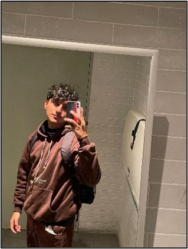

    <h3>Universidad Peruana de Ciencias Aplicadas</h3>
    </img> 
    <strong>Ingeniería de Software - 7mo Ciclo</strong> 
    <strong>Desarrollo de Soluciones IOT</strong> 
    <strong>1ASI0572</strong> 
    <strong>Profesor: Marco Antonio León Baca</strong> 
     <strong>Report</strong> 
     <strong>Tavolo</strong> 
    <!--<strong>name startup</strong>-->

<h3> Team Members: </h3>

| Member                              |    Code    |
| :---------------------------------- | :--------: |
| Baldeon Fabian, Aldo Alberto        | u202122633 |
| Cama Salvatierra, Jimena Tamara     | u202210778 |
| Castillo Castillo, Jair Alexander   | u202211390 |
| La Torre Valle, Franz Jair          | u202012378 |
| Quezada Portalatino, Barbara Susana | u202211800 |

<h3 align="center">Abril, 2025</h3>

  

## Registro de Versiones del Informe

El objetivo de esta sección es resumir las modificaciones relevantes que se realizan al informe durante el ciclo de vida del proyecto. Esta sección inicia en una página nueva e incluye un cuadro con la siguiente estructura:

<table>
  <thead>
    <tr>
      <th>Versión</th>
      <th>Fecha</th>
      <th>Autor</th>
      <th>Descripción de modificación</th>
    </tr>
  </thead>
  <tbody>
    <tr>
      <td>0.1</td>
      <td>-</td>
      <td>-</td>
      <td>-</td>
    </tr>
    
  </tbody>
</table>

## Project Report Collaboration Insights

Para desarrollar el proyecto, se empleó GitHub como herramienta para gestionar versiones y facilitar la colaboración en tiempo real. A continuación, se proporciona el enlace al repositorio del proyecto:

| **Descripción**            | **Enlace**                                                                 |
| :-------------------------: | :------------------------------------------------------------------------: |
| Repositorio del Proyecto    | https://github.com/IoT-Solutions-SW71-Grupo-4/HidroBots-Report.git         |
| Link de la Organización     | https://github.com/upc-pre-202510-1asi0572-2952-tavolo                    |

**TB1:**

Para el TB1, se asignaron responsabilidades específicas a cada integrante, las cuales se detallan a continuación:

| Miembro del Equipo | Tarea Asignada |
|       :---:        |      :---:     |
| Aldo Baldeon       |        -       |
| Barbara Quezada    |        -       |
| Franz La Torre     |        -       |
| Jimena Cama        |        -       |
| Jair Castillo      |        -       |

Cabe destacar que, durante la creación del informe, se realizaron commits específicos para cada tarea asignada, lo que permitió garantizar un control de versiones y una colaboración efectiva en tiempo real.

Miembros

- Aldo Baldeon    (CodAress)
- Barbara Quezada (BarbaraQP15)
- Franz La Torre  (FranzJairLTV)
- Jimena Cama     (AkSoon-ie)
- Jair Castillo   (U202211390)
  
El uso de GitHub ha permitido gestionar versiones y fomentar la colaboración en tiempo real, facilitando que los integrantes del equipo trabajen tanto de forma asincrónica como sincrónica en el proyecto. Asimismo, la metodología Gitflow ha posibilitado la creación de diversas ramas para el desarrollo de las tareas asignadas, promoviendo un trabajo autónomo y colaborativo entre los miembros.

La rama "develop" se utilizó como un entorno para integrar las tareas de cada miembro de manera estructurada y organizada, mientras que la rama "main" se destinó a la entrega de la versión final del proyecto.

# Contenido

## Tabla de Contenidos

### [Registro de Versiones del Informe](#registro-de-versiones-del-informe)

### [Project Report Collaboration Insights](#project-report-collaboration-insights)

### [Contenido](#contenido)

### [Student Outcomes](#student-outcome)

### [Capítulo I: Introducción](#capítulo-i-introducción)

- [Contenido](#contenido)
  - [Tabla de Contenidos](#tabla-de-contenidos)
    - [Registro de Versiones del Informe](#registro-de-versiones-del-informe-1)
    - [Project Report Collaboration Insights](#project-report-collaboration-insights-1)
    - [Contenido](#contenido-1)
    - [Student Outcomes](#student-outcomes)
    - [Capítulo I: Introducción](#capítulo-i-introducción)
    - [Capítulo II: Requirements Elicitation \& Analysis](#capítulo-ii-requirements-elicitation--analysis)
    - [Capítulo III: Requirements Specification](#capítulo-iii-requirements-specification)
    - [Capítulo IV: Solution Software Design](#capítulo-iv-solution-software-design)
    - [Capítulo V: Solution UI/UX Design](#capítulo-v-solution-uiux-design)
    - [Capítulo VI: Product Implementation, Validation \& Deployment](#capítulo-vi-product-implementation-validation--deployment)
    - [Conclusiones](#conclusiones)
    - [Bibliografía](#bibliografía)
    - [Anexos](#anexos)
- [Student Outcome](#student-outcome)
- [Capítulo I: Introducción](#capítulo-i-introducción-1)
  - [1.1. Startup Profile](#11-startup-profile)
    - [1.1.1. Descripción de la Startup](#111-descripción-de-la-startup)
    - [1.1.2. Perfiles de integrantes del equipo](#112-perfiles-de-integrantes-del-equipo)
  - [1.2. Solution Profile](#12-solution-profile)
    - [1.2.1. Antecedentes y problemática](#121-antecedentes-y-problemática)
    - [1.2.2. Lean UX Process](#122-lean-ux-process)
      - [1.2.2.1. Lean UX Problem Statements](#1221-lean-ux-problem-statements)
      - [1.2.2.2. Lean UX Assumptions](#1222-lean-ux-assumptions)
          - [**Business Outcomes:**](#business-outcomes)
          - [**Users:**](#users)
          - [**User Outcomes \& Benefits:**](#user-outcomes--benefits)
          - [**Feature Assumptions:**](#feature-assumptions)
          - [**Business Assumptions:**](#business-assumptions)
          - [**User Assumptions:**](#user-assumptions)
      - [1.2.2.3. Lean UX Hypothesis Statements](#1223-lean-ux-hypothesis-statements)
      - [1.2.2.4. Lean UX Canvas](#1224-lean-ux-canvas)
  - [1.3. Segmentos objetivo](#13-segmentos-objetivo)

### [Capítulo II: Requirements Elicitation & Analysis](#capc3adtulo-ii-requirements-elicitation--analysis-1)

- [2.1. Competidores](#21-competidores)
  - [2.1.1. Análisis competitivo](#211-análisis-competitivo)
  - [2.1.2. Estrategias y tácticas frente a competidores](#212-estrategias-y-tácticas-frente-a-competidores)
- [2.2. Entrevistas](#22-entrevistas)
  - [2.2.1. Diseño de entrevistas](#221-diseño-de-entrevistas)
  - [2.2.2. Registro de entrevistas](#222-registro-de-entrevistas)
  - [2.2.3. Análisis de entrevistas](#223-análisis-de-entrevistas)
- [2.3. Needfinding](#23-needfinding)
  - [2.3.1. User Personas](#231-user-personas)
  - [2.3.2. User Task Matrix](#232-user-task-matrix)
  - [2.3.3. User Journey Mapping](#233-user-journey-mapping)
  - [2.3.4. Empathy Mapping](#234-empathy-mapping)
  - [2.3.5. As-is Scenario Mapping](#235-as-is-scenario-mapping)
- [2.4. Ubiquitous Language](#24-ubiquitous-language)

### [Capítulo III: Requirements Specification](#capc3adtulo-iii-requirements-specification)

- [3.1. To-Be Scenario Mapping](#31-to-be-scenario-mapping)
- [3.2. User Stories](#32-user-stories)
- [3.3. Impact Mapping](#33-impact-mapping)
- [3.4. Product Backlog](#34-product-backlog)

### [Capítulo IV: Solution Software Design](#capc3adtulo-iv-solution-software-design)

- [4.1. Strategic-Level Domain-Driven Design](#41-strategic-level-domain-driven-design)
  - [4.1.1. Event Storming](#411-event-storming)
    - [4.1.1.1 Candidate Context Discovery](#4111-candidate-context-discovery)
    - [4.1.1.2 Domain Message Flows Modeling](#4112-domain-message-flows-modeling)
    - [4.1.1.3 Bounded Context Canvases](#4113-bounded-context-canvases)
  - [4.1.2. Context Mapping](#412-context-mapping)
  - [4.1.3. Software Architecture](#413-software-architecture)
    - [4.1.3.1. Software Architecture System Landscape Diagram](#4131-software-architecture-system-landscape-diagram)
    - [4.1.3.2. Software Architecture Context Level Diagrams](#4132-software-architecture-context-level-diagrams)
    - [4.1.3.3. Software Architecture Deployment Diagrams](#4133-software-architecture-deployment-diagrams)
- [4.2. Tactical-Level Domain-Driven Design](#42-tactical-level-domain-driven-design)
  - [4.2.X. Bounded Context: Bounded Context Name](#42x-bounded-context-bounded-context-name)
    - [4.2.X.1. Domain Layer](#42x1-domain-layer)
    - [4.2.X.2. Interface Layer](#42x2-interface-layer)
    - [4.2.X.3. Application Layer](#42x3-application-layer)
    - [4.2.X.4. Infrastructure Layer](#42x4-infrastructure-layer)
    - [4.2.X.6. Bounded Context Software Architecture Component Level Diagrams](#42x6-bounded-context-software-architecture-component-level-diagrams)
    - [4.2.X.7. Bounded Context Software Architecture Code Level Diagrams](#42x7-bounded-context-software-architecture-code-level-diagrams)
      - [4.2.X.7.1. Bounded Context Domain Layer Class Diagrams](#42x71-bounded-context-domain-layer-class-diagrams)
      - [4.2.X.7.2. Bounded Context Database Design Diagram](#42x72-bounded-context-database-design-diagram)

### [Capítulo V: Solution UI/UX Design](#capc3adtulo-v-solution-uiux-design)
- [5.1. Style Guidelines](#51-style-guidelines)
  - [5.1.1. General Style Guidelines](#511-general-style-guidelines)
  - [5.1.2. Web, Mobile and IoT Style Guidelines](#512-web-mobile-and-iot-style-guidelines)
- [5.2. Information Architecture](#52-information-architecture)
  - [5.2.1. Organization Systems](#521-organization-systems)
  - [5.2.2. Labeling Systems](#522-labeling-systems)
  - [5.2.3. SEO Tags and Meta Tags](#523-seo-tags-and-meta-tags)
  - [5.2.4. Searching Systems](#524-searching-systems)
  - [5.2.5. Navigation Systems](#525-navigation-systems)
- [5.3. Landing Page UI Design](#53-landing-page-ui-design)
  - [5.3.1. Landing Page Wireframe](#531-landing-page-wireframe)
  - [5.3.2. Landing Page Mock-up](#532-landing-page-mock-up)
- [5.4. Applications UX/UI Design](#54-applications-uxui-design)
  - [5.4.1. Applications Wireframes](#541-applications-wireframes)
  - [5.4.2. Applications Wireflow Diagrams](#542-applications-wireflow-diagrams)
  - [5.4.3. Applications Mock-ups](#543-applications-mock-ups)
  - [5.4.4. Applications User Flow Diagrams](#544-applications-user-flow-diagrams)
- [5.5. Applications Prototyping](#55-applications-prototyping)

### [Capítulo VI: Product Implementation, Validation & Deployment](#capitulo-vi-product-implementation-validation-deployment)
- [6.1. Software Configuration Management](#61-software-configuration-management)
  - [6.1.1. Software Development Environment Configuration](#611-software-development-environment-configuration)
  - [6.1.2. Source Code Management](#612-source-code-management)
  - [6.1.3. Source Code Style Guide & Conventions](#613-source-code-style-guide-conventions)
  - [6.1.4. Software Deployment Configuration](#614-software-deployment-configuration)
- [6.2. Landing Page, Services & Applications Implementation](#62-landing-page-services--applications-implementation)
- [6.3. Validation Interviews](#63-validation-interviews)
- [6.3.1. Diseño de Entrevistas](#631-diseño-de-entrevistas)
- [6.3.2. Registro de Entrevistas](#632-registro-de-entrevistass)
- [6.3.3. Evaluaciones según heurísticas](#633-evaluaciones-según-heurísticas)
- [6.4. Video About-the-Product](#64-video-about-the-product)

### [Conclusiones](#conclusiones)

- [Conclusiones y recomendaciones](#conclusiones-y-recomendaciones)

### [Bibliografía](#bibliografía)

### [Anexos](#anexos)

# Student Outcome

El curso contribuye al cumplimiento del Student Outcome ABET:
**ABET – EAC - Student Outcome 5**
**Criterio:** La capacidad de funcionar efectivamente en un equipo cuyos miembros
juntos proporcionan liderazgo, crean un entorno de colaboración e inclusivo,
establecen objetivos, planifican tareas y cumplen objetivos.
En el siguiente cuadro se describe las acciones realizadas y enunciados de
conclusiones por parte del grupo, que permiten sustentar el haber alcanzado el logro del ABET – EAC - Student Outcome 5.

<!-- Cambiamos el rowspan="1" por rowspan="n" cuando agregamos más de una acción realizada por criterio específico. (TB1, TP1, TB2, TF1)-->

<table>
    <tr>
        <th><b>Criterio específico</b></th>
        <th><b>Acciones realizadas</b></th>
        <th><b>Conclusiones</b></th>
    </tr>
    <tr>
        <td rowspan="1"><b>Trabaja en equipo para proporcionar liderazgo en forma conjunta</b></td>
        <td>TB1  
            <b>Baldeon Fabian, Aldo Alberto</b> 
            - Lorem ipsum dolor sit amet, consectetur adipiscing elit. Curabitur vel erat sit amet enim fringilla tincidunt ut ut mi.
               
            <b>Cama Salvatierra, Jimena Tamara</b> 
            - Lorem ipsum dolor sit amet, consectetur adipiscing elit. Curabitur vel erat sit amet enim fringilla tincidunt ut ut mi.
              
            <b>Castillo Castillo, Jair Alexander</b> 
            - Lorem ipsum dolor sit amet, consectetur adipiscing elit. Curabitur vel erat sit amet enim fringilla tincidunt ut ut mi.
              
            <b>La Torre Valle, Franz Jair</b> 
            - Lorem ipsum dolor sit amet, consectetur adipiscing elit. Curabitur vel erat sit amet enim fringilla tincidunt ut ut mi.
              
            <b>Quezada Portalatino, Barbara Susana</b> 
            - Lorem ipsum dolor sit amet, consectetur adipiscing elit. Curabitur vel erat sit amet enim fringilla tincidunt ut ut mi.
              
        </td>
        <td>TB1  
            - Lorem ipsum dolor sit amet, consectetur adipiscing elit. Curabitur vel erat sit amet enim fringilla tincidunt ut ut mi.
        </td>
    </tr>
    <tr>
        <td rowspan="1"><b>Crea un entorno colaborativo e inclusivo, establece metas, planifica tareas y cumple objetivos.</b></td>
        <td>TB1  
            <b>Baldeon Fabian, Aldo Alberto</b> 
            - Lorem ipsum dolor sit amet, consectetur adipiscing elit. Curabitur vel erat sit amet enim fringilla tincidunt ut ut mi.
               
            <b>Cama Salvatierra, Jimena Tamara</b> 
            - Lorem ipsum dolor sit amet, consectetur adipiscing elit. Curabitur vel erat sit amet enim fringilla tincidunt ut ut mi.
              
            <b>Castillo Castillo, Jair Alexander</b> 
            - Lorem ipsum dolor sit amet, consectetur adipiscing elit. Curabitur vel erat sit amet enim fringilla tincidunt ut ut mi.
              
            <b>La Torre Valle, Franz Jair</b> 
            - Lorem ipsum dolor sit amet, consectetur adipiscing elit. Curabitur vel erat sit amet enim fringilla tincidunt ut ut mi.
              
            <b>Quezada Portalatino, Barbara Susana</b> 
            - Lorem ipsum dolor sit amet, consectetur adipiscing elit. Curabitur vel erat sit amet enim fringilla tincidunt ut ut mi.
              
        </td>
        <td>TB1  
            - Lorem ipsum dolor sit amet, consectetur adipiscing elit. Curabitur vel erat sit amet enim fringilla tincidunt ut ut mi.
        </td>
    </tr>
</table>

# Capítulo I: Introducción

## 1.1. Startup Profile

### 1.1.1. Descripción de la Startup 

**Nombre startup** es una empresa dedicada a la implementación de soluciones IoT para la gestión inteligente del aforo de restaurantes, cafeterías y otros establecimientos de hostelería. Nuestro sistema permitirá a los establecimientos monitorizar en tiempo real la ocupación de mesas y ofrecer a los clientes información actualizada a través de una aplicación móvil y web, mejorando la experiencia del usuario y la eficiencia operativa. 

**Mision:** 
Brindar una solución IoT innovadora que permita a restaurantes, cafeterías y locales similares gestionar su foro de forma eficiente y segura, ofreciendo una experiencia de usuario intuitiva y facilitando la toma de decisiones operativas en tiempo real.

**Visión:** 
Ser la plataforma líder en gestión inteligente de aforo para el sector de la hostelería en el Perú, reconocida por la innovación, la eficiencia operativa y el impacto positivo en la experiencia del cliente.

### 1.1.2. Perfiles de integrantes del equipo  

<table>
  <tr align="center">
    <td rowspan="4">
      
    </td>
    <td align="left">
      <b>Nombre y Apellido:</b>
                   
      Aldo Alberto Baldeon Fabian
    </td>
  </tr>
  <tr>
    <td align="left">
    <b>Código:</b>
     
    U202122633
    </td>
  </tr>
  <tr>
    <td align="left">
    <b>Carrera:</b>
     
    Ingeniería de Software
    </td>
  </tr>
  <tr>
    <td align="left">
    <b>Acerca de:</b>
     
    Soy Aldo Alberto Baldeon Fabian, estudio la carrera de Ingeniería de Software en la UPC. Escogí esta carrera porque me interesó el desarrollo de aplicaciones. Soy responsable y me gusta trabajar en equipo. Poseo conocimientos básicos en C#, java, JavaScript, HTML y CSS. También, poseo conocimientos intermedios en C + +, SQL y MongoDB, además de contar con experiencia en Git y GitHub.
    </td>
  </tr>
  </tr>

  <tr align="center">
    <td rowspan="4">
      
    </td>
    <td align="left">
      <b>Nombre y Apellido:</b>
                   
      Barbara Susana Quezada Portalatino
    </td>
  </tr>
  <tr>
    <td align="left">
    <b>Código:</b>
     
    U202211800
    </td>
  </tr>
  <tr>
    <td align="left">
    <b>Carrera:</b>
     
    Ingeniería de Software
    </td>
  </tr>
  <tr>
    <td align="left">
    <b>Acerca de:</b>
     
    Barbara Susana Quezada Portalatino, cursando el séptimo ciclo de la carrera de software, trabajo mayormente bajo un rol de líder que me ayuda a poder organizar no solo la ideas de mi grupo sino que las ideas aterricen en la ejecución. Soy una persona muy disciplinada y detallista.
    </td>
  </tr>
  </tr>
   <tr align="center">
    <td rowspan="4">
      
    </td>
    <td align="left">
      <b>Nombre y Apellido:</b>
                   
      Jimena Tamara Cama Salvatierra
    </td>
  </tr>
  <tr>
    <td align="left">
    <b>Código:</b>
     
    U2022210778
    </td>
  </tr>
  <tr>
    <td align="left">
    <b>Carrera:</b>
     
    Ingeniería de Software
    </td>
  </tr>
  <tr>
    <td align="left">
    <b>Acerca de:</b>
     
     Soy estudiante de la carrera de Ingeniería de Software en la UPC y actualmente estoy cursando el 7mo ciclo. Me considero una persona curiosa, determinada y organizada. Con la experiencia en proyectos de startup y trabajos en equipo, trabajaré junto a mis compañeros para lograr un óptimo resultado del proyecto.
    </td>
  </tr>
  </tr>

<tr align="center">
    <td rowspan="4">
      
    </td>
    <td align="left">
      <b>Nombre y Apellido:</b>
                   
      Jair Alexander Castillo Castillo
    </td>
  </tr>
  <tr>
    <td align="left">
    <b>Código:</b>
     
    U202211390
    </td>
  </tr>
  <tr>
    <td align="left">
    <b>Carrera:</b>
     
    Ingeniería de Software
    </td>
  </tr>
  <tr>
    <td align="left">
    <b>Acerca de:</b>
     
    Soy estudiante de la carrera de Ingeniería de Software en la UPC y me encuentro en el 7to ciclo. Me considero una persona dedicada, comprensiva y metódica. Con mis habilidades de liderazgo y mi capacidad para trabajar en equipo en un ambiente de respeto, estoy segura de que podré dirigir la implementación de la startup de nuestro proyecto de manera exitosa.
    </td>
  </tr>
  </tr>
  
<tr align="center">
    <td rowspan="4">
      
    </td>
    <td align="left">
      <b>Nombre y Apellido:</b>
                   
      Franz Jair La Torre Valle
    </td>
  </tr>
  <tr>
    <td align="left">
    <b>Código:</b>
     
    U202012378
    </td>
  </tr>
  <tr>
    <td align="left">
    <b>Carrera:</b>
     
    Ingeniería de Software
    </td>
  </tr>
  <tr>
    <td align="left">
    <b>Acerca de:</b>
     
    Soy estudiante de la carrera de Ingeniería de Software en la Universidad Peruana de Ciencias Aplicadas. Mi compromiso con el equipo se basa en mantener una participación activa en todas las actividades, estar siempre disponible para resolver dudas y contribuir de manera significativa al desarrollo del proyecto. Busco aportar con soluciones innovadoras, apoyo constante y un aprendizaje continuo para alcanzar los objetivos propuestos.
    </td>
  </tr>

</table>

## 1.2. Solution Profile

Nuestra propuesta consiste en el desarrollo de una solución tecnológica basada en IoT, compuesta por sensores de peso que detectan en tiempo real la ocupación de mesas en cafeterías con un margen de error inferior al 5 %. Esta información se comunica automáticamente a una aplicación web y móvil dirigida exclusivamente a los comensales, quienes podrán visualizar desde su dispositivo personal la disponibilidad de mesas antes de acudir al establecimiento. Se busca garantizar que el usuario final no espere más de 2 minutos al llegar para acceder a una mesa libre, con una actualización de datos cada 10 segundos y una interfaz optimizada con tiempos de carga inferiores a 5 segundos. La solución se orienta a mejorar la experiencia del cliente al ofrecer información clara, precisa y en tiempo real que facilite la toma de decisiones sobre su visita al local.

En la etapa actual, la implementación del sistema, tanto a nivel físico como tecnológico, será realizada directamente por nuestro equipo, ya que somos los únicos que conocemos a profundidad su funcionamiento. Sin embargo, el proyecto contempla una fase de escalamiento en la cual la instalación podrá ser realizada por el propio personal del establecimiento en menos de una hora, sin necesidad de soporte técnico especializado. Asimismo, se proyecta el desarrollo de una futura interfaz administrativa destinada a las cafeterías, que les permita monitorear el flujo de comensales, analizar métricas de ocupación y optimizar la rotación de mesas. 

### 1.2.1. Antecedentes y problemática  

El sector gastronómico peruano consolida su posición como uno de los pilares de la economía, mostrando un crecimiento sostenido en los últimos años. Según datos del INEI (citados por la Oficina General de Evaluación de Impacto y Estudios Económicos, 2025), Lima representó el 41.6 % del gasto anual en restaurantes durante 2024, confirmando su liderazgo en el consumo nacional. Sin embargo, este crecimiento viene acompañado de desafíos operativos: las cafeterías experimentan variaciones considerables en la ocupación de mesas según el horario, temporada o ubicación, lo que puede derivar en tiempos de espera superiores a 10 minutos para los comensales y, en consecuencia, en una experiencia insatisfactoria y pérdida de clientes potenciales.

Ante este escenario, la tecnología surge como una herramienta clave. López-Chau et al. (2022), en su publicación en Estudios Gerenciales, evidencian cómo las soluciones digitales pueden optimizar el flujo de clientes mediante sistemas de gestión inteligente. Partiendo de esta base, la integración de sensores IoT en las mesas, conectados a una aplicación web y móvil dirigida exclusivamente al comensal, permite acceder a información en tiempo real sobre la disponibilidad de espacios. Así, se espera reducir el tiempo de espera a menos de 2 minutos en establecimientos con alta demanda y aumentar en un 30–40 % la eficiencia operativa. Esta solución no requiere interacción directa con el personal del local, y su aplicación genera ventajas competitivas al mejorar la experiencia del cliente y favorecer la fidelización.

**What? - ¿Qué?**  
La problemática actual en muchos restaurantes y cafeterías es la falta de un sistema en tiempo real que permita conocer el estado de ocupación de sus mesas. La ausencia de esta tecnología dificulta la gestión del aforo, especialmente en horas pico o durante eventos especiales, lo cual puede afectar la experiencia del cliente.

**When? - ¿Cuándo?** 
El problema se vuelve crítico en momentos de alta afluencia, como durante almuerzos, cenas, fines de semana o eventos especiales, en los cuales la ocupación irregular de las mesas puede generar aglomeraciones y una mala experiencia para los clientes.

**Where? - ¿Dónde?** 
El desafío se presenta en restaurantes, cafeterías y otros establecimientos de hostelería, tanto en grandes ciudades como en zonas turísticas, donde la demanda y el flujo de clientes varían constantemente.

**Who? - ¿Quién?**  
Los principales afectados son los propietarios y administradores de locales de hostelería, así como los clientes que buscan una experiencia cómoda y segura. Además, las autoridades sanitarias y de seguridad pueden verse beneficiadas al contar con datos en tiempo real para el control de aforo.

**Why? - ¿Por qué?**  
La falta de información precisa sobre la ocupación de mesas puede generar problemas de sobreaforo, dificultades en la atención al cliente y riesgos en el cumplimiento de protocolos de seguridad. La integración de tecnologías IoT permite automatizar y optimizar estos procesos, reduciendo errores humanos y mejorando la eficiencia operativa.

**How? - ¿Cómo?**  
La solución se implementará instalando sensores de peso en cada mesa, conectados a una red IoT que transmite datos en tiempo real a una plataforma centralizada. A través de una aplicación móvil y web, los usuarios podrán visualizar la disponibilidad de mesas y, a su vez, el personal del establecimiento podrá gestionar la ocupación de manera óptima y recibir alertas en caso de anomalías.

**How much? - ¿Cuánto?**  
_¿Cuánto afecta este problema?_  
La falta de control de aforo puede traducirse en pérdidas económicas para los establecimientos debido a la ineficiencia en la asignación de mesas, así como en sanciones por incumplimiento de normativas de seguridad.

_¿Cuánto costará resolver este problema?_  
El costo de implementación dependerá del número de mesas y la infraestructura necesaria para la conexión y mantenimiento de los sensores, así como del desarrollo de la plataforma digital. Se estima que la inversión inicial se recuperará rápidamente mediante la optimización del uso del espacio y el incremento en la satisfacción del cliente.

_¿Cuántas personas se beneficiarán?_  
Esta solución beneficiará directamente a los clientes y al personal de los establecimientos, con un impacto indirecto en el sector de la hostelería en general. Se estima que, en establecimientos de tamaño mediano, la adopción de la tecnología podría mejorar la eficiencia operativa en un 30-40%, beneficiando a cientos de usuarios diarios.

**Conclusiones de 5W's y 2H's:**  
La implementación de la solución IoT para el control de aforo permite identificar y abordar de manera efectiva los problemas relacionados con la ocupación ineficiente de mesas. Al automatizar la detección y gestión del aforo, se optimiza el uso del espacio en los establecimientos, se mejora la experiencia del cliente y se aseguran protocolos de seguridad que contribuyen a la sostenibilidad operativa.

### 1.2.2. Lean UX Process

#### 1.2.2.1. Lean UX Problem Statements 

En **IOTForge**, operamos en el dominio de cafeterías, con un enfoque exclusivo en la optimización de la experiencia de sus comensales mediante soluciones digitales accesibles. Actualmente, estas cafeterías enfrentan un problema operativo: sus clientes no cuentan con una herramienta en tiempo real que les permita visualizar la disponibilidad de mesas antes o durante su llegada al local. Esta falta de visibilidad genera tiempos de espera que superan los 10 minutos en horas pico, lo que afecta directamente la satisfacción del comensal, reduce la rotación de mesas y disminuye la posibilidad de fidelización.  

La brecha (gap) identificada es la inexistencia de una solución tecnológica automatizada y centrada en el usuario final **el comensal** que comunique, de manera clara y rápida, la disponibilidad de mesas. Para resolver esta problemática, proponemos una aplicación web y móvil diseñada exclusivamente para los comensales, alimentada por sensores de peso ubicados en cada mesa, que detectan en tiempo real si están ocupadas o disponibles. Esta solución permitirá reducir los tiempos de espera a menos de 2 minutos en los picos de demanda, facilitando decisiones más rápidas por parte del usuario.  

Nuestra visión estratégica es ofrecer este servicio como un modelo B2B personalizado para cafeterías, que nos contactan para adaptar la interfaz de la aplicación a la imagen y características particulares de su negocio. En una segunda etapa, se proyecta desarrollar una interfaz de análisis para los administradores, que les permita visualizar el flujo de clientes y patrones de ocupación sin necesidad de intervención técnica constante. El segmento inicial al que nos dirigimos está conformado por cafeterías en zonas de alta afluencia de Lima Metropolitana, con capacidad entre 8 y 20 mesas, interesadas en mejorar su experiencia de atención al cliente sin inversiones complejas en infraestructura tecnológica.  

#### 1.2.2.2. Lean UX Assumptions  

###### **Business Outcomes:**

- Aumento del 25% en la eficiencia operativa de los establecimientos que adopten la solución.
- Reducción del 30% en incidencias por sobreaforo y problemas de asignación de mesas.
- Incremento del 20% en la satisfacción de los clientes, medido a través de encuestas de experiencia.
- Incremento del 15% en el flujo de clientes al evitar tiempos de espera prolongados.
- Mejora en el cumplimiento de protocolos de seguridad y normativas vigentes.

###### **Users:**

Los usuarios primarios son:
- Propietarios y administradores de restaurantes y cafeterías: Interesados en optimizar el uso del espacio y garantizar la seguridad en el establecimiento.  
  
- Clientes: Usuarios que buscan información en tiempo real sobre la disponibilidad de mesas para planificar su visita de manera eficiente.  

###### **User Outcomes & Benefits:**

- Propietarios/Administradores:
  - Control en tiempo real del aforo y asignación de mesas.
  - Reducción de errores manuales en la gestión de espacios.
  - Acceso a estadísticas e informes que faciliten la toma de decisiones.

- Clientes:
  - Información precisa sobre la disponibilidad de mesas.
  - Reducción de tiempos de espera al llegar al local.
  - Mejora en la experiencia y comodidad al planificar su visita.

###### **Feature Assumptions:**

- Detección en tiempo real: Uso de sensores de peso para determinar la ocupación de cada mesa.

- Aplicación móvil y web: Interfaz intuitiva que permita a los usuarios conocer la disponibilidad en tiempo real.

- Alertas y notificaciones: Envío de notificaciones al personal del local en caso de ocupación irregular o sobreaforo.

- Reportes y análisis: Generación de informes históricos y en tiempo real para facilitar la toma de decisiones y mejorar la gestión operativa.

###### **Business Assumptions:**

1.  **Creemos que nuestros usuarios necesitan** un sistema automatizado y en tiempo real que facilite la gestión del aforo en establecimientos de hostelería.

2. **Estas necesidades se pueden satisfacer** mediante la implementación de sensores IoT y el desarrollo de una plataforma digital accesible desde dispositivos móviles y computadoras.

3. **Nuestros clientes serán** restaurantes, cafeterías y otros locales de hostelería que buscan mejorar la eficiencia en la gestión de sus espacios y la experiencia de sus clientes.

4. **El valor más importante que un cliente quiere de nuestros servicios es** la capacidad de optimizar la ocupación de mesas en tiempo real, garantizando tanto la seguridad como la eficiencia operativa.

5. **El cliente también va obtener** beneficios adicionales como la recopilación de datos para análisis futuros.

6. **Vamos a obtener la mayoría de nuestros clientes mediante** estrategias de marketing digital, participación en ferias de tecnología y colaboraciones con asociaciones del sector de hostelería.

7. **Vamos a obtener ingresos mediante** la venta de la solución IoT como hardware y software.

8. **Nuestra competencia principal** son los sistemas tradicionales de control de aforo y soluciones de monitoreo manual.

9. **Vamos a tener ventaja frente a nuestra competencia debido a** la automatización en tiempo real, la facilidad de uso y la capacidad de integración con otras plataformas, lo que mejora significativamente la eficiencia operativa.

10. **El mayor riesgo del servicio es** la posible resistencia de los establecimientos a la adopción de nuevas tecnologías y la integración con sistemas ya existentes.

11. **Lo resolveremos mediante** demostraciones prácticas, pruebas piloto y estrategias de capacitación para asegurar una transición suave y una rápida adopción de la tecnología.

###### **User Assumptions:**

**¿Quién es el usuario?**  
Los usuarios son propietarios, administradores y clientes de restaurantes, cafeterías y otros locales de hostelería, que buscan una solución tecnológica para gestionar de manera eficiente la ocupación de mesas. 

**¿Qué problemas tiene nuestro producto? ¿Resolver?**  
El principal problema es la falta de información en tiempo real sobre la disponibilidad de mesas, lo que genera tiempos de espera, errores en la asignación de asientos y riesgos en el cumplimiento de normativas de seguridad. Nuestra solución automatiza este proceso, reduciendo la incertidumbre y mejorando la experiencia del usuario.  

**¿Qué características son importantes?**  
- Monitoreo en tiempo real de la ocupación mediante sensores de peso.
- Interfaz intuitiva y amigable en la aplicación móvil y web.
- Alertas y notificaciones automáticas para el personal del local.
- Reportes históricos y en tiempo real para el análisis del uso del espacio.
- Integración con otros sistemas de gestión interna del establecimiento.
 

**¿Dónde encaja nuestro producto en su trabajo o vida?**  
La solución se integra en la operación diaria de los establecimientos de hostelería, facilitando tanto la gestión interna (para administradores) como la experiencia del cliente al planificar su visita.  

**¿Cuándo y cómo es nuestro producto? ¿Usado?**  
El producto es utilizado en tiempo real, especialmente durante horas pico y en momentos de alta afluencia, permitiendo a los establecimientos gestionar el aforo de forma continua y los clientes verificar la disponibilidad antes de llegar.  

**¿Cómo debe verse nuestro productoo y cómo debe comportarse?**  
La interfaz visual debe ser moderna, limpia e intuitiva, con gráficos y datos en tiempo real que faciliten la rápida comprensión del estado de ocupación. Además, el sistema debe ser ágil, confiable y accesible desde múltiples dispositivos, garantizando una experiencia fluida y sin complicaciones.  

#### 1.2.2.3. Lean UX Hypothesis Statements  

A continuación, se detallan las hipótesis formuladas para abordar la problemática mediante las funcionalidades incluidas en nuestra propuesta de solución IoT. Cada hipótesis está diseñada para ser clara, cuantificable y permitir una evaluación objetiva de su éxito.

- **Hypothesis Statement 1:**  
    **Creemos que** los propietarios y administradores de restaurantes y cafeterías necesitan una herramienta en tiempo real que les permita monitorear la ocupación de mesas de forma automatizada. 
     

    **Sabremos** que hemos tenido éxito. 
     

    **Cuando** al menos el 75% de estos usuarios informen una mejora en la eficiencia operativa y una reducción del 30% en incidencias por sobreaforo.
     

- **Hypothesis Statement 2:**  
    **Creemos que** los clientes valorarán disponer de información actualizada sobre la disponibilidad de mesas a través de una aplicación móvil y web. 
     

    **Sabremos** que hemos tenido éxito. 
     

    **Cuando** el 80% de los clientes reporten una experiencia mejorada y una disminución notable en los tiempos de espera al llegar al establecimiento.
     

- **Hypothesis Statement 3:**  
    **Creemos que** la implementación de sensores IoT integrados en las mesas, que transmitan datos en tiempo real a una plataforma centralizada, facilitará la gestión del aforo y optimizará el flujo de clientes. 
     

    **Sabremos** que hemos tenido éxito. 
     

    **Cuando** los establecimientos vean un incremento del 25% en la eficiencia en la asignación de mesas y una recuperación de la inversión en menos de 12 meses. 
     

- **Hypothesis Statement 4:**  
    **Creemos que** una interfaz intuitiva y amigable en la aplicación digital fomentará la adopción tanto por parte de administradores como de clientes, simplificando el proceso de toma de decisiones y la planificación de visitas. 
     
    **Sabremos** que hemos tenido éxito. 
     

    **Cuando** el 80% de los usuarios completen tareas básicas en la aplicación sin necesidad de asistencia y se mantenga un alto nivel de satisfacción en encuestas posteriores a su experiencia. 
     

#### 1.2.2.4. Lean UX Canvas

## 1.3. Segmentos objetivo

Nuestros segmentos objetivo se centran en aquellos actores que se beneficiarán directamente del control automatizado del aforo y la optimización del flujo de clientes:

- **Propietarios y Administradores de Restaurantes y Cafeterías:**  
 Este segmento es clave, ya que busca herramientas que faciliten la gestión en tiempo real de la ocupación de mesas, reduzcan errores manuales y optimicen la operación del negocio. Son usuarios que valoran la eficiencia operativa y la posibilidad de obtener estadísticas precisas para la toma de decisiones. 
  

- **Clientes de Establecimientos de Hostelería**  
Los clientes se benefician al contar con información actualizada sobre la disponibilidad de mesas, lo que les permite planificar su visita de manera eficiente, evitar largos tiempos de espera y disfrutar de una experiencia más cómoda y agradable.

