

    <h3>Universidad Peruana de Ciencias Aplicadas</h3>
    </img> 
    <strong>Ingeniería de Software - 7mo Ciclo</strong> 
    <strong>Desarrollo de Soluciones IOT</strong> 
    <strong>1ASI0572</strong> 
    <strong>Profesor: Marco Antonio León Baca</strong> 
     <strong>Report</strong> 
     <strong>Tavolo</strong> 
    <!--<strong>name startup</strong>-->

<h3> Team Members: </h3>

| Member                              |    Code    |
| :---------------------------------- | :--------: |
| Baldeon Fabian, Aldo Alberto        | u202122633 |
| Cama Salvatierra, Jimena Tamara     | u202210778 |
| Castillo Castillo, Jair Alexander   | u202211390 |
| La Torre Valle, Franz Jair          | u202012378 |
| Quezada Portalatino, Barbara Susana | u202211800 |

<h3 align="center">Abril, 2025</h3>

  

## Registro de Versiones del Informe

El objetivo de esta sección es resumir las modificaciones relevantes que se realizan al informe durante el ciclo de vida del proyecto. Esta sección inicia en una página nueva e incluye un cuadro con la siguiente estructura:

<table>
  <thead>
    <tr>
      <th>Versión</th>
      <th>Fecha</th>
      <th>Autor</th>
      <th>Descripción de modificación</th>
    </tr>
  </thead>
  <tbody>
    <tr>
      <td>0.1</td>
      <td>18/04/2025</td>
      <td>Equipo completo</td>
      <td>Creación inicial del informe con la estructura base y distribución de responsabilidades</td>
    </tr>
    <tr>
      <td>0.2</td>
      <td>19/04/2025</td>
      <td>Aldo Baldeon, Jair Castillo</td>
      <td>Desarrollo del Capítulo I: Introducción, Startup Profile y Solution Profile</td>
    </tr>
    <tr>
      <td>0.3</td>
      <td>20/04/2025</td>
      <td>Franz La Torre</td>
      <td>Desarrollo del Capítulo II: Análisis competitivo y diseño de entrevistas</td>
    </tr>
    <tr>
      <td>0.4</td>
      <td>20/04/2025</td>
      <td>Barbara Quezada, Jimena Cama</td>
      <td>Desarrollo inicial del Capítulo IV: Bounded Contexts y Domain-Driven Design</td>
    </tr>
    <tr>
      <td>0.5</td>
      <td>21/04/2025</td>
      <td>Jair Castillo, Aldo Baldeon</td>
      <td>Desarrollo del Capítulo III: To-Be Scenario Mapping e Impact Mapping</td>
    </tr>
    <tr>
      <td>0.6</td>
      <td>22/04/2025</td>
      <td>Franz La Torre</td>
      <td>Realización y documentación de entrevistas, desarrollo del Needfinding</td>
    </tr>
    <tr>
      <td>0.7</td>
      <td>23/04/2025</td>
      <td>Equipo completo</td>
      <td>Revisión general del documento e integración de todas las secciones</td>
    </tr>
    <tr>
      <td>0.8</td>
      <td>24/04/2025</td>
      <td>Barbara Quezada, Jimena Cama</td>
      <td>Finalización de diagramas C4 y mejora de los diagramas de clase del dominio</td>
    </tr>
    <tr>
      <td>0.9</td>
      <td>24/04/2025</td>
      <td>Aldo Baldeon</td>
      <td>Desarrollo del Product Backlog y mejora de las User Stories</td>
    </tr>
    <tr>
      <td>1.0</td>
      <td>25/04/2025</td>
      <td>Equipo completo</td>
      <td>Revisión final, corrección de errores y entrega del documento para TB1</td>
    </tr>
  </tbody>
</table>
 

# Project Report Collaboration Insights

 Para desarrollar el proyecto, se empleó GitHub como herramienta para gestionar versiones y facilitar la colaboración en tiempo real. A continuación, se proporciona el enlace al repositorio del proyecto:

| **Descripción**            | **Enlace**                                                                 |
| :-------------------------: | :------------------------------------------------------------------------: |
| Repositorio del Proyecto    | https://github.com/orgs/upc-pre-202510-1asi0572-2952-tavolo/repositories         |
| Link de la Organización     | https://github.com/upc-pre-202510-1asi0572-2952-tavolo                    |

**TB1:**

Para el TB1, se asignaron responsabilidades específicas a cada integrante, las cuales se detallan a continuación:

| Miembro del Equipo | Tarea Asignada |
|       :---:        |      :---:     |
| Aldo Baldeon       | Desarrollo del Capítulo I (Startup Profile, Solution Profile, análisis de antecedentes y problemática) y Capítulo III (To-Be Scenario Mapping, Product Backlog) |
| Barbara Quezada    | Desarrollo del Capítulo IV (Arquitectura del software, diseño estratégico y táctico de Domain-Driven Design, C4 Model) |
| Franz La Torre     | Desarrollo del Capítulo II (Análisis de competidores, Needfinding, diseño y análisis de entrevistas) |
| Jimena Cama        | Desarrollo del Capítulo IV (Diagramas de clase, diagramas de componentes, diseño de BD) |
| Jair Castillo      | Desarrollo del Capítulo I (Lean UX Process, Lean UX Canvas) y Capítulo III (User Stories, Impact Mapping) |

Cabe destacar que, durante la creación del informe, se realizaron commits específicos para cada tarea asignada, lo que permitió garantizar un control de versiones y una colaboración efectiva en tiempo real. El equipo mantuvo reuniones semanales de sincronización para asegurar la coherencia entre los diferentes capítulos y compartir avances.

Miembros

- Aldo Baldeon    (CodAress) - Responsable del análisis de la solución y estructuración del producto
- Barbara Quezada (BarbaraQP15) - Responsable del diseño arquitectónico y modelado estratégico
- Franz La Torre  (FranzJairLTV) - Responsable de la investigación de usuarios y análisis competitivo
- Jimena Cama     (aksonie) - Responsable del modelado técnico y representación de componentes
- Jair Castillo   (U202211390) - Responsable del marco metodológico y especificación de historias
  
El uso de GitHub ha permitido gestionar versiones y fomentar la colaboración en tiempo real, facilitando que los integrantes del equipo trabajen tanto de forma asincrónica como sincrónica en el proyecto. Asimismo, la metodología Gitflow ha posibilitado la creación de diversas ramas para el desarrollo de las tareas asignadas, promoviendo un trabajo autónomo y colaborativo entre los miembros.

La rama "develop" se utilizó como un entorno para integrar las tareas de cada miembro de manera estructurada y organizada, mientras que la rama "main" se destinó a la entrega de la versión final del proyecto. Esta estrategia permitió una revisión conjunta del contenido antes de su integración final, reduciendo errores y asegurando la calidad del informe presentado.

# Contenido

## Tabla de Contenidos

### [Registro de Versiones del Informe](#registro-de-versiones-del-informe)

### [Project Report Collaboration Insights](#project-report-collaboration-insights)

### [Contenido](#contenido)

### [Student Outcomes](#student-outcome)

### [Capítulo I: Introducción](#capítulo-i-introducción)
  - [1.1. Startup Profile](#11-startup-profile)
    - [1.1.1. Descripción de la Startup](#111-descripción-de-la-startup)
    - [1.1.2. Perfiles de integrantes del equipo](#112-perfiles-de-integrantes-del-equipo)
  - [1.2. Solution Profile](#12-solution-profile)
    - [1.2.1. Antecedentes y problemática](#121-antecedentes-y-problemática)
    - [1.2.2. Lean UX Process](#122-lean-ux-process)
      - [1.2.2.1. Lean UX Problem Statements](#1221-lean-ux-problem-statements)
      - [1.2.2.2. Lean UX Assumptions](#1222-lean-ux-assumptions)
          - [**Business Outcomes:**](#business-outcomes)
          - [**Users:**](#users)
          - [**User Outcomes \& Benefits:**](#user-outcomes--benefits)
          - [**Feature Assumptions:**](#feature-assumptions)
          - [**Business Assumptions:**](#business-assumptions)
          - [**User Assumptions:**](#user-assumptions)
      - [1.2.2.3. Lean UX Hypothesis Statements](#1223-lean-ux-hypothesis-statements)
      - [1.2.2.4. Lean UX Canvas](#1224-lean-ux-canvas)
  - [1.3. Segmentos objetivo](#13-segmentos-objetivo)

### [Capítulo II: Requirements Elicitation & Analysis](#capc3adtulo-ii-requirements-elicitation--analysis-1)
- [2.1. Competidores](#21-competidores)
  - [2.1.1. Análisis competitivo](#211-análisis-competitivo)
  - [2.1.2. Estrategias y tácticas frente a competidores](#212-estrategias-y-tácticas-frente-a-competidores)
- [2.2. Entrevistas](#22-entrevistas)
  - [2.2.1. Diseño de entrevistas](#221-diseño-de-entrevistas)
  - [2.2.2. Registro de entrevistas](#222-registro-de-entrevistas)
  - [2.2.3. Análisis de entrevistas](#223-análisis-de-entrevistas)
- [2.3. Needfinding](#23-needfinding)
  - [2.3.1. User Personas](#231-user-personas)
  - [2.3.2. User Task Matrix](#232-user-task-matrix)
  - [2.3.3. User Journey Mapping](#233-user-journey-mapping)
  - [2.3.4. Empathy Mapping](#234-empathy-mapping)
  - [2.3.5. As-is Scenario Mapping](#235-as-is-scenario-mapping)
- [2.4. Ubiquitous Language](#24-ubiquitous-language)

### [Capítulo III: Requirements Specification](#capc3adtulo-iii-requirements-specification)
- [3.1. To-Be Scenario Mapping](#31-to-be-scenario-mapping)
- [3.2. User Stories](#32-user-stories)
- [3.3. Impact Mapping](#33-impact-mapping)
- [3.4. Product Backlog](#34-product-backlog)

### [Capítulo IV: Solution Software Design](#capc3adtulo-iv-solution-software-design)
- [4.1. Strategic-Level Domain-Driven Design](#41-strategic-level-domain-driven-design)
  - [4.1.1. Event Storming](#411-event-storming)
    - [4.1.1.1 Candidate Context Discovery](#4111-candidate-context-discovery)
    - [4.1.1.2 Domain Message Flows Modeling](#4112-domain-message-flows-modeling)
    - [4.1.1.3 Bounded Context Canvases](#4113-bounded-context-canvases)
  - [4.1.2. Context Mapping](#412-context-mapping)
  - [4.1.3. Software Architecture](#413-software-architecture)
    - [4.1.3.1. Software Architecture System Landscape Diagram](#4131-software-architecture-system-landscape-diagram)
    - [4.1.3.2. Software Architecture Context Level Diagrams](#4132-software-architecture-context-level-diagrams)
    - [4.1.3.3. Software Architecture Deployment Diagrams](#4133-software-architecture-deployment-diagrams)
- [4.2. Tactical-Level Domain-Driven Design](#42-tactical-level-domain-driven-design)
  - [4.2.X. Bounded Context: Bounded Context Name](#42x-bounded-context-bounded-context-name)
    - [4.2.X.1. Domain Layer](#42x1-domain-layer)
    - [4.2.X.2. Interface Layer](#42x2-interface-layer)
    - [4.2.X.3. Application Layer](#42x3-application-layer)
    - [4.2.X.4. Infrastructure Layer](#42x4-infrastructure-layer)
    - [4.2.X.6. Bounded Context Software Architecture Component Level Diagrams](#42x6-bounded-context-software-architecture-component-level-diagrams)
    - [4.2.X.7. Bounded Context Software Architecture Code Level Diagrams](#42x7-bounded-context-software-architecture-code-level-diagrams)
      - [4.2.X.7.1. Bounded Context Domain Layer Class Diagrams](#42x71-bounded-context-domain-layer-class-diagrams)
      - [4.2.X.7.2. Bounded Context Database Design Diagram](#42x72-bounded-context-database-design-diagram)

### [Capítulo V: Solution UI/UX Design](#capc3adtulo-v-solution-uiux-design)
- [5.1. Style Guidelines](#51-style-guidelines)
  - [5.1.1. General Style Guidelines](#511-general-style-guidelines)
  - [5.1.2. Web, Mobile and IoT Style Guidelines](#512-web-mobile-and-iot-style-guidelines)
- [5.2. Information Architecture](#52-information-architecture)
  - [5.2.1. Organization Systems](#521-organization-systems)
  - [5.2.2. Labeling Systems](#522-labeling-systems)
  - [5.2.3. SEO Tags and Meta Tags](#523-seo-tags-and-meta-tags)
  - [5.2.4. Searching Systems](#524-searching-systems)
  - [5.2.5. Navigation Systems](#525-navigation-systems)
- [5.3. Landing Page UI Design](#53-landing-page-ui-design)
  - [5.3.1. Landing Page Wireframe](#531-landing-page-wireframe)
  - [5.3.2. Landing Page Mock-up](#532-landing-page-mock-up)
- [5.4. Applications UX/UI Design](#54-applications-uxui-design)
  - [5.4.1. Applications Wireframes](#541-applications-wireframes)
  - [5.4.2. Applications Wireflow Diagrams](#542-applications-wireflow-diagrams)
  - [5.4.3. Applications Mock-ups](#543-applications-mock-ups)
  - [5.4.4. Applications User Flow Diagrams](#544-applications-user-flow-diagrams)
- [5.5. Applications Prototyping](#55-applications-prototyping)

### [Capítulo VI: Product Implementation, Validation & Deployment](#capitulo-vi-product-implementation-validation-deployment)
- [6.1. Software Configuration Management](#61-software-configuration-management)
  - [6.1.1. Software Development Environment Configuration](#611-software-development-environment-configuration)
  - [6.1.2. Source Code Management](#612-source-code-management)
  - [6.1.3. Source Code Style Guide & Conventions](#613-source-code-style-guide-conventions)
  - [6.1.4. Software Deployment Configuration](#614-software-deployment-configuration) 
- [6.2. Landing Page, Services & Applications Implementation](#62-landing-page-services--applications-implementation)
  - [6.2.1. Sprint 1](#621-sprint-1)
    - [6.2.1.1. Sprint Planning 1](#6211-sprint-planning-1)
    - [6.2.1.2. Aspect Leaders and Collaborators](#6212-aspect-leaders-and-collaborators)
    - [6.2.1.3. Sprint Backlog 1](#6213-sprint-backlog-1)
    - [6.2.1.4. Development Evidence for Sprint Review](#6214-development-evidence-for-sprint-review)
    - [6.2.1.5. Testing Suite Evidence for Sprint Review](#6215-testing-suite-evidence-for-sprint-review)
    - [6.2.1.6. Execution Evidence for Sprint Review](#6216-execution-evidence-for-sprint-review)
    - [6.2.1.7. Services Documentation Evidence for Sprint Review](#6217-services-documentation-evidence-for-sprint-review)
    - [6.2.1.8. Software Deployment Evidence for Sprint Review](#6218-software-deployment-evidence-for-sprint-review)
    - [6.2.1.9. Team Collaboration Insights during Sprint](#6219-team-collaboration-insights-during-sprint)

### [Conclusiones](#conclusiones)
### [Bibliografía](#bibliografía)
### [Anexos](#anexos)
  
  
# Student Outcome

El curso contribuye al cumplimiento del Student Outcome ABET:
**ABET – EAC - Student Outcome 5**
**Criterio:** La capacidad de funcionar efectivamente en un equipo cuyos miembros
juntos proporcionan liderazgo, crean un entorno de colaboración e inclusivo,
establecen objetivos, planifican tareas y cumplen objetivos.
En el siguiente cuadro se describe las acciones realizadas y enunciados de
conclusiones por parte del grupo, que permiten sustentar el haber alcanzado el logro del ABET – EAC - Student Outcome 5.

<table>
    <tr>
        <th><b>Criterio específico</b></th>
        <th><b>Acciones realizadas</b></th>
        <th><b>Conclusiones</b></th>
    </tr>
    <tr>
        <td rowspan="1"><b>Trabaja en equipo para proporcionar liderazgo en forma conjunta</b></td>
        <td>TB1  
            <b>Baldeon Fabian, Aldo Alberto</b> 
            - He demostrado liderazgo colaborando activamente con Jair en el desarrollo del Capítulo I y en el diseño táctico de la solución. Asumí el liderazgo en la elaboración del perfil de la startup, la definición de los antecedentes, el desarrollo del Lean UX Process, y el diseño a nivel táctico del software con el enfoque de Domain-Driven Design. Esto ha permitido consolidar una visión común del proyecto.
               
            <b>Cama Salvatierra, Jimena Tamara</b> 
            - He demostrado la capacidad de trabajar eficazmente en equipos multidisciplinarios, asumiendo roles de liderazgo compartido para la toma de decisiones y el logro de objetivos comunes. En el desarrollo de proyectos, fomenté un entorno inclusivo donde cada integrante pudo aportar sus fortalezas, promoviendo la comunicación abierta, la planificación conjunta de tareas y la adaptación ante cambios.
              
            <b>Castillo Castillo, Jair Alexander</b> 
            - He liderado en conjunto con Aldo el desarrollo del Capítulo I, enfocándome especialmente en la elaboración del Lean UX Canvas y la definición de hipótesis. Asimismo, tomé la iniciativa en la elaboración del To-Be Scenario Mapping y el Impact Mapping, consolidando así la visión futura del sistema.
              
            <b>La Torre Valle, Franz Jair</b> 
            - Asumí un rol de liderazgo en el Capítulo II, enfocándome en el análisis de requerimientos. Me encargué del análisis competitivo, diseño y evaluación de entrevistas, así como del Needfinding completo. Lideré la exploración profunda de las necesidades de los usuarios para alinear los requerimientos con la visión del producto.
              
            <b>Quezada Portalatino, Barbara Susana</b> 
            - He compartido el liderazgo del Capítulo IV con Jimena, asegurando que el diseño de alto nivel del sistema refleje la arquitectura definida y cumpla con las expectativas funcionales. También aporté activamente en la redacción del backlog y en las historias de usuario del sistema.
              
        </td>
        <td>TB1:
            Hemos demostrado un liderazgo compartido al asumir responsabilidades clave en cada capítulo del proyecto, asegurando que cada integrante tome la iniciativa en distintas áreas. La colaboración entre Aldo y Jair en la introducción y conceptualización del problema, el liderazgo de Franz en la investigación de requerimientos, y la toma de decisiones técnicas y estratégicas por parte de Jimena y Bárbara reflejan un liderazgo distribuido y coherente. Esto ha permitido que el equipo avance con una visión unificada del proyecto y tome decisiones informadas en conjunto.
        </td>
    </tr>
    <tr>
        <td rowspan="1"><b>Crea un entorno colaborativo e inclusivo, establece metas, planifica tareas y cumple objetivos.</b></td>
        <td>TB1  
            <b>Baldeon Fabian, Aldo Alberto</b> 
            - He contribuido a crear un entorno de trabajo participativo al compartir avances de forma constante, establecer cronogramas claros y ayudar a coordinar las entregas de los distintos capítulos. Me aseguré de cumplir los objetivos asignados dentro de los plazos, especialmente en los apartados de análisis y diseño de la solución.
               
            <b>Cama Salvatierra, Jimena Tamara</b> 
            - He demostrado la capacidad de crear un entorno de trabajo colaborativo e inclusivo, en el que se valora la participación activa de todos los integrantes del equipo. A lo largo del desarrollo del proyecto, trabajé en la definición de metas comunes, la planificación de tareas con enfoque estratégico y el cumplimiento de los objetivos establecidos, asegurando una gestión eficiente del tiempo y los recursos.
              
            <b>Castillo Castillo, Jair Alexander</b> 
            - He aportado al trabajo grupal coordinando con los demás miembros la integración de los entregables del Capítulo III, asegurando que los insumos de análisis sean reflejados en las historias de usuario y el backlog. Mi planificación detallada ha permitido cumplir los entregables sin contratiempos.
              
            <b>La Torre Valle, Franz Jair</b> 
            - Organicé sesiones para compartir hallazgos con el equipo, facilitando un espacio abierto para retroalimentación. Además, establecí objetivos claros para cada sección del capítulo y cumplí con cada uno dentro del tiempo estimado.
              
            <b>Quezada Portalatino, Barbara Susana</b> 
            - Promoví la colaboración mediante la constante retroalimentación con el equipo y la organización de sesiones de revisión conjunta. Gracias a una planificación ordenada y objetiva, logré cumplir con todos los entregables asignados, manteniendo una sinergia adecuada con Jimena y el resto del equipo.
              
        </td>
        <td> TB1:
            A lo largo del desarrollo del proyecto, hemos construido un entorno de trabajo colaborativo y respetuoso, donde cada voz ha sido escuchada y valorada. La planificación de tareas se realizó en base a las fortalezas individuales, estableciendo metas claras para cada entrega. La comunicación constante entre los miembros del grupo permitió resolver dudas, alinear criterios y asegurar el cumplimiento de los objetivos establecidos. Esta dinámica no solo optimizó la ejecución del proyecto, sino que fortaleció la cohesión del equipo.
        </td>
    </tr>
</table>

# Capítulo I: Introducción

## 1.1. Startup Profile

### 1.1.1. Descripción de la Startup 

**TAVOLO** es una solución tecnológica desarrollada para **optimizar la experiencia en cafeterías peruanas** mediante el uso de **dispositivos IoT** integrados a un sistema web y móvil. Su propuesta se enfoca exclusivamente en resolver los problemas relacionados con la ocupación de mesas, la gestión de reservas y la visualización de información relevante para los comensales, administradores y usuarios superadministradores.

Para los comensales, TAVOLO permite visualizar el menú digital de una sede, conocer la disponibilidad de mesas en tiempo real, realizar reservas y consultar detalles de las mismas. También se ofrece la posibilidad de visualizar la ubicación de todas las sedes en un mapa interactivo, registrarse como nuevo usuario o iniciar sesión para acceder a funcionalidades personalizadas. Estas características permiten al usuario planificar su visita con antelación y evitar tiempos de espera innecesarios. Un estudio reciente de Apoyo Consultoría (2023) reveló que el 62 % de los limeños evita acudir a locales con alta concurrencia si no puede consultar previamente la disponibilidad, lo cual respalda la utilidad de este enfoque preventivo basado en datos en tiempo real.

Desde el panel de administración, los administradores pueden gestionar la sede que se les ha asignado. Esto incluye agregar nuevas mesas, eliminar aquellas que ya no estén en uso, visualizar todas las reservas registradas en su local y confirmar que están gestionando la sede correcta. Esta funcionalidad permite a los encargados mantener un control actualizado del aforo, planificar la atención de manera eficiente y optimizar la logística operativa. La digitalización de estas tareas manuales no solo mejora la precisión en la gestión, sino que también incrementa la productividad del personal administrativo.

TAVOLO se presenta así como una respuesta concreta y realista a los desafíos cotidianos que enfrentan las cafeterías en Perú. No pretende cubrir todo el ciclo de negocio de un restaurante, sino **centrarse exclusivamente en la mejora del proceso de aforo, reservas y atención al cliente**. Este enfoque especializado y realista busca generar impacto directo en la experiencia del usuario y en la eficiencia del negocio, con una implementación que puede ser gradual, asequible y con bajo nivel de complejidad técnica.

**Mision:** 
Brindar una solución tecnológica eficiente y accesible para la gestión de aforo en cafeterías peruanas, utilizando dispositivos IoT y plataformas digitales que permitan a los comensales acceder a información en tiempo real, y a los administradores optimizar la ocupación de mesas y las reservas, **mejorando así la experiencia del cliente y la operación del negocio.**

**Visión:** 
Consolidarse como la **solución de referencia en el Perú** para la digitalización de procesos de atención en cafeterías, mediante el uso de tecnología embebida, edge computing y sistemas en la nube, promoviendo una experiencia de consumo más ordenada, rápida y satisfactoria para los comensales, y una gestión más eficiente para los negocios del sector gastronómico.

### 1.1.2. Perfiles de integrantes del equipo  
## 1.1.2. Perfiles de integrantes del equipo

| Foto | Información |
|------|-------------|
|  | **Nombre y Apellido:** Aldo Alberto Baldeon Fabian **Código:** U202122633 **Carrera:** Ingeniería de Software **Acerca de:** Soy Aldo Alberto Baldeon Fabian, estudio la carrera de Ingeniería de Software en la UPC. Escogí esta carrera porque me interesó el desarrollo de aplicaciones. Soy responsable y me gusta trabajar en equipo. Poseo conocimientos básicos en C#, java, JavaScript, HTML y CSS. También, poseo conocimientos intermedios en C + +, SQL y MongoDB, además de contar con experiencia en Git y GitHub. |
|  | **Nombre y Apellido:** Barbara Susana Quezada Portalatino **Código:** U202211800 **Carrera:** Ingeniería de Software **Acerca de:** Barbara Susana Quezada Portalatino, cursando el séptimo ciclo de la carrera de software, trabajo mayormente bajo un rol de líder que me ayuda a poder organizar no solo la ideas de mi grupo sino que las ideas aterricen en la ejecución. Soy una persona muy disciplinada y detallista. |
|  | **Nombre y Apellido:** Jimena Tamara Cama Salvatierra **Código:** U2022210778 **Carrera:** Ingeniería de Software **Acerca de:** Soy estudiante de la carrera de Ingeniería de Software en la UPC y actualmente estoy cursando el 7mo ciclo. Me considero una persona curiosa, determinada y organizada. Con la experiencia en proyectos de startup y trabajos en equipo, trabajaré junto a mis compañeros para lograr un óptimo resultado del proyecto. |
|  | **Nombre y Apellido:** Jair Alexander Castillo Castillo **Código:** U202211390 **Carrera:** Ingeniería de Software **Acerca de:** Soy estudiante de la carrera de Ingeniería de Software en la UPC y me encuentro en el 7to ciclo. Me considero una persona dedicada, comprensiva y metódica. Con mis habilidades de liderazgo y mi capacidad para trabajar en equipo en un ambiente de respeto, estoy segura de que podré dirigir la implementación de la startup de nuestro proyecto de manera exitosa. |
|  | **Nombre y Apellido:** Franz Jair La Torre Valle **Código:** U202012378 **Carrera:** Ingeniería de Software **Acerca de:** Soy estudiante de la carrera de Ingeniería de Software en la Universidad Peruana de Ciencias Aplicadas. Mi compromiso con el equipo se basa en mantener una participación activa en todas las actividades, estar siempre disponible para resolver dudas y contribuir de manera significativa al desarrollo del proyecto. Busco aportar con soluciones innovadoras, apoyo constante y un aprendizaje continuo para alcanzar los objetivos propuestos. |

## 1.2. Solution Profile

**TAVOLO es una solución tecnológica integral basada en IoT** que transforma la forma en que los comensales interactúan con las cafeterías. El sistema utiliza sensores de peso (con un margen de error inferior al 5 %) para detectar en tiempo real la ocupación de las mesas. Esta información se transmite automáticamente a una aplicación web y móvil dirigida a los comensales, permitiéndoles consultar la disponibilidad de mesas desde sus dispositivos personales antes de llegar al establecimiento.

El objetivo principal es minimizar los tiempos de espera, asegurando que el **usuario final no espere más de 2 minutos para acceder a una mesa libre**. Para ello, el sistema realiza **actualizaciones cada 10 segundos** y cuenta con una interfaz optimizada con tiempos de carga inferiores a 5 segundos. De este modo, se mejora significativamente la experiencia del cliente, brindándole información clara, precisa y en tiempo real que le facilite tomar decisiones sobre su visita.

Actualmente, la implementación del sistema, tanto a nivel físico como tecnológico, está a cargo del equipo de desarrollo, quienes conocen a fondo su funcionamiento. Sin embargo, contemplamos una fase de escalamiento en la que el personal de cada cafetería podrá instalar el sistema en menos de una hora, sin necesidad de asistencia técnica especializada.

Además, TAVOLO incluye una interfaz administrativa exclusiva para cada sede, donde los administradores pueden agregar mesas, consultar la sede asignada, visualizar reservas y, próximamente estadísticas. Esta funcionalidad permitirá optimizar la rotación de mesas y mejorar la gestión del flujo de comensales.

### 1.2.1. Antecedentes y problemática  

En los últimos años, el sector gastronómico en el Perú ha mostrado un crecimiento sostenido, especialmente en ciudades como Lima, Arequipa y Cusco, donde las cafeterías han ganado popularidad como espacios de encuentro social y laboral. Según el Ministerio de la Producción (2022), **los negocios relacionados con alimentos y bebidas representaron más del 35 % del total de microempresas en el sector servicios**. Sin embargo, la mayoría de estos establecimientos aún carece de tecnologías que les permitan gestionar de forma eficiente su aforo y rotación de clientes, especialmente en horas pico. Pese al avance de la digitalización en otros rubros, la implementación de tecnologías inteligentes, como sensores IoT o aplicaciones móviles personalizadas, aún es limitada en el sector gastronómico peruano (INEI, 2021).

Actualmente, uno de los principales desafíos para los clientes de cafeterías en el Perú es la incertidumbre sobre la disponibilidad de mesas, lo que genera pérdidas de tiempo, experiencias insatisfactorias y, en algunos casos, la decisión de no ingresar al local. Esta problemática se intensifica en zonas urbanas con alta demanda, donde la falta de sistemas de gestión en tiempo real impide una distribución óptima del aforo. Según un estudio de Apoyo Consultoría (2023), **más del 60 % de los consumidores en Lima indicaron que evitarían acudir a locales concurridos si tuvieran una alternativa digital que les informe sobre la disponibilidad antes de salir de casa.** Esta situación representa no solo una oportunidad de mejora para la experiencia del cliente, sino también una necesidad de transformación digital en la industria.

Aplicando la técnica de las 5 W y 2 H:

**What? - ¿Qué?**  
TAVOLO es una solución tecnológica integrada con IoT que permite **monitorear en tiempo real la ocupación de mesas en cafeterías**, proporcionando a los clientes información precisa sobre la disponibilidad antes de llegar al establecimiento. Además, ofrece a los administradores la posibilidad de **gestionar las mesas** y **reservas de comensales** mediante una interfaz intuitiva.

**Why? - ¿Por qué?** 
El problema se vuelve crítico en momentos de alta afluencia, como durante almuerzos, cenas, fines de semana o eventos especiales, en los cuales la ocupación irregular de las mesas puede generar aglomeraciones y una mala experiencia para los clientes.

**Where? - ¿Dónde?** 
El sistema está destinado a **cafeterías ubicadas en áreas urbanas** de alta demanda, comenzando con Lima, y se proyecta expandir a otras ciudades del Perú y eventualmente a Latinoamérica. La interfaz web y móvil estará disponible para clientes en cualquier lugar, mientras que la instalación física de los sensores de ocupación será realizada dentro de las cafeterías.

**When? - ¿Cuando?**  
La implementación inicial del sistema se desarrollará en un corto plazo, con un escalamiento proyectado a futuro para permitir la instalación por parte del personal de las cafeterías sin soporte técnico especializado.

**Who? - ¿Quién?**  
El sistema está dirigido a comensales y administradores de cafeterías. Los comensales utilizan la aplicación para verificar la disponibilidad de mesas y realizar reservas. Los administradores gestionan las mesas y reservas.

**How? - ¿Cómo?**  
La solución se implementará instalando sensores de peso en cada mesa, conectados a una red IoT que transmite datos en tiempo real a una plataforma centralizada. A través de una aplicación móvil y web, los usuarios podrán visualizar la disponibilidad de mesas y, a su vez, el personal del establecimiento podrá gestionar la ocupación de manera óptima y recibir alertas en caso de anomalías.

**How much? - ¿Cuánto?**  
_¿Cuánto afecta este problema?_  
La falta de control de aforo puede traducirse en pérdidas económicas para los establecimientos debido a la ineficiencia en la asignación de mesas, así como en sanciones por incumplimiento de normativas de seguridad.

_¿Cuánto costará resolver este problema?_  
El costo de implementación dependerá del número de mesas y la infraestructura necesaria para la conexión y mantenimiento de los sensores, así como del desarrollo de la plataforma digital. Se estima que la inversión inicial se recuperará rápidamente mediante la optimización del uso del espacio y el incremento en la satisfacción del cliente.

_¿Cuántas personas se beneficiarán?_  
Esta solución beneficiará directamente a los clientes y al personal de los establecimientos, con un impacto indirecto en el sector gatronómico en general. Se estima que, en establecimientos de tamaño mediano, la adopción de la tecnología podría mejorar la eficiencia operativa en un 30-40%, beneficiando a cientos de usuarios diarios.

La problemática identificada no requiere una transformación completa del modelo de negocio de las cafeterías, sino una **intervención técnica puntual** que resuelva los cuellos de botella más frecuentes: **el acceso a información de disponibilidad, la planificación anticipada y la gestión eficiente del espacio físico**. En ese sentido, **TAVOLO no busca reemplazar los procesos tradicionales**, sino complementarlos con herramientas tecnológicas que permitan a las cafeterías peruanas operar con mayor previsibilidad, rapidez y satisfacción del cliente.

### 1.2.2. Lean UX Process

#### 1.2.2.1. Lean UX Problem Statements 

### Visitante
**Para** los visitantes que desean informarse sobre soluciones tecnológicas aplicadas a cafeterías,  
**que necesitan** comprender qué es TAVOLO, cómo funciona y qué valor ofrece,  
**pero** actualmente no encuentran en el ecosistema digital peruano una presentación clara ni accesible que comunique efectivamente los beneficios de una solución basada en IoT para el sector gastronómico.  
**Esto les impide** considerar su adopción, recomendarla o confiar en su utilidad real.

El 35 % de las microempresas peruanas del sector servicios corresponde a negocios de alimentos y bebidas, pero más del 70 % de estas aún no cuenta con estrategias digitales de comunicación técnica o funcional.  
**TAVOLO busca resolver** este vacío mediante una landing page visual, estructurada y orientada a comunicar desde el **primer contacto su propuesta de valor**, casos de uso y beneficios diferenciadores.

### Comensal
**Para** comensales que frecuentan cafeterías en zonas urbanas del Perú,  
**que necesitan** conocer en tiempo real la disponibilidad de mesas, visualizar el menú digital y reservar con antelación,  
**pero** actualmente enfrentan esperas innecesarias, incertidumbre al llegar al local y una experiencia de consumo poco predecible,  
**lo que afecta** su comodidad y decisión de volver a consumir en el mismo establecimiento.

Según un estudio de Apoyo Consultoría (2023), **el 62 % de los consumidores limeños evitaría ingresar a un local si no puede verificar previamente su nivel de aforo**.  
TAVOLO responde a esta necesidad con una plataforma sincronizada con sensores embebidos, que ofrece al comensal una app móvil para autogestión de su visita y planificación de su consumo con mínima fricción.

### Administrador
**Para** los administradores de cafeterías encargados de operar las sedes en tiempo real,  
**que necesitan** gestionar la ocupación de mesas, controlar reservas y visualizar su sede asignada mediante una interfaz digital centralizada,  
**pero** actualmente dependen de métodos manuales y no cuentan con herramientas que integren sensores físicos con flujos operativos,  
**lo que genera** errores en la asignación, sobreaforo no controlado y decisiones reactivas.

En cafeterías de tamaño mediano en Lima, la falta de automatización genera pérdidas operativas y afecta la experiencia del cliente. Según datos internos y análisis del sector, **la eficiencia puede incrementarse en un 30–40 % con tecnologías de digitalización inteligente**.  
TAVOLO busca transformar este escenario mediante un panel de administración en la nube, que unifica la gestión de sedes, mesas y reservas en una interfaz intuitiva con datos en tiempo real.

#### 1.2.2.2. Lean UX Assumptions
A partir del análisis del contexto y las necesidades identificadas en los distintos perfiles de usuario, se establecen los siguientes supuestos iniciales que guían el diseño y validación del producto TAVOLO. Estos supuestos serán **contrastados durante el desarrollo iterativo** del proyecto para asegurar que el producto responda realmente a los objetivos planteados.

###### **Business Outcomes:**
- Aumento del 25% en la eficiencia operativa de los establecimientos que adopten la solución.
- Reducción del 30% en incidencias por sobreaforo y problemas de asignación de mesas.
- Incremento del 20% en la satisfacción de los clientes, medido a través de encuestas de experiencia.
- Incremento del 15% en el flujo de clientes al evitar tiempos de espera prolongados.
- Mejora en el cumplimiento de protocolos de seguridad y normativas vigentes.

###### **Users:**
Los usuarios primarios son:
- Propietarios y administradores cafeterías: Interesados en optimizar el uso del espacio y garantizar la seguridad en el establecimiento.  
- Clientes: Usuarios que buscan información en tiempo real sobre la disponibilidad de mesas para planificar su visita de manera eficiente.  

###### **User Outcomes & Benefits:**
- Propietarios/Administradores:
  - Control en tiempo real del aforo y asignación de mesas.
  - Reducción de errores manuales en la gestión de espacios.
  - Acceso a estadísticas e informes que faciliten la toma de decisiones.

- Clientes:
  - Información precisa sobre la disponibilidad de mesas.
  - Reducción de tiempos de espera al llegar al local.
  - Mejora en la experiencia y comodidad al planificar su visita.

###### **Feature Assumptions:**
- Visualización en tiempo real del estado de ocupación de las mesas.
- Funcionalidad de reservas digitales.
- Menú accesible por sede desde la aplicación.
- Gestión de mesas y reservas para administradores.
- Acceso completo a la plataforma para superadministradores.
- Seguridad basada en autenticación por roles.

###### **Business Assumptions:**
1.  **Creemos que nuestros usuarios necesitan** un sistema automatizado y en tiempo real que facilite la gestión del aforo en establecimientos de hostelería.

2. **Estas necesidades se pueden satisfacer** mediante la implementación de sensores IoT y el desarrollo de una plataforma digital accesible desde dispositivos móviles y computadoras.

3. **Nuestros clientes serán** cafeterías que buscan mejorar la eficiencia en la gestión de sus espacios y la experiencia de sus clientes.

4. **El valor más importante que un cliente quiere de nuestros servicios es** la capacidad de optimizar la ocupación de mesas en tiempo real, garantizando tanto la seguridad como la eficiencia operativa.

5. **El cliente también va obtener** beneficios adicionales como la recopilación de datos para análisis futuros.

6. **Vamos a obtener la mayoría de nuestros clientes mediante** estrategias de marketing digital, participación en ferias de tecnología y colaboraciones con asociaciones del sector de gastronomía.

7. **Vamos a obtener ingresos mediante** la venta de la solución IoT como hardware y software.

8. **Nuestra competencia principal** son los sistemas tradicionales de control de aforo y soluciones de monitoreo manual.

9. **Vamos a tener ventaja frente a nuestra competencia debido a** la automatización en tiempo real, la facilidad de uso y la capacidad de integración con otras plataformas, lo que mejora significativamente la eficiencia operativa.

10. **El mayor riesgo del servicio es** la posible resistencia de los establecimientos a la adopción de nuevas tecnologías y la integración con sistemas ya existentes.

11. **Lo resolveremos mediante** demostraciones prácticas, pruebas piloto y estrategias de capacitación para asegurar una transición suave y una rápida adopción de la tecnología.

###### **User Assumptions:**

**¿Quién es el usuario?**  
Los usuarios son propietarios, administradores y clientes de restaurantes, cafeterías y otros locales de hostelería, que buscan una solución tecnológica para gestionar de manera eficiente la ocupación de mesas. 

**¿Qué problemas tiene nuestro producto? ¿Resolver?**  
El principal problema es la falta de información en tiempo real sobre la disponibilidad de mesas, lo que genera tiempos de espera, errores en la asignación de asientos y riesgos en el cumplimiento de normativas de seguridad. Nuestra solución automatiza este proceso, reduciendo la incertidumbre y mejorando la experiencia del usuario.  

**¿Qué características son importantes?**  
- Monitoreo en tiempo real de la ocupación mediante sensores de peso.
- Interfaz intuitiva y amigable en la aplicación móvil y web.
- Alertas y notificaciones automáticas para el personal del local.
- Reportes históricos y en tiempo real para el análisis del uso del espacio.
- Integración con otros sistemas de gestión interna del establecimiento.
 

**¿Dónde encaja nuestro producto en su trabajo o vida?**  
La solución se integra en la operación diaria de las cafeterías, facilitando tanto la gestión interna (para administradores) como la experiencia del cliente al planificar su visita. 

**¿Cuándo y cómo es nuestro producto? ¿Usado?**  
El producto es utilizado en tiempo real, especialmente durante horas pico y en momentos de alta afluencia, permitiendo a los establecimientos gestionar el aforo de forma continua y los clientes verificar la disponibilidad antes de llegar.  

**¿Cómo debe verse nuestro productoo y cómo debe comportarse?**  
La interfaz visual debe ser moderna, limpia e intuitiva, con gráficos y datos en tiempo real que faciliten la rápida comprensión del estado de ocupación. Además, el sistema debe ser ágil, confiable y accesible desde múltiples dispositivos, garantizando una experiencia fluida y sin complicaciones.  

#### 1.2.2.3. Lean UX Hypothesis Statements  

A continuación, se detallan las hipótesis formuladas para abordar la problemática mediante las funcionalidades incluidas en nuestra propuesta de solución IoT. Cada hipótesis está diseñada para ser clara, cuantificable y permitir una evaluación objetiva de su éxito.

- **Hypothesis Statement 1:**  
    **Creemos que** los propietarios y administradores de cafeterías necesitan una herramienta en tiempo real que les permita monitorear la ocupación de mesas de forma automatizada. 
     

    **Sabremos** que hemos tenido éxito. 
     

    **Cuando** al menos el 75% de estos usuarios informen una mejora en la eficiencia operativa y una reducción del 30% en incidencias por sobreaforo.
     

- **Hypothesis Statement 2:**  
    **Creemos que** los clientes valorarán disponer de información actualizada sobre la disponibilidad de mesas a través de una aplicación móvil y web. 
     

    **Sabremos** que hemos tenido éxito. 
     

    **Cuando** el 80% de los clientes reporten una experiencia mejorada y una disminución notable en los tiempos de espera al llegar al establecimiento.
     

- **Hypothesis Statement 3:**  
    **Creemos que** la implementación de sensores IoT integrados en las mesas, que transmitan datos en tiempo real a una plataforma centralizada, facilitará la gestión del aforo y optimizará el flujo de clientes. 
     

    **Sabremos** que hemos tenido éxito. 
     

    **Cuando** los establecimientos vean un incremento del 25% en la eficiencia en la asignación de mesas y una recuperación de la inversión en menos de 12 meses. 
     

- **Hypothesis Statement 4:**  
    **Creemos que** una interfaz intuitiva y amigable en la aplicación digital fomentará la adopción tanto por parte de administradores como de clientes, simplificando el proceso de toma de decisiones y la planificación de visitas. 
     
    **Sabremos** que hemos tenido éxito. 
     

    **Cuando** el 80% de los usuarios completen tareas básicas en la aplicación sin necesidad de asistencia y se mantenga un alto nivel de satisfacción en encuestas posteriores a su experiencia. 
     

#### 1.2.2.4. Lean UX Canvas

## 1.3. Segmentos objetivo
TAVOLO está diseñado para atender las necesidades reales de usuarios que interactúan directamente con el sistema dentro del entorno de atención y operación en cafeterías. A partir del análisis funcional y del levantamiento de requisitos, se identifican dos segmentos objetivos clave, sobre los cuales se construye y valida el producto.
**1. Comensales recurrentes en zonas urbanas de alta afluencia**
Este segmento está compuesto por usuarios finales que visitan frecuentemente cafeterías ubicadas en distritos con alto tránsito peatonal, como San Isidro, Miraflores, Surco y San Miguel. Se trata principalmente de estudiantes universitarios, trabajadores de oficina y profesionales jóvenes que priorizan la optimización de su tiempo durante el desayuno, el almuerzo o reuniones breves. Son usuarios digitales familiarizados con el uso de aplicaciones móviles y esperan poder visualizar la disponibilidad de mesas, hacer reservas y consultar el menú digital desde sus dispositivos personales. Este segmento es fundamental para validar la propuesta de valor del producto y su utilidad en entornos reales de consumo.
**2. Administradores operativos de cafeterías**
Este grupo corresponde a los encargados de gestionar el funcionamiento de una sede física. Tienen bajo su responsabilidad el control del aforo, la gestión de mesas y la administración de reservas. También requieren saber qué sede tienen asignada y mantener el sistema actualizado según los cambios del local. Este segmento valida la funcionalidad del panel de gestión administrativa, que incluye herramientas visuales, control de datos en tiempo real y facilidad de uso en entornos dinámicos como una cafetería con alta rotación.

Cabe precisar que, si bien el sistema contempla un **rol de superadministrador** con acceso total a las funcionalidades, este **no representa un segmento objetivo del producto**, sino que corresponde exclusivamente al equipo de desarrollo encargado de configurar el sistema, realizar pruebas y brindar soporte técnico al propietario del negocio.

# Capítulo II: Requirements Elicitation & Analysis
## 2.1. Competidores
Algunos de los competidores a los que Tavolo podría enfrentarse son:
<ul>
    <li>
        <b>Eat App: </b>Plataforma de gestión de reservas y mesas que permite a los restaurantes automatizar la asignación de mesas, mejorar la experiencia del cliente y analizar datos de comportamiento. Eat App se destaca por su CRM integrado y herramientas de marketing, aunque su sistema depende de reservas manuales y no detecta la ocupación en tiempo real.
    </li>
    <li>
        <b>OpenTable: </b>Uno de los líderes globales en reservas en línea para restaurantes. Ofrece una experiencia fluida para los usuarios al permitir reservas anticipadas y gestionar la disponibilidad de mesas. Sin embargo, su enfoque está más orientado a restaurantes formales y no cuenta con integración de sensores ni monitoreo automático de mesas.
    </li>
    <li>
        <b>Waitlist Me: </b>Aplicación que digitaliza la lista de espera tradicional, permitiendo a los clientes apuntarse desde sus teléfonos y recibir notificaciones cuando su mesa esté lista. Aunque mejora la organización y reduce aglomeraciones, depende de la actualización manual por parte del personal y no ofrece información en tiempo real sobre la ocupación real del local.
    </li>
</ul>

### 2.1.1. Análisis competitivo

<table><tr><th colspan="16" valign="top"><b>Competitive Analysis Landscape</b></th></tr>
<tr><td colspan="9" valign="top">¿Por qué llevar a cabo este análisis?  </td><td colspan="7" valign="top">Este análisis se lleva a cabo para poder investigar, analizar y comparar el comportamiento de los competidores directos o indirectos en el mercado.</td></tr>
<tr><td colspan="6" valign="top">
<b>Nombre</b>

</td><td colspan="3" valign="top"><b>Tavolo</b></td><td colspan="3" valign="top"><b>Eat App</b></td><td colspan="3" valign="top"><b>OpenTable</b></td><td valign="top"><b>Waitlist Me</b></td></tr>
<tr><td colspan="6" valign="top"><b>Logo</b> </td><td colspan="3" valign="top">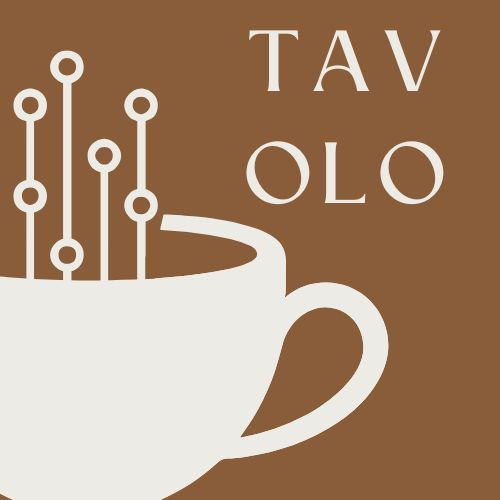</td><td colspan="3" valign="top"></td><td colspan="3" valign="top"><td valign="top"></tr>
<tr><td colspan="3" rowspan="4" valign="top"><b>Perfil</b></td><td colspan="3" rowspan="2" valign="top"><b>Overview</b></td><td colspan="3" rowspan="2" valign="top">Es una solución tecnológica integral basada en IoT, diseñada específicamente para cafeterías. Utiliza sensores de peso para detectar automáticamente la ocupación de mesas y actualiza esta información cada 10 segundos en una app web y móvil. El sistema también ofrece una interfaz administrativa para la sede, facilitando la gestión del flujo de comensales y mejorando la rotación de mesas.</td><td colspan="3" rowspan="2" valign="top">Es una plataforma de gestión de restaurantes basada en la nube que permite manejar reservas, asignación de mesas, datos de clientes y campañas de marketing automatizadas. Su enfoque está en ofrecer una experiencia completa para restaurantes que desean profesionalizar la relación con sus clientes, utilizando herramientas de CRM, reportes y análisis de comportamiento.</td><td colspan="3" rowspan="2" valign="top">Es una de las plataformas más reconocidas a nivel mundial para reservas en restaurantes. Los usuarios pueden buscar establecimientos, ver disponibilidad en tiempo real, leer reseñas y reservar directamente desde la app o el sitio web. También ofrece herramientas para los restaurantes, aunque su enfoque principal está en mejorar la experiencia del comensal antes de llegar al lugar.</td><td rowspan="2" valign="top">Es una solución que digitaliza el proceso de espera en locales físicos, como restaurantes, cafeterías y tiendas. Los clientes pueden apuntarse a una lista desde sus dispositivos y reciben notificaciones cuando su turno se acerca. También permite al staff gestionar el flujo de clientes de forma más organizada, aunque depende de la intervención manual.</td></tr>
<tr></tr>
<tr><td colspan="3" rowspan="2" valign="top"><b>Ventaja competitiva ¿Qué valor ofrece a los clientes?</b></td><td colspan="3" rowspan="2" valign="top">Brinda información precisa y en tiempo real sobre la disponibilidad de mesas, ayudando a evitar esperas y optimizando su visita desde antes de llegar al local.</td><td colspan="3" rowspan="2" valign="top">Permite reservar mesas de forma sencilla y recibir un servicio más personalizado, gracias al uso de datos históricos y preferencias del cliente.</td><td colspan="3" rowspan="2" valign="top">Facilita la reserva anticipada en restaurantes de forma rápida y confiable, brindando acceso a una amplia variedad de opciones en una sola plataforma.</td><td rowspan="2" valign="top">Reduce la incertidumbre y el tiempo de espera físico, al permitirles ocupar su tiempo libremente mientras esperan su turno.</td></tr>
<tr></tr>
<tr><td colspan="3" rowspan="2" valign="top"><b>Perfil de Marketing</b></td><td colspan="3" valign="top"><b>Mercado objetivo</b></td><td colspan="3" valign="top">Cafeterías que buscan innovar en la gestión de mesas y mejorar la experiencia del cliente mediante tecnología avanzada.</td><td colspan="3" valign="top">Restaurantes que buscan mejorar su gestión de reservas y la experiencia del cliente. Su mercado abarca desde pequeños establecimientos hasta grandes cadenas hoteleras y restaurantes de alta gama.</td><td colspan="3" valign="top">Gama de restaurantes, desde pequeños locales hasta grandes cadenas internacionales, que buscan gestionar reservas en línea y mejorar la experiencia del cliente.</td><td valign="top">Restaurantes, cafeterías y otros establecimientos de servicio rápido que buscan gestionar eficientemente las listas de espera y mejorar la experiencia del cliente.</td></tr>
<tr><td colspan="3" valign="top"><b>Estrategias de Marketing</b></td><td colspan="3" valign="top">
Demostraciones en vivo.

Alianzas estratégicas.

Publicidad en redes sociales.

Marketing de contenidos.
</td><td colspan="3" valign="top">
Optimización de motores de búsqueda.

Publicidad de pago por clic.

Alianzas estratégicas.
</td><td colspan="3" valign="top">
Publicidad y promoción.

Análisis de datos.

Segmentación de clientes.
</td><td valign="top">
Pruebas gratuitas y demostraciones.

Testimonios y reseñas.

</td></tr>
<tr><td colspan="3" rowspan="3" valign="top"><b>Perfil de producto</b></td><td colspan="3" valign="top"><b>Productos y Servicios</b></td><td colspan="3" valign="top">Solución basada en IoT que utiliza sensores de peso para detectar la ocupación de las mesas en tiempo real. Esta información se refleja automáticamente en una app web y móvil, permitiendo a los comensales ver la disponibilidad de mesas antes de llegar. Además, incluye una interfaz administrativa para la gestión del flujo de comensales y optimización de la rotación de mesas.</td><td colspan="3" valign="top">Proporciona un sistema de reservas en línea, un CRM para gestionar relaciones con los clientes, herramientas de marketing automatizado, análisis de datos y reportes detallados, así como la integración con otros sistemas de restaurante como POS (punto de venta) y plataformas de pago.</td><td colspan="3" valign="top">Ofrece a los restaurantes herramientas para gestionar la disponibilidad de mesas, realizar reservas, y personalizar la experiencia del cliente. También proporciona servicios de marketing y publicidad, herramientas de CRM y análisis detallados del rendimiento del restaurante, como la ocupación y los tiempos de espera.</td><td valign="top">Ofrece una solución digital para gestionar las listas de espera en tiempo real. Los restaurantes pueden asignar mesas y notificar a los clientes mediante SMS o la app cuando su mesa esté lista. Además, la plataforma ofrece análisis sobre los tiempos de espera y la rotación de mesas para mejorar la eficiencia del establecimiento.</td></tr>
<tr><td colspan="3" valign="top"><b>Precios y Costos</b></td><td colspan="3" valign="top">Ofrece un modelo de suscripción mensual, con precios que varían según el número de mesas y funcionalidades requeridas. A diferencia de sus competidores, no cobra comisiones por cada reserva, lo que lo convierte en una opción más rentable a largo plazo. Puede haber un costo inicial por la instalación de los sensores.</td><td colspan="3" valign="top">Sigue un modelo de suscripción mensual, con precios que empiezan desde $99 por mes dependiendo del tamaño del restaurante y las funcionalidades necesarias. Además, en algunos casos, cobran comisiones por cada reserva realizada a través de la plataforma.</td><td colspan="3" valign="top">Opera con un modelo basado en suscripción mensual, cuyo precio inicial ronda los $39 por mes. Además, cobra una comisión por cada reserva realizada a través de la plataforma, que varía entre el 1% y el 5%. También puede haber costos adicionales por servicios de promoción o características premium.</td><td valign="top">Opera con un modelo de suscripción mensual, comenzando desde $29 al mes para restaurantes pequeños. No cobra comisiones por reserva, lo que lo hace una opción más accesible en términos de costos continuos. Los precios varían según el tamaño del restaurante y las funcionalidades adicionales requeridas.</td></tr>
<tr><td colspan="3" valign="top"><b>Canales de distribución</b></td><td colspan="3" valign="top">
- Página web

- Aplicaciones móviles en dispositivos iOS y Android.

</td><td colspan="3" valign="top">
- Página web

- Aplicaciones móviles en dispositivos iOS y Android.
</td><td colspan="3" valign="top">
- Página web

- Aplicaciones móviles en dispositivos iOS y Android.
</td><td valign="top">
- Página web

- Aplicaciones móviles en dispositivos iOS y Android.
</td></tr>
<tr><td colspan="3" rowspan="4" valign="top"><b>Análisis FODA</b></td><td colspan="3" valign="top"><b>Fortalezas</b></td><td colspan="3" valign="top">
- Detección automática de ocupación en tiempo real.

- App ligera, actualizaciones rápidas (cada 10 segundos).

- Instalación simple sin técnicos.
</td><td colspan="3" valign="top">
- Plataforma integral con CRM y analítica.

- Buena integración con otros sistemas.

- Funciona en móviles y tablets.
</td><td colspan="3" valign="top">
- Marca reconocida globalmente.

- Gran base de usuarios y restaurantes.

- Interfaz amigable para el cliente.
</td><td valign="top">
- Fácil de usar y configurar.

- Económico y accesible.

- Sin comisiones por cliente.
</td></tr>
<tr><td colspan="3" valign="top"><b>Debilidades</b></td><td colspan="3" valign="top">
- Requiere hardware (sensores).

- Etapa temprana de adopción y posicionamiento.
</td><td colspan="3" valign="top">
- No detecta ocupación en tiempo real.

- Costos altos para pequeños restaurantes.
</td><td colspan="3" valign="top">
- Comisiones por reserva.

- Menor personalización para negocios pequeños.
</td><td valign="top">
- Dependencia del ingreso manual del personal.

- Sin monitoreo físico de mesas.
</td></tr>
<tr><td colspan="3" valign="top"><b>Oportunidades</b></td><td colspan="3" valign="top">
- Escalamiento a grandes cadenas de cafeterías.

- Expansión hacia restaurantes u hoteles.
</td><td colspan="3" valign="top">
- Expansión en mercados emergentes.

- Alianzas con grandes cadenas.
</td><td colspan="3" valign="top">
- Ampliar servicios para cafeterías o locales pequeños.

- Integración con experiencias gastronómicas.
</td><td valign="top">
- Penetrar en mercados de comida rápida y cafeterías.

- Mejora con inteligencia artificial.
</td></tr>
<tr><td colspan="3" valign="top"><b>Amenazas</b></td><td colspan="3" valign="top">
- Copia del modelo por grandes competidores.

- Desconfianza inicial por ser una tecnología emergente.
</td><td colspan="3" valign="top">
- Competencia con soluciones más automatizadas.

- Cambios en las tecnologías de reservas.
</td><td colspan="3" valign="top">
- Nuevas plataformas sin comisiones.

- Desintermediación (restaurantes que prefieren sistemas propios).
</td><td valign="top">
- Soluciones con detección automática.

- Apps integrales que lo superen en funcionalidades.
</td></tr>
</table>

### 2.1.2. Estrategias y tácticas frente a competidores

Hemos empleado un análisis FODA para identificar las posibilidades y desafíos en el mercado, así como para evaluar nuestras fortalezas y debilidades internas. Esta metodología nos ha permitido concebir estrategias y tácticas que se ajusten de manera coherente a nuestro entorno y a los recursos disponibles.

**Estrategia de diferenciación tecnológica:**

La principal estrategia de Tavolo es posicionarse como una solución única en el mercado al incorporar tecnología IoT para detectar en tiempo real la ocupación de mesas, eliminando por completo la necesidad de intervención humana o registro manual. Esto permite ofrecer al cliente final información confiable y constante, algo que sus competidores no alcanzan con precisión.

**Estrategia de enfoque de nicho en cafeterías:**

Otra estrategia clave es enfocarse en un nicho específico y muy definido: las cafeterías. A diferencia de otras plataformas que buscan abarcar todo tipo de restaurantes, Tavolo se especializa en un entorno donde la rotación rápida, la autogestión y la simplicidad son fundamentales. En línea con esto, la táctica es desarrollar un lenguaje de marca, interfaz y funcionalidades adaptadas a este tipo de negocio, además de lanzar campañas dirigidas a franquicias de cafeterías o locales independientes que no requieren una infraestructura compleja, pero sí soluciones eficientes.

**Estrategia de escalabilidad y fácil instalación:**

Pensando en el crecimiento, Tavolo adopta una estrategia de escalabilidad técnica, diseñando un sistema que puede instalarse sin necesidad de personal técnico, en menos de una hora, lo que facilita su expansión sin altos costos logísticos. Como táctica, se crean tutoriales paso a paso, videos cortos y documentación visual clara que permiten a cualquier miembro del personal ejecutar la instalación.

**Estrategia de posicionamiento de marca y educación del mercado:**

Tavolo impulsa una estrategia de posicionamiento de marca basada en innovación y liderazgo de pensamiento en el sector horeca. La táctica principal para esto es la generación de contenido educativo (blogs, infografías, webinars) que informan sobre la importancia del monitoreo en tiempo real, las pérdidas por esperas largas y cómo la tecnología puede resolverlo, posicionando a Tavolo como referente en soluciones inteligentes para la industria.

## 2.2. Entrevistas
### 2.2.1. Diseño de entrevistas

### Propietarios de cafeterías

**Preguntas de presentación:**

1. ¿Podrías indicarnos tu nombre y el de tu cafetería?
2. ¿Qué puesto ocupas dentro de la empresa?
3. ¿Desde cuándo está funcionando tu cafetería?

**Propósito:** Queremos entender tus necesidades y retos para mejorar la gestión del aforo en tu cafetería.

**Entrevista:**

1. ¿Cómo gestionas actualmente las reservas y la disponibilidad de mesas?
2. ¿Qué problemas enfrentas con el tiempo de espera de los clientes?
3. ¿Estarías interesado en una solución tecnológica para gestionar las mesas en tiempo real?
4. ¿Qué características consideras más importantes en una plataforma de gestión de aforo?
5. ¿Qué tan importante es para ti la facilidad de instalación y el soporte técnico?
6. ¿Cómo crees que la tecnología puede mejorar la experiencia del cliente y optimizar la operación de tu cafetería?
7. ¿Algo más que te gustaría agregar sobre tus necesidades o expectativas?

### Clientes de establecimiento

**Preguntas de presentación:**

1. ¿Podrías indicarnos tu nombre?
2. ¿Con qué frecuencia sueles visitar cafeterías?
3. ¿Qué tipo de cafeterías prefieres (por ejemplo, locales, cadenas, cafeterías gourmet)?

**Propósito:** Queremos conocer tu experiencia como cliente en cafeterías y cómo la tecnología podría mejorarla.

**Entrevista:**

1. ¿Cómo sueles consultar la disponibilidad de mesas antes de ir a una cafetería?
2. ¿Qué tan importante es para ti poder hacer reservas online para evitar esperas?
3. ¿Te gustaría ver la disponibilidad de mesas en tiempo real a través de una app?
4. ¿Qué características debería tener una app de cafetería para que la uses con frecuencia?
5. ¿Cómo valoras la rapidez y facilidad de uso de una aplicación para gestionar tu experiencia en la cafetería?
6. ¿Algo más que consideras importante para mejorar tu experiencia como cliente?

### 2.2.2. Registro de entrevistas
### Propietarios de cafeterías 
**Entrevista #1** 
**Link:** [https://drive.google.com/file/d/1CVDQx8Ue15xk7yt8oukkN1S87bAc7TeB/view?usp=sharing](https://drive.google.com/file/d/1QeR3Ds2W3V0-4MHyfneMgFkaFLi7aG39/view?usp=sharing) 
 
**Entrevistado:** Diego Morales 
**Duración:** 5:20 
**Resumen:** La persona entrevistada señala que es un cliente frecuente de diversas cafeterías, desde locales con propuestas culinarias elaboradas hasta las más conocidas franquicias. Si las circunstancias lo permiten, suele consultar si hay mesas libres antes de dirigirse al lugar, aunque reconoce que no siempre sigue esta práctica. Manifiesta un deseo por contar con herramientas que le permitan conocer la ocupación y otros datos de interés de antemano. 

**Entrevista #2** 
**Link:**[https://drive.google.com/file/d/1WTxiDxw4vaabZhFvibL8mHLINcrJR0_9/view?usp=sharing](https://drive.google.com/file/d/1WTxiDxw4vaabZhFvibL8mHLINcrJR0_9/view?usp=sharing)
 
**Entrevistado:** Jenna Vasquez 
**Duración:** 4:21 
**Resumen:** En la entrevista, Jenna, dueña de una cafetería, destacó la necesidad crucial de implementar tecnología de fácil acceso y uso, específicamente sensores que no requieran una capacitación extensa del personal, lo que representaría un ahorro significativo de tiempo y recursos. Adicionalmente, expresó su frustración con el sistema actual de gestión manual de reservas, el cual es propenso a errores frecuentes que generan inconvenientes tanto para los clientes como para la operación del negocio, describiéndolo como un verdadero "dolor de cabeza". Jenna ve en una aplicación como TAVOLO una solución potencial que podría automatizar el proceso de reservas, reducir los errores humanos y aliviar la carga operativa de su personal.ReintentarClaude puede cometer errores. Verifique las respuestas. 

### Clientes de establecimiento
**Entrevista #1** 
**Link:** [https://drive.google.com/file/d/1CVDQx8Ue15xk7yt8oukkN1S87bAc7TeB/view?usp=sharing](https://drive.google.com/file/d/1CVDQx8Ue15xk7yt8oukkN1S87bAc7TeB/view?usp=sharing)  
**Entrevistado:** Elias Yauri Paucar 
**Duración:** 3:18 
 
**Resumen:** El entrevistado indica que acostumbra visitar diferentes tipos de cafeterías, incluyendo tanto establecimientos gourmet como cadenas comerciales. Cuando tiene la opción, verifica la disponibilidad de espacio antes de ir, aunque no siempre lo hace. Expresa interés en poder acceder a información sobre disponibilidad y otros detalles similares.  Respecto a aplicaciones, valora principalmente tres aspectos: una interfaz intuitiva, facilidad de uso y funcionalidades relevantes. Finalmente, para el entrevistado es fundamental que la navegación dentro de la aplicación sea sencilla de comprender y que ofrezca una experiencia fluida. 

**Entrevista #2**
**Link:** [https://youtu.be/QGSisj7iF-k](https://youtu.be/QGSisj7iF-k)
**Entrevistada:** Aleshka Fernández 
**Duración:** 3:54 
 
**Resumen:** La entrevistada menciona que suele visitar cafeterías locales que ofrezcan cafés artesanales o exclusivos del establecimiento. Destaca que, cuando tiene poco tiempo, valora poder reservar sus lugares favoritos. También muestra interés en conocer el aforo en tiempo real. Le gustaría que la aplicación fuera intuitiva, atractiva y visualmente llamativa. Además, considera ideal que la app le sugiera las mejores cafeterías cercanas, según su ubicación y el tipo de cafetería que prefiere. También desea encontrar fácilmente un buscador dentro de la aplicación, dejar calificaciones sobre los lugares visitados y recibir recomendaciones de cafeterías similares en caso de que el tiempo de espera en su lugar habitual sea muy largo. 

### 2.2.3. Análisis de entrevistas
### Propietarios de cafeterías
Los propietarios entrevistados son también usuarios frecuentes de cafeterías, lo que les permite empatizar con las necesidades del cliente. Aunque no siempre consultan la disponibilidad de mesas antes de asistir a un local, valoran contar con herramientas tecnológicas que les brinden información en tiempo real sobre la ocupación y otros datos operativos. Identifican como problemáticas la falta de visibilidad para anticiparse a la demanda y la toma de decisiones basada en intuiciones. Por ello, ven como una gran oportunidad integrar soluciones que mejoren la rotación de mesas, optimicen la operación y reduzcan el estrés, siempre y cuando sean fáciles de usar y autogestionables. 

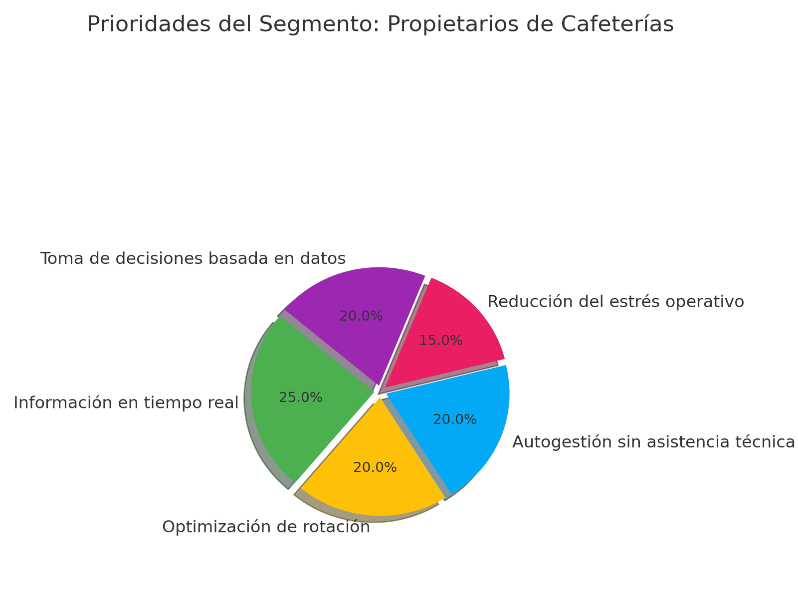

### Clientes de establecimiento
Los clientes entrevistados visitan diversos tipos de cafeterías y, cuando tienen la oportunidad, valoran consultar la disponibilidad de mesas antes de llegar. Expresan interés en aplicaciones que ofrezcan una experiencia fluida, intuitiva y visualmente atractiva, que les permita ahorrar tiempo, reservar su lugar favorito o encontrar recomendaciones personalizadas según sus preferencias y ubicación. Las principales frustraciones se centran en no saber si encontrarán espacio y en apps poco claras o con funciones irrelevantes. Ven como ganancia una app que no solo informe disponibilidad en tiempo real, sino que también les permita planificar mejor y descubrir nuevas cafeterías fácilmente.

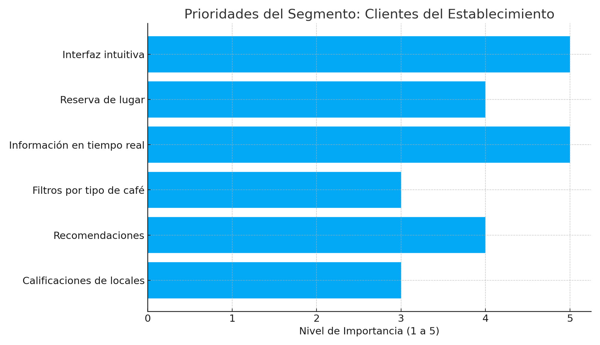

## 2.3. Needfinding
### 2.3.1. User Personas
Propietarios de cafeterías

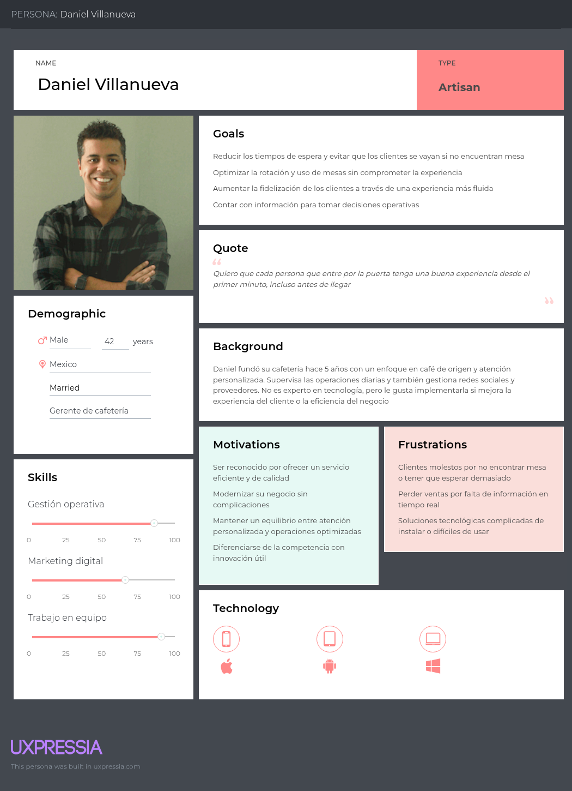

Clientes de establecimiento

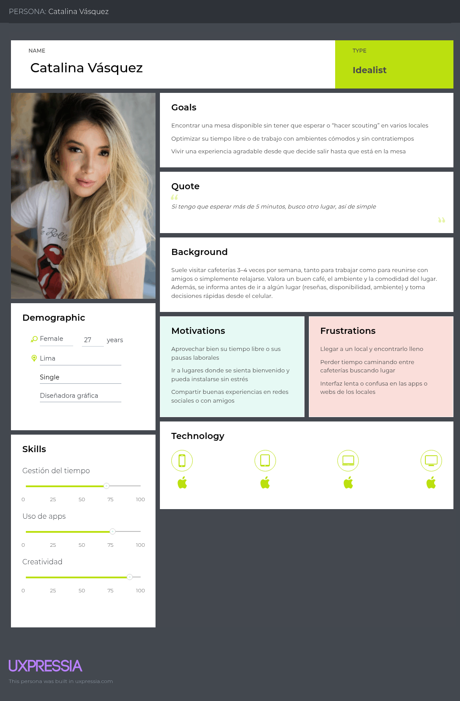

### 2.3.2. User Task Matrix
Propietarios de cafeterías

| Tarea |   Importancia   | Frecuencia |
|:------|:------|:----------|
|Consultar el estado de ocupación de mesas|Alta|Alta|
|Agregar/modificar mesas desde el panel administrativo|Media|Media|
|Gestionar reservas desde el panel|Media|Media|
|Configurar parámetros iniciales (sede, nombre, etc.)|Media|Baja|
|Supervisar que el sistema esté funcionando correctamente|Alta|Alta|
|Ver reportes o estadísticas de uso (futura función)|Alta|Media|

Clientes de establecimiento

| Tarea |   Importancia   | Frecuencia |
|:------|:------|:----------|
|Consultar disponibilidad de mesas en tiempo real|Alta|Alta|
|Acceder rápidamente desde el celular|Alta|Alta|
|Buscar cafeterías cercanas con disponibilidad|Alta|Media|
|Guardar su cafetería favorita (opcional futuro)|Media|Baja|
|Compartir o recomendar la cafetería con amigos|Media|Media|

### 2.3.3. User Journey Mapping
Propietarios de cafeterías

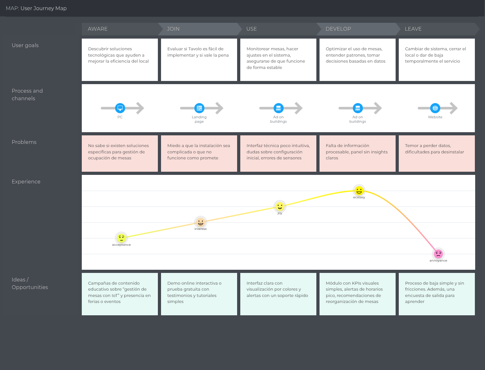

Clientes de establecimiento

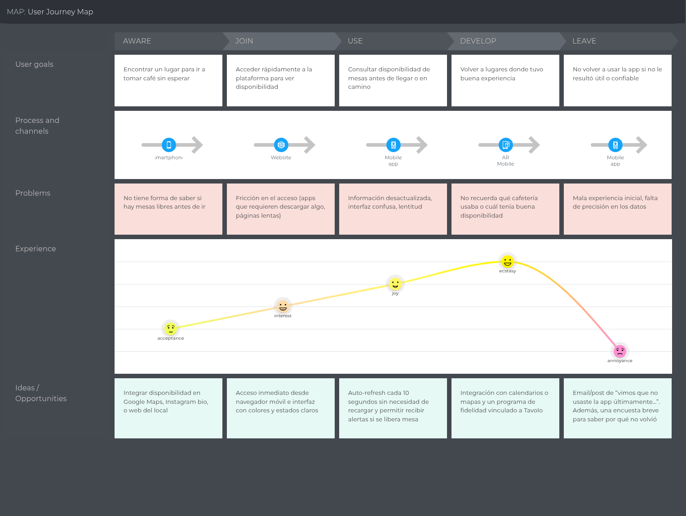

### 2.3.4. Empathy Mapping
Propietarios de cafeterías

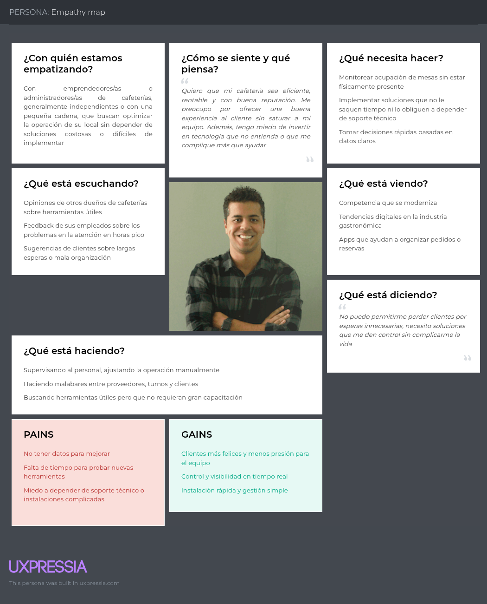

Clientes de establecimiento

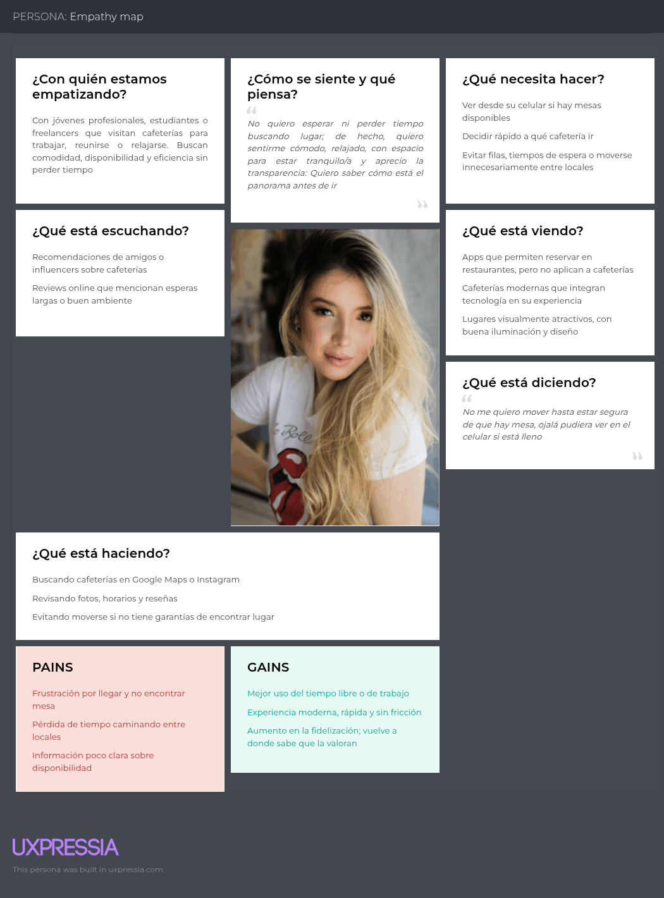

### 2.3.5. As-is Scenario Mapping
Propietarios de cafeterías

| FASES | Apertura del local | Horas pico | Tiempos muertos o baja rotación | Cierre y evaluación |
|-------|--------------------|------------|---------------------------------|---------------------|
| **DOING** | Llego temprano a preparar el salón y reviso la limpieza    Organizo al personal según la estimación de flujo del día    Activo los pedidos de proveedores y abro caja | Superviso el movimiento del salón y doy indicaciones rápidas    Coordino con el personal para liberar mesas    Intento gestionar manualmente el flujo de comensales | Trato de motivar al personal a optimizar ocupación    Me enfoco en redes, promociones o planificación de eventos | Reviso la caja, analizo el desempeño del día    Comento con el equipo los problemas que se presentaron |
| **THINKING** | “¿Cómo puedo organizar mejor al equipo si se llena?” | “¿Hay alguien esperando afuera? ¿Ya se fue esa mesa del fondo?”    “Estamos perdiendo ventas por no rotar bien las mesas” | “¿Se estará yendo gente por no ver mesas disponibles?”    “¿Debemos reducir el horario de atención?” | “Hoy podríamos haber ganado más si organizábamos mejor”    “¿Y si hubiera una forma de saber cuántas mesas se usan realmente?” |
| **FEELING** | Expectativa positiva    Ligera ansiedad por la incertidumbre del día | Estrés por la carga simultánea de tareas    Frustración al ver ineficiencia en la atención | Impotencia por no tener visibilidad clara del flujo    Curiosidad por probar nuevas soluciones, pero con dudas | Frustración al no tener datos para tomar decisiones    Motivación parcial por mejorar, pero sin claridad sobre el cómo |

Clientes de establecimiento

| FASES | Decisión de salir | Camino al local | Llegada y evaluación del lugar | Cambio de plan o espera |
|-------|-------------------|-----------------|--------------------------------|-------------------------|
| **DOING** | Consulto Google Maps o redes sociales para elegir una cafetería    Pregunto a amigos si conocen un lugar con espacio    Busco una opción con buen ambiente y sin demasiada gente | Voy caminando o en transporte mientras reviso reseñas    Consulto stories o publicaciones recientes del local | Me asomo o entro para ver si hay mesas    Hablo con un mozo o espero que me asignen espacio    Evalúo el ambiente | Decido esperar de pie, buscar otro local o cancelar mi plan    Dejo una reseña o me quejo en redes si tuve mala experiencia |
| **THINKING** | “¿Estará lleno ese lugar que me gusta?”    “Sería genial saber desde casa si hay mesas” | “No tengo ganas de andar buscando otro lugar”    “Si llego y no hay lugar, capaz me vuelvo a casa” | “No hay lugar, otra vez”    “¿Por qué no hay una app para esto?” | “No vuelvo más a este lugar sin saber si hay lugar antes” |
| **FEELING** | Entusiasmo por salir a tomar algo o trabajar fuera    Inseguridad por no saber si encontrará lugar | Expectativa mezclada con incertidumbre    Poca paciencia, sobre todo si va con tiempo limitado | Decepción si no encuentra lugar    Irritación si ve mesas vacías sin uso | Frustración, molestia, desilusión    Sensación de que no valoraron su tiempo |

## 2.4. Ubiquitous Language
Estos son los términos y conceptos comunes utilizados en nuestro proyecto:

- **Sede:** Unidad donde opera una cafetería. Cada sede puede tener múltiples mesas y su propio panel administrativo.
- **Mesa:** Elemento disponible para ser ocupado por los clientes. Puede ser activada o desactivada desde el panel.
- **Silla con sensor:** Elemento equipado con un sensor de peso que detecta si está siendo utilizada. Su estado ayuda a determinar la ocupación de la mesa.
- **Sensor:** Dispositivo IoT instalado en cada silla que detecta cambios de peso para determinar si hay una persona sentada.
- **Ocupación:** Estado de una mesa, determinado por la detección de presencia en una o más sillas asociadas.
- **Panel administrativo:** Interfaz web usada por el propietario o administrador para gestionar mesas, consultar disponibilidad y visualizar estadísticas.
- **Administrador:** Usuario con control sobre una sede, encargado de gestionar mesas, configuraciones y visualización de datos.
- **Cliente:** Persona que visita la cafetería. Puede usar la app para ver disponibilidad de mesas en tiempo real.
- **Actualización de estado:** Proceso automático mediante el cual el sistema recibe datos de los sensores en las sillas y actualiza la información visible para clientes y administradores.
- **Rotación de mesas:** Número de veces que una mesa es ocupada en un período determinado. Métrica usada para medir eficiencia.

# Capítulo III: Requirements Specification

## 3.1. To-Be Scenario Mapping
Este mapeo “To-Be” presenta el escenario ideal posterior a la implementación de Tavolo, describiendo cómo cambiarán las experiencias del propietario de la cafetería y del comensal gracias a la solución IoT propuesta. Se detallan acciones, pensamientos y emociones alineadas a los beneficios que aporta el sistema.

### ¿Qué hace el Dueño del Café?

| **Phases**                     | **Doing**                                                                                          | **Thinking**                                           | **Feeling**               |
|-------------------------------|-----------------------------------------------------------------------------------------------------|--------------------------------------------------------|---------------------------|
| **Registro del local**        | • Instala la app Tavolo.    • Crea su cuenta como dueño de local.    • Registra su cafetería y sedes. | • “Qué bueno que puedo registrar todas mis sedes fácil.”   • “Ahora tengo visibilidad online.” | • Aliviado   • Organizado |
| **Gestión del aforo**         | • Consulta la ocupación en tiempo real de su sede.   • Revisa cada sede desde su celular o computadora.                    | • “Qué fácil es ver cuántas mesas están ocupadas.”   • “Ya no dependo del personal para esto.”  • “Qué accesible que pueda ver desde cualquier dispositivo la app de Tavolo.” | • En control   • Eficiente  |
| **Gestión del tiempo de espera** | • Ve cómo los clientes reservan online.   • Evita colas en la entrada.                             | • “Qué bueno que ya no hay filas innecesarias.”   • “Mis clientes llegan más contentos.”      | • Relajado   • Optimista   |
| **Monitoreo de mesas**        | • Agrega o elimina mesas.   • Coordina instalación de sensores IoT.                              | • “Wow, es sencillo gestionar las mesas con ayuda.”   • “No imaginé tanta flexibilidad.”      | • Empoderado   • Innovador  |
| **Visibilidad en Google Maps**| • Permite que los clientes lo busquen por nombre.   • Revisa su sede en la app de Tavolo.          | • “Qué útil que aparezcamos en Google con mis datos.”   • “Nos encuentran más rápido.”        | • Conectado   • Satisfecho  |

### ¿Qué hace el Usuario?

| Phases | Descubrimiento de la aplicación | Registro de datos personales | Búsqueda de cafeterías | Reserva de asientos |
|--------|-------------------------------|----------------------------|------------------------|-------------------|
| **Doing** | • Descarga Tavolo desde la tienda de aplicaciones. • Explora las funcionalidades principales. | • Registra sus datos en Tavolo. • Configura sus cafeterias favoritas. | • Utiliza la función de búsqueda por ubicación. • Revisa la disponibilidad en tiempo real. | • Selecciona una mesa disponible. • Confirma la reserva para una hora específica. |
| **Thinking** | "Esta app me ayudará a no perder tiempo buscando lugares disponibles." | "El proceso de registro es rápido." | "Me encanta poder ver exactamente dónde hay espacio antes de ir." | "La reserva fue sencilla y ahora tengo mi lugar asegurado." |
| **Feeling** | Curiosidad | Comodidad | Alivio | Satisfacción |

## 3.2. User Stories
### Épicas

| Epic ID 	| Name 	|
|:---:	|:---:	|
| EPIC-LANDING-001 	| Funcionalidades landing page 	|
| EPIC-CLIENT-002 	| Funcionalidades user comensal 	|
| EPIC-ADMIN-003 	| Funcionalidades user administrador 	|
| EPIC-SUPERADMIN-004 	| Funcionalidades user superadmin 	|
| EPIC-BOOKING-TECH 	| Funcionalidades de desarrolladores 	|

 

| Story ID 	| Título 	| Descripción 	| Epic ID 	| Usuario 	| Criterios de aceptación 	|
|---	|---	|---	|---	|---	|---	|
| US001 	| Ver sección "¿Qué es Tavolo?" 	| Como visitante de la página, quiero entender qué es Tavolo desde la landing page para conocer su propósito y cómo puede ayudarme como comensal o administrador de cafetería. 	| EPIC-LANDING-001 	| Visitante landing page 	| Escenario 1: Dado que el visitante accede a la landing page, Cuando hace scroll en "¿Qué es Tavolo?", Entonces el sistema le muestra la sección donde se describe claramente el objetivo de la solución.  Escenario 2: Dado que el visitante accede a la landing page, Cuando hace click en "¿Qué es Tavolo?", Entonces el sistema le muestra la sección donde se describe claramente el objetivo de la solución. 	|
| US002 	| Ver sección "Características clave" 	| Como visitante, quiero revisar una lista de características principales de Tavolo para evaluar si cubre mis necesidades como usuario final o administrador. 	| EPIC-LANDING-001 	| Visitante landing page 	| Escenario 1: Dado que el usuario navega la landing, Cuando cuando hace scroll a la sección "Características clave", Entonces el sistema le muestra un resumen de las funcionalidades más importantes del sistema.  Escenario 2: Dado que el visitante está en la landing, Cuando da click sobre el botón "Características clave", Entonces el sistema le muestra un resumen de las funcionalidades más importantes del sistema. 	|
| US003 	| Ver la galería virtual 	| Como visitante, quiero ver una galería virtual en la landing para visualizar cómo luce Tavolo, su interfaz y los sensores en acción. 	| EPIC-LANDING-001 	| Visitante landing page 	| Escenario 1: Dado que el usuario navega la landing, Cuando cuando hace scroll a la sección "Galería Virtual" Entonces visualiza el contenido visual ilustrativo del sistema en uso  Escenario 2: Dado que el usuario navega la landing, Cuando cuando hace click a la sección "Galería Virtual" Entonces visualiza el contenido visual ilustrativo del sistema en uso 	|
| US004 	| Usar el formulario de contacto 	| Como visitante interesado, quiero tener acceso a un formulario o medio de contacto en la landing para comunicarme con el equipo de Tavolo. 	| EPIC-LANDING-001 	| Visitante landing page 	| Escenario 1: Dado que el visitante accede a "Contáctanos" Cuando completa el formulario con sus datos Entonces el sistema debe notificar al equipo de Tavolo  Escenario 2: Dado que el visitante intenta enviar el formulario, Cuando deja campos obligatorios vacíos, Entonces el sistema debe mostrar mensajes de validación para completar la información. 	|
| US005 	| Ver menú digital de una sede 	| Como comensal, quiero visualizar el menú de la cafetería para conocer los productos disponibles antes de asistir. 	| EPIC-CLIENT-002 	| Comensal 	| Escenario 1: Dado que el comensal accede a la app, Cuando le da click a la sección "Menú", Entonces el sistema debe mostrar el menú completo de la cafetería.  Escenario 2: Dado que el comensal visualiza el menú, Cuando selecciona una categoría como “Bebidas” o “Postres”, Entonces el sistema filtra los productos mostrados según esa categoría. 	|
| US006 	| Visualizar reserva activa 	| Como comensal, quiero poder visualizar mi reserva activa desde la aplicación, para confirmar los detalles de mi mesa y el horario reservado antes de llegar a la cafetería. 	| EPIC-CLIENT-002 	| Comensal 	| Escenario 1: Dado que el comensal ha iniciado sesión en la aplicación y tiene al menos una reserva activa, Cuando accede a la sección principal, Entonces el sistema le muestra la información de la reserva actual incluyendo horario, sede y número de mesa.  Escenario 2: Dado que el comensal visualiza su reserva, Cuando esta ya ha expirado, Entonces el sistema la remueve de la sección activa. 	|
| US007 	| Ver disponibilidad de mesas en tiempo real 	| Como comensal, quiero conocer la disponibilidad de mesas para decidir que sede visitar de la cafetería. 	| EPIC-CLIENT-002 	| Comensal 	| Escenario 1: Dado que el comensal accede a la app Cuando le da click a la sección "Explorar Sedes" Entonces el sistema debe mostrarle la información de la sedes con sus respectivos aforos disponibles  Escenario 2: Dado que el comensal visualiza el estado de aforo de las sedes Cuando hay una actualización desde los sensores Entonces el sistema debe reflejar el nuevo estado en menos de 5 segundos  Escenario 3: Dado que todas las mesas están ocupadas en una sede Cuando el comensal visualiza la disponibilidad Entonces el sistema debe informar que no hay mesas disponibles actualmente 	|
| US008 	| Reservar una mesa 	| Como comensal, quiero reservar una mesa para asegurarme un lugar al llegar a la cafetería. 	| EPIC-CLIENT-002 	| Comensal 	| Escenario 1: Dado que el comensal selecciona una sede en la sección "Explorar Sedes" Cuando el comensal selecciona la hora aproximada de estadía Y selecciona una mesa disponible Entonces el sistema debe permitir realizar la reserva  Escenario 2: Dado que el comensal ya tiene una reserva activa Cuando intenta crear una nueva Entonces el sistema debe evitarlo e informar que ya tiene una reserva activa 	|
| US009 	| Visualizar más sedes en un mapa 	| Como comensal, quiero poder ver más sedes en el mapa para poder identificar el más cercano. 	| EPIC-CLIENT-002 	| Comensal 	| Escenario 1: Dado que el comensal quiere ver más sedes Cuando le da click a la sección "Sedes" Entonces el sistema debe mostrar todas las sedes de la cafetería  Escenario 2: Dado que el comensal se encuentra en la sección "Sedes" Y puede ver todas las sedes de la cafetería Cuando le da click al botón de "Ver en mapa" Entonces el sistema muestra un pop up con la dirección en un mapa interactivo 	|
| US010 	| Registro de cuenta de comensal 	| Como visitante, quiero poder registrarme como comensal en el sistema Tavolo para poder acceder a las funcionalidades de reserva y visualización de mesas. 	| EPIC-CLIENT-002 	| Visitante 	| Escenario 1: Dado que un visitante accede a la aplicación Cuando completa el formulario de registro con nombre y contraseña Y acepta los términos y condiciones Entonces el sistema debe crear una cuenta nueva Y permitir el acceso a las funcionalidades de comensal  Escenario 2: Dado que un visitante intenta registrarse con un nombre de usuario ya usado, Cuando envía el formulario, Entonces el sistema debe impedir el registro y mostrar un mensaje de error indicando que el correo ya está registrado. 	|
| US011 	| Inicio de sesión de cuenta de comensal 	| Como comensal registrado, quiero poder iniciar sesión en el sistema para acceder a mis reservas y funcionalidades personalizadas. 	| EPIC-CLIENT-002 	| Comensal 	| Escenario 1: Dado que un comensal registrado accede a la pantalla de login Cuando ingresa sus credenciales correctas (email y contraseña) Entonces el sistema debe autenticarlo Y redirigirlo al dashboard principal  Escenario 2: Dado que un usuario ingresa credenciales incorrectas Cuando intenta iniciar sesión Entonces el sistema debe mostrar un mensaje de error Y permitir reintentar 	|
| US012 	| Agregar nuevas mesas 	| Como administrador de cafetería, quiero agregar mesas al sistema para gestionar mejor la ocupación. 	| EPIC-ADMIN-003 	| Administrador 	| Escenario 1: Dado que el admin accede al panel de su sede Cuando le da click a la sección "Gestión de Mesas" Y posteriormente a la opción "Agregar una nueva mesa" Entonces el sistema le brinda un formulario simple de registro de mesa. Escenario 2: Dado que el admin ingresa los datos correctos de la mesa como su identificador y capacidad de sillas Y le da click al botón "Guardar" Entonces el sistema guarda con su identificador y capacidad de sillas la mesa registrada 	|
| US013 	| Visualizar reservas realizadas 	| Como administrador, quiero ver las reservas registradas en mi sede para planificar el servicio. 	| EPIC-ADMIN-003 	| Administrador 	| Escenario 1: Dado que el administrador accede a su sede Cuando le da clic a la sección "Visualizar Reservas" Entonces el sistema debe mostrar las reservas con usuario, hora y mesa  Escenario 2: Dado que el administrador ha filtrado por persona o mesa Cuando aplica el filtro Entonces el sistema debe mostrar solo las reservas que coinciden con los criterios seleccionados 	|
| US014 	| Ver la sede asignada 	| Como administrador, quiero confirmar qué sede tengo asignada para asegurarme de gestionar la correcta. 	| EPIC-ADMIN-003 	| Administrador 	| Escenario 1: Dado que el administrador inicia sesión Cuando accede a su información Entonces el sistema debe mostrar la sede asociada a su cuenta  Escenario 2: Dado que el administrador tiene asignada una sede Cuando intenta acceder a otra sede que no le corresponde Entonces el sistema le impede el acceso 	|
| US015 	| Eliminar mesas 	| Como administrador, quiero poder eliminar mesas que ya no están en uso en mi sede, para mantener el sistema actualizado y evitar asignaciones incorrectas. 	| EPIC-ADMIN-003 	| Administrador 	| Escenario 1: Dado que el administrador ha iniciado sesión Y se encuentra en la sección "Ver Mesas" Cuando selecciona una mesa existente y confirma su eliminación Entonces la mesa es eliminada del sistema y deja de aparecer en la lista  Escenario 2: Dado que la mesa tiene una reserva activa Cuando el administrador intenta eliminarla Entonces el sistema debe impedir la eliminación y mostrar un mensaje indicando que no puede eliminar mesas con reservas activas 	|
| US016 	| Inicio de sesión de administrador 	| Como administrador, quiero poder iniciar sesión en el sistema con mis credenciales específicas para acceder al panel de administración de mi sede. 	| EPIC-ADMIN-003 	| Administrador 	| Escenario 1: Dado que un administrador accede a la pantalla de login Cuando ingresa sus credenciales válidas Entonces el sistema debe autenticarlo Y mostrar el panel de administración con las funcionalidades asociadas a su sede  Escenario 2: Dado que un administrador ingresa credenciales incorrectas Cuando intenta acceder Entonces el sistema debe mostrar un mensaje de error Y registrar el intento fallido por seguridad 	|
| US017 	| Resgistro de cuenta de administrador 	| Como superadministrador, quiero poder registrar administradores como administradores de una sede en el sistema Tavolo para poder acceder a las funcionalidades de ver reserva y la gestión de mesas. 	| EPIC-SUPERADMIN-004 	| Superadmin 	| Escenario 1: Dado que un superadmin se encuentra en su cuenta Cuando se dirija a la seccion de "Administradores" Y dan click a agregar administrador Entonces pueden registrar un administrador y asignarle una sede  Escenario 2: Dado que un superadmin ha registrado a un administrador Cuando se dirije a la sección de "Administradores" Entonces puede visualizar los administradores que han registrado 	|
| US018 	| Acceder a todos los módulos del sistema 	| Como superadmin, quiero tener acceso a todas las funcionalidades del sistema para realizar pruebas, crear sedes y admins. 	| EPIC-SUPERADMIN-004 	| Superadmin 	| Escenario 1: Dado que el superadmin accede al sistema Cuando desea visualizar sedes o usuarios Entonces el sistema debe permitirle ver toda la información  Escenario 2: Dado que el superadmin crea un nuevo admin o sede Cuando registra los datos Entonces el sistema debe almacenarlos y mostrar confirmación 	|

## Technical user stories
| Story ID 	| Título 	| Descripción 	| Epic ID 	| Usuario 	| Criterios de aceptación 	|
|---	|---	|---	|---	|---	|---	|
| TAVOLO-TS001 	| Implementar Endpoint para Obtener Mesas 	| Como Developer, quiero implementar un endpoint de API que permita a las aplicaciones frontend obtener la lista de mesas disponibles en una sede específica, para que los usuarios puedan ver el estado de ocupación. 	| EPIC-BOOKING-TECH 	| Developer 	| Escenario 1: Obtener mesas disponibles exitosamente Dado que existe una sede con mesas registradas Cuando un cliente solicita la lista de mesas para esa sede Entonces el sistema responde con un código 200 OK y una lista de mesas con su estado de ocupación. Escenario 2: Sede no encontrada Dado que se solicita una sede que no existe Cuando el sistema intenta obtener las mesas Entonces el sistema responde con un código 404 Not Found. 	|
| TAVOLO-TS002 	| Procesar Datos de Sensor de Ocupación 	| Como Developer, quiero implementar la lógica de backend para recibir y procesar los datos de ocupación enviados por los sensores IoT, para que el sistema actualice el estado de las mesas en tiempo real. 	| EPIC-IOT-PROCESSING 	| Developer 	| Escenario 1: Datos de ocupación recibidos y procesados Dado que el Edge API recibe datos de ocupación de un sensor Cuando el backend procesa estos datos Entonces el estado de la mesa correspondiente se actualiza en la base de datos. Escenario 2: Datos inválidos recibidos Dado que el Edge API recibe datos con formato inválido Cuando el backend intenta procesarlos Entonces el sistema registra un error y descarta los datos inválidos. 	|
| TAVOLO-TS003 	| Integrar con Google Maps API (Backend) 	| Como Developer, quiero implementar la integración con la API de Google Maps en el backend para obtener información geográfica de las sedes, para que las aplicaciones frontend puedan mostrar las ubicaciones en un mapa. 	| EPIC-BRANCHING-TECH 	| Developer 	| Escenario 1: Obtener coordenadas de sede exitosamente Dado que se registra una nueva sede con una dirección válida Cuando el backend llama a la API de Google Maps con la dirección Entonces la API responde con las coordenadas geográficas correctas. Escenario 2: Dirección inválida Dado que se registra una sede con una dirección inválida Cuando el backend llama a la API de Google Maps Entonces el sistema responde con un error o datos de ubicación nulos. 	|
| TAVOLO-TS004 	| Implementar Lógica de Reserva de Mesa API 	| Como Developer, quiero implementar la lógica de backend para gestionar el proceso de reserva de mesas a través de la API, asegurando la disponibilidad y registrando la reserva correctamente. 	| EPIC-BOOKING-TECH 	| Developer 	| Escenario 1: Reserva de mesa exitosa Dado que un usuario solicita reservar una mesa disponible Cuando la lógica de reserva valida la disponibilidad y registra la reserva Entonces la reserva se crea en la base de datos y el estado de la mesa se actualiza a "Reservado". Escenario 2: Mesa no disponible Dado que un usuario intenta reservar una mesa ya ocupada o reservada Cuando la lógica de reserva valida la disponibilidad Entonces el sistema rechaza la reserva y responde con un mensaje de error de disponibilidad. 	|

## 3.3. Impact mapping.
 

## 3.4. Product Backlog.

| # 	| Story ID 	| Título 	| Descripción 	| Story Points 	|
|:---:	|---	|---	|---	|---	|
| 1 	| US008 	| Reservar una mesa 	| Como comensal, quiero reservar una mesa para asegurarme un lugar al llegar a la cafetería. 	| 13 	|
| 2 	| US018 	| Acceder a todos los módulos del sistema 	| Como superadmin, quiero tener acceso a todas las funcionalidades del sistema para realizar pruebas, crear sedes y admins. 	| 13 	|
| 3 	| US007 	| Ver disponibilidad de mesas en tiempo real 	| Como comensal, quiero conocer la disponibilidad de mesas para decidir que sede visitar de la cafetería. 	| 8 	|
| 4 	| US012 	| Agregar nuevas mesas 	| Como administrador de cafetería, quiero agregar mesas al sistema para gestionar mejor la ocupación. 	| 5 	|
| 5 	| US009 	| Visualizar más sedes en un mapa 	| Como comensal, quiero poder ver más sedes en el mapa para poder identificar el más cercano. 	| 5 	|
| 6 	| US006 	| Visualizar reserva activa 	| Como comensal, quiero poder visualizar mi reserva activa desde la aplicación, para confirmar los detalles de mi mesa y el horario reservado antes de llegar a la cafetería. 	| 5 	|
| 7 	| US013 	| Visualizar reservas realizadas 	| Como administrador, quiero ver las reservas registradas en mi sede para planificar el servicio. 	| 5 	|
| 8 	| US017 	| Resgistro de cuenta de administrador 	| Como superadministrador, quiero poder registrar administradores como administradores de una sede en el sistema Tavolo para poder acceder a las funcionalidades de ver reserva y la gestión de mesas. 	| 5 	|
| 9 	| US005 	| Ver menú digital de una sede 	| Como comensal, quiero visualizar el menú de la cafetería para conocer los productos disponibles antes de asistir. 	| 3 	|
| 10 	| US004 	| Usar el formulario de contacto 	| Como visitante interesado, quiero tener acceso a un formulario o medio de contacto en la landing para comunicarme con el equipo de Tavolo. 	| 3 	|
| 11 	| US014 	| Ver la sede asignada 	| Como administrador, quiero confirmar qué sede tengo asignada para asegurarme de gestionar la correcta. 	| 3 	|
| 12 	| US015 	| Eliminar mesas 	| Como administrador, quiero poder eliminar mesas que ya no están en uso en mi sede, para mantener el sistema actualizado y evitar asignaciones incorrectas. 	| 3 	|
| 13 	| US010 	| Registro de cuenta de comensal 	| Como visitante, quiero poder registrarme como comensal en el sistema Tavolo para poder acceder a las funcionalidades de reserva y visualización de mesas. 	| 3 	|
| 14 	| US011 	| Inicio de sesión de cuenta de comensal 	| Como comensal registrado, quiero poder iniciar sesión en el sistema para acceder a mis reservas y funcionalidades personalizadas. 	| 3 	|
| 15 	| US016 	| Inicio de sesión de administrador 	| Como administrador, quiero poder iniciar sesión en el sistema con mis credenciales específicas para acceder al panel de administración de mi sede. 	| 3 	|
| 16 	| US001 	| Ver sección "¿Qué es Tavolo?" 	| Como visitante de la página, quiero entender qué es Tavolo desde la landing page para conocer su propósito y cómo puede ayudarme como comensal o administrador de cafetería. 	| 2 	|
| 17 	| US002 	| Ver sección "Características clave" 	| Como visitante, quiero revisar una lista de características principales de Tavolo para evaluar si cubre mis necesidades como usuario final o administrador. 	| 2 	|
| 18 	| US003 	| Ver la galería virtual 	| Como visitante, quiero ver una galería virtual en la landing para visualizar cómo luce Tavolo, su interfaz y los sensores en acción. 	| 2 	|

# Capítulo IV: Solution Software Design

## 4.1. Strategic-Level Domain-Driven Design.

### 4.1.1. EventStorming.

Con el objetivo de comprender en profundidad el dominio de Tavolo, se llevó a cabo una sesión de Event Storming de aproximadamente 1 hora. Esto permitió que nosotros como equipo organizaramos nuestras ideas y pensamientos sobre sistema desde múltiples perspectivas: negocio, usuario final, administración y experiencia. A través de esta dinámica, identificamos eventos clave, comandos, usuarios y agregados que nos ayudaron a esbozar una primera visión integral del sistema.

 

**Se vieron los siguientes puntos en la reunión:**

- Exploración del dominio general

Se partió desde la experiencia del visitante en la landing page, avanzando por el flujo de registro e inicio de sesión como comensal o administrador, hasta la reserva de mesas, visualización en tiempo real y gestión desde el panel administrativo.

- Identificación de eventos y comandos clave

Se colocaron notas naranjas para eventos, y se complementaron con comandos en azul. EL equipo seguío de las User Stories previamente realizadas, lo que aseguró la coherencia y el flujo de ña solución. 

- Asignación de roles y responsables

Se diferenciaron los actores como: comensal, administrador, superadmin, visitante, para asociar claramente qué parte del sistema controlan o en qué puntos interactúan. Al dividirlo de esta manera es más fácil detectar posibles conflictos o áreas de mejora en la experiencia. 

- Evidencia de lo relizado en la reunion

#### 4.1.1.1 Candidate Context Discovery.
Identificar contextos candidatos es un paso clave para gestionar la complejidad en el desarrollo de sistemas. Se trata de un análisis minucioso que busca entender los elementos centrales del sistema y sus interconexiones. A partir de ahí, se procede a agrupar estos elementos en 'contextos delimitados' lógicos y coherentes. Esta separación no solo facilita el diseño y la implementación, sino que también tiene como meta principal potenciar la escalabilidad, el desempeño y la mantenibilidad del sistema resultante.

#### 4.1.1.2 Domain Message Flows Modeling.
Para analizar y diseñar sistemas de software, se usa el Modelado de Flujos de Mensajes de Dominio, un método que ilustra la transferencia de información entre componentes mediante mensajes. Este proceso se centra en especificar los mensajes enviados y recibidos por los diferentes actores del sistema y en descifrar sus relaciones. El uso de esta metodología aporta claridad para entender y representar las vías de información del sistema, permitiendo detectar problemas potenciales más fácilmente y optimizar la estructura del diseño. A modo de ejemplo, mostraremos a continuación algunos diagramas aplicados a nuestro sistema.

#### 4.1.1.3 Bounded Context Canvases.

### Booking Management

### Table Management

### Menu Management

### IoT Monitoring
 

### Headquarter Management
 

### 4.1.2. Context Mapping.
En esta sección desarrollamos un conjunto de *context maps* para visualizar las relaciones entre los *bounded contexts* del sistema. A partir de la información recolectada, exploramos distintas alternativas de diseño, cuestionando cómo cambiaría la estructura si reubicamos, dividimos o agrupamos *capabilities*. Finalmente, evaluamos cada propuesta considerando patrones como *Anti-corruption Layer*, *Conformist*, *Customer/Supplier* y *Shared Kernel*, con el fin de definir la mejor aproximación para la arquitectura del dominio. A continucación presentaremos las opciones que contemplamos para Tavolo y la estructura final.

**Opción 1**

En esta estructura mantenemos los cinco bounded contexts separados con relaciones claramente definidas. Las ventajas de este tipo de contexto son por un lado la clara separación de responsabilidades y por otro lado, se especifica que cada contexto se enfoca en una funcionalidad específica. Una de las principales desventajas es que hay una mayor complejidad en la sincronización entre contextos.

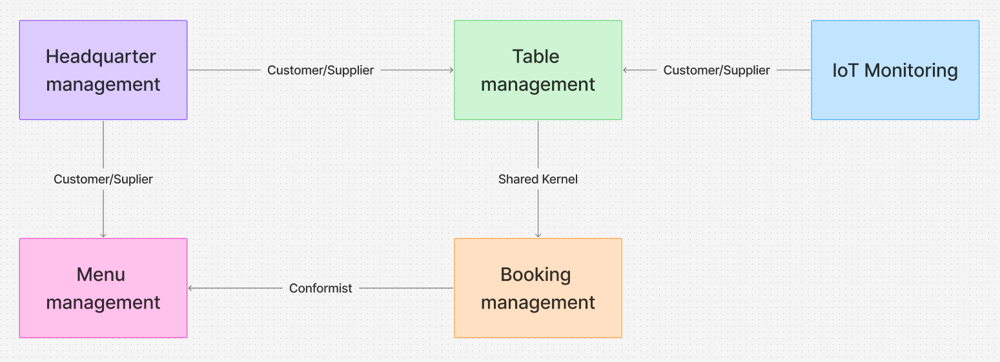

 

**Opción 2**

Esta alternativa propone unir los contextos de IoT Monitoring y Table Management en un solo bounded context. Al hacerlo, se elimina la necesidad de sincronización externa entre ambos, manteniendo relaciones similares con los demás contextos del sistema.   Esta combinación presenta ventajas como la simplificación de la arquitectura al disminuir la cantidad de bounded contexts, una comunicación más directa entre la detección de ocupación y la gestión de mesas.   No obstante, una desventajas es la combinación de responsabilidades distintas, ya que una parte se enfoca en la infraestructura de sensores y la otra en procesos administrativos. Esto podría dificultar que el personal de cafetería realice la instalación del sistema en menos de una hora sin ayuda técnica, y además genera el riesgo de que un solo contexto asuma demasiadas funciones.

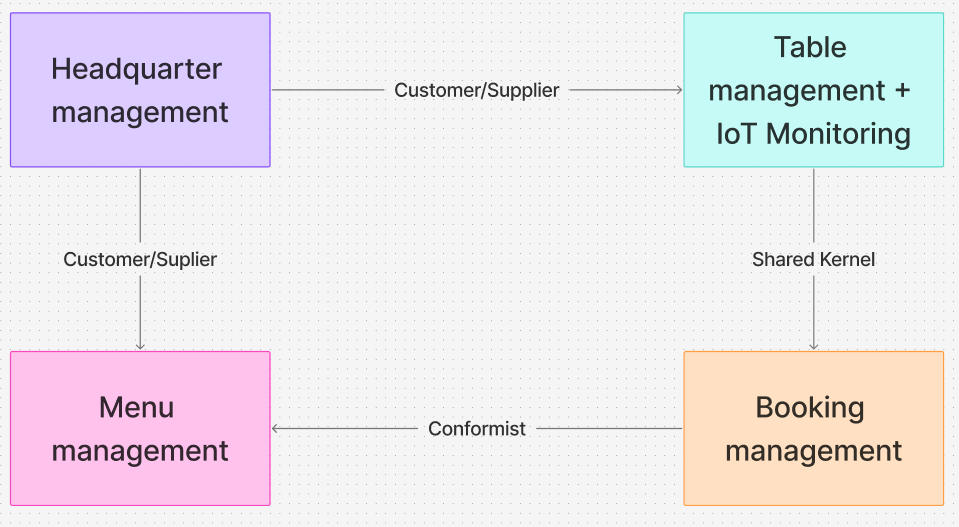

 

**Opcion 3** 

Esta alternativa propone una arquitectura compuesta por cinco bounded contexts bien definidos, con relaciones claras entre ellos. La estructura busca equilibrar la separación de responsabilidades, para permitir que el sistema escale y se mantenga con facilidad. Además, facilita la instalación sin asistencia técnica y asegura tiempos de respuesta adecuados, lo que contribuye directamente a mejorar la experiencia del cliente en el uso del sistema Tavolo.

* Headquarter Management se comunica con Menu Management y Table Management, proporcionando la información de las sedes. Menu Management adapta su contenido según cada sede, y Table Management utiliza la información organizativa que viene de Headquarter. En ambos casos, la relación es del tipo Customer/Supplier, donde Headquarter es el proveedor.

* Table Management y Booking Management comparten el modelo de “mesa” y su disponibilidad. Por eso, tienen una relación de tipo Shared Kernel, lo que asegura que ambos usen los mismos conceptos para evitar errores o confusión.

* Booking Management también se relaciona con Menu Management, pero en este caso la relación es Conformist. Booking utiliza información del menú, pero se adapta a su estructura sin modificarla.

* IoT Monitoring se conecta con Table Management mediante una Anti-corruption Layer. Esta capa traduce los datos que vienen de los sensores a un formato que Table Management pueda entender. Así, se protege el sistema de los detalles técnicos del IoT y se facilita la instalación del sistema sin ayuda especializada.

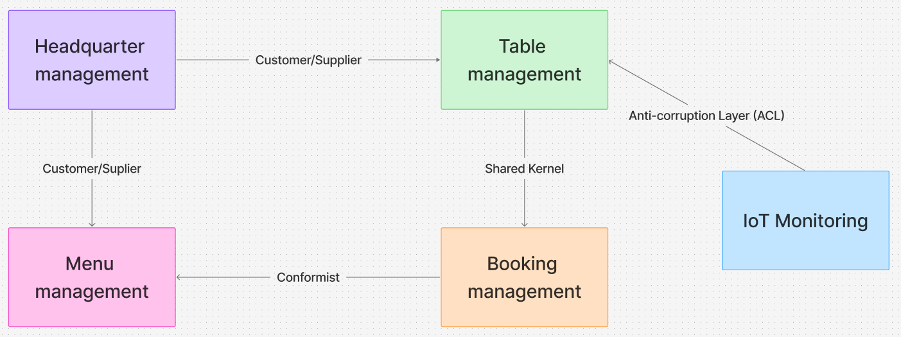

 

**Elección**  
Elegimos la **opción 3**, ya que proporciona el mejor equilibrio entre la separación de responsabilidades, la fácil de implementación y el cumplimiento de los requisitos del sistema.  
Al definir cinco bounded contexts con relaciones claras, se facilita la evolución independiente de cada parte del sistema, lo que mejora su escalabilidad y mantenibilidad. Además, al separar gestiones, como la de gestión de IoT mediante una Anti-corruption Layer, se simplifica la instalación. Asimismo, esta estructura garantiza tiempos de respuesta rápidos y optimiza la gestión de mesas, reservas y menús, brindando una experiencia más fluida y eficiente para los usuarios y el personal.

### 4.1.3. Software Architecture.
En esta sección, se presenta y explica la representación de la arquitectura de software para Tavolo utilizando el C4 Model. A través de estos diagramas, se busca proporcionar una comprensión clara y accesible de la arquitectura de Tavolo, permitiendo a los miembros del equipo, stakeholders y futuros desarrolladores entiendan cómo se organiza y comunica el sistema a diferentes niveles.

#### 4.1.3.1. Software Architecture System Landscape Diagram.
Este diagrama muestra que Tavolo opera en un ecosistema compuesto por tres tipos de usuarios (Comensales, Administradores de Cafeterías y Super Administradores) que interactúan directamente con el sistema principal Tavolo App. El sistema se conecta con un servicio externo: Google Maps API para mostrar ubicaciones de cafeterías. Los Comensales usan Tavolo para reservar mesas y consultar menús, los Administradores de Cafeterías proporcionan información sobre menús y gestionan sus mesas, mientras que los Super Administradores (equipo de desarrollo) mantienen y actualizan el sistema. 
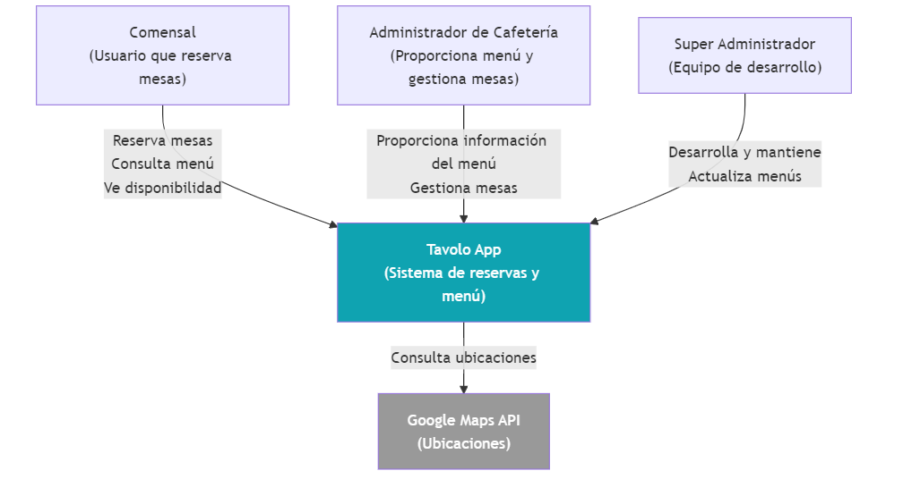 
#### 4.1.3.2. Software Architecture Context Level Diagrams.
Este diagrama muestra que el sistema Tavolo (representado como una única entidad) interactúa con tres tipos de usuarios: Comensales que utilizan el sistema para encontrar cafeterías, ver menús y realizar reservas; Administradores de Cafeterías que actualizan la información de menús y mesas; y Super Administradores que gestionan el mantenimiento general del sistema. Tavolo también se comunica con dos sistemas externos: Google Maps para mostrar ubicaciones geográficas de cafeterías y un sistema de Sensores IoT que proporciona datos en tiempo real sobre la ocupación de mesas en los establecimientos. 
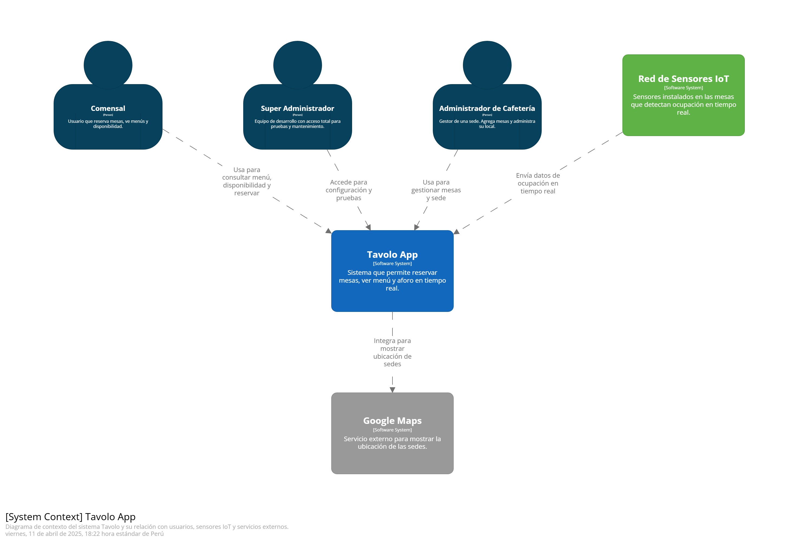 
#### 4.1.3.2. Software Architecture Container Level Diagrams.
Este diagrama muestra que el sistema Tavolo está compuesto por cuatro contenedores principales: una aplicación web accesible desde navegadores, una aplicación móvil para dispositivos portátiles, una API que gestiona toda la lógica de negocio y una base de datos que almacena la información del sistema. Además, incluye un módulo de sensores encargado de procesar los datos provenientes de dispositivos Arduino ubicados en las mesas. Por último, la API también se conecta con Google Maps, una aplicación externa, permitiendo que el comensal acceda a un mapa interactivo con las ubicaciones de las distintas sedes de la cafetería. 
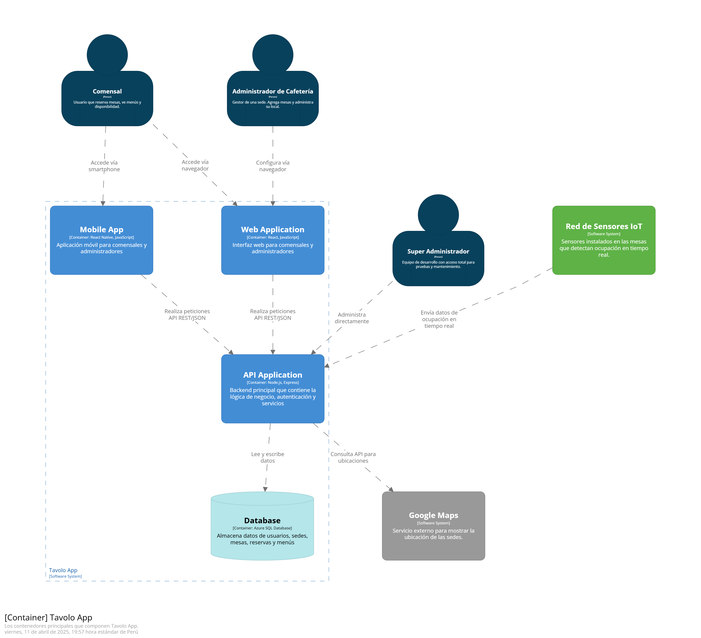 
#### 4.1.3.3. Software Architecture Deployment Diagrams.
Este diagrama muestra que el sistema Tavolo se despliega en tres entornos principales: Microsoft Azure Cloud, Dispositivos Cliente y Cafeterías físicas. En Azure, el sistema utiliza App Service para alojar la aplicación web frontend (WebStorm), otro App Service para la API (Spring Boot/Java) con documentación Swagger, Azure Database for PostgreSQL para los datos, y Azure IoT Hub para gestionar comunicaciones con dispositivos IoT. Los usuarios acceden al sistema a través de navegadores web o dispositivos Android. En cada cafetería, se instalan sensores Arduino en las mesas que envían datos de ocupación a un Gateway Arduino local, el cual transmite esta información al IoT Hub en Azure. Todas las comunicaciones entre componentes utilizan protocolos seguros como HTTPS, MQTT/TLS o conexiones PostgreSQL. 
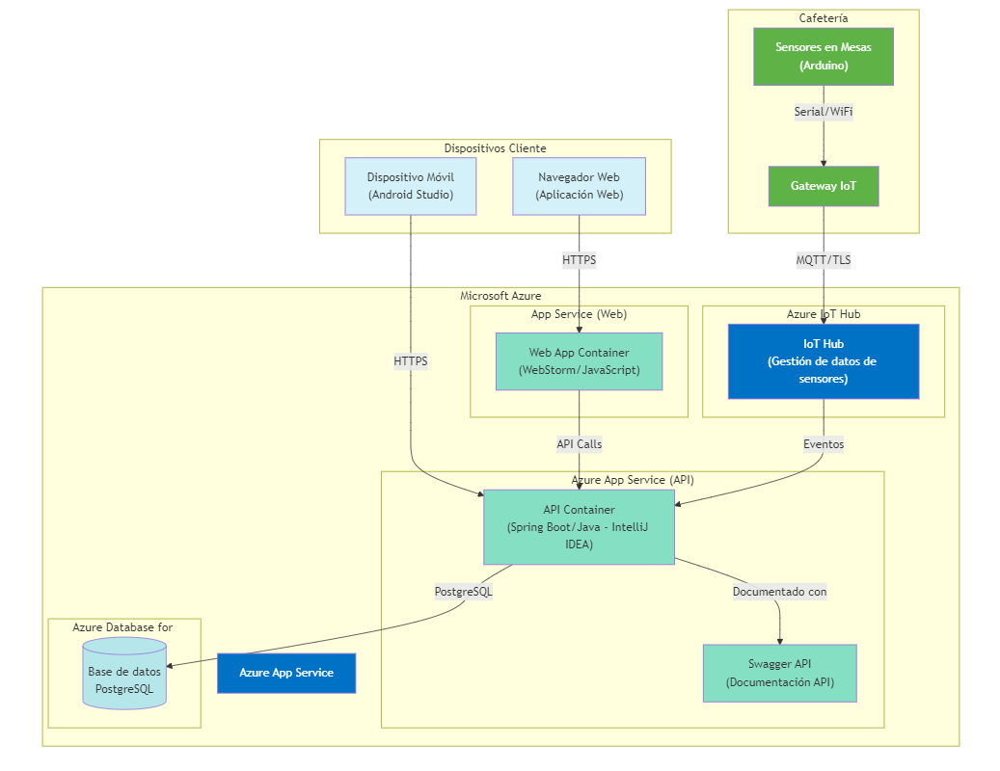 

## 4.2. Tactical-Level Domain-Driven-Design

### 4.2.1 Bounded Context: IAM Bounded Context

El **IAM (Identity and Access Management) Bounded Context** es responsable de gestionar la autenticación y la creación de usuarios en el sistema. Este contexto asegura que los usuarios puedan registrarse, iniciar sesión y gestionar sus credenciales de manera segura, cumpliendo con los estándares de seguridad y privacidad.

#### 4.2.1.1. Domain Layer

La **Domain Layer** del IAM Bounded Context encapsula la lógica de negocio relacionada con la autenticación y la gestión de usuarios. En esta capa, se definen los elementos principales del dominio, como agregados, entidades y objetos de valor, que representan los conceptos clave del sistema.

##### **Aggregates**
1. **User**
   - **Propósito**: El agregado principal es el usuario (`User`), que encapsula la lógica de negocio relacionada con la autenticación y la gestión de roles.
   - **Atributos**:
     - `username`: Identificador único del usuario, validado para cumplir con restricciones de longitud y unicidad.
     - `password`: Contraseña del usuario, almacenada de forma segura.
     - `roles`: Conjunto de roles asociados al usuario, representados como una relación `ManyToMany` con la entidad `Role`.
   - **Métodos**:
     - `addRole(Role role)`: Agrega un rol al usuario.
     - `addRoles(List<Role> roles)`: Agrega múltiples roles al usuario, validando que sean roles válidos.
   - **Características**:
     - Extiende `AuditableAbstractAggregateRoot`, lo que permite auditar cambios en los usuarios.
     - Gestiona la relación entre usuarios y roles, asegurando consistencia y validación.

##### **Entities**
1. **Role**
   - **Propósito**: La entidad `Role` representa los roles que pueden ser asignados a los usuarios.
   - **Atributos**:
     - `id`: Identificador único del rol.
     - `name`: Nombre del rol, representado como un valor enumerado (`Roles`).
   - **Métodos**:
     - `getDefaultRole()`: Devuelve el rol predeterminado (`ROLE_USER`).
     - `toRoleFromName(String name)`: Convierte un nombre de rol en una instancia de `Role`.
     - `validateRoleSet(List<Role> roles)`: Valida un conjunto de roles, asignando un rol predeterminado si el conjunto está vacío o es nulo.
   - **Características**:
     - Define una relación única entre los nombres de roles y sus representaciones en la base de datos.
     - Facilita la validación y asignación de roles a los usuarios.

##### **Value Objects**: 
1. **Roles**
   - **Propósito**: El objeto de valor `Roles` es una enumeración que define los roles disponibles en el sistema.
   - **Valores**:
     - `ROLE_ADMIN`: Rol de administrador.
     - `ROLE_SUPERVISOR`: Rol de supervisor.
     - `ROLE_USER`: Rol de usuario estándar.
   - **Características**:
     - Representa roles como valores inmutables, asegurando consistencia en su uso dentro del dominio.

En conjunto, estos elementos permiten modelar de manera robusta y segura la lógica de negocio relacionada con la autenticación y la gestión de usuarios, asegurando que las reglas del dominio se cumplan de manera consistente.

#### 4.2.1.2. Interface Layer

La **Interface Layer** del IAM Bounded Context expone los puntos de entrada al sistema a través de controladores REST. Estos controladores permiten la interacción con las entidades del dominio mediante solicitudes HTTP, facilitando la comunicación entre los clientes y el sistema. Además, esta capa incluye recursos y transformadores que aseguran una representación adecuada de los datos y su conversión entre las capas de la aplicación.

#### **Controllers**

Los controladores son responsables de manejar las solicitudes HTTP y delegar la lógica de negocio a los servicios correspondientes. A continuación, se describen los principales controladores:

1. **UsersController**
   - **Propósito**: Gestiona las operaciones relacionadas con los usuarios.
   - **Endpoints**:
     - `GET /api/v1/users`: Obtiene la lista de todos los usuarios.
     - `GET /api/v1/users/{userId}`: Obtiene los detalles de un usuario específico por su ID.
   - **Dependencias**:
     - `UserQueryService`: Servicio encargado de manejar las consultas relacionadas con los usuarios.

2. **RolesController**
   - **Propósito**: Gestiona las operaciones relacionadas con los roles.
   - **Endpoints**:
     - `GET /api/v1/roles`: Obtiene la lista de todos los roles disponibles.
   - **Dependencias**:
     - `RoleQueryService`: Servicio encargado de manejar las consultas relacionadas con los roles.

3. **AuthenticationController**
   - **Propósito**: Gestiona las operaciones de autenticación y registro de usuarios.
   - **Endpoints**:
     - `POST /api/v1/authentication/sign-up`: Registra un nuevo usuario en el sistema.
     - `POST /api/v1/authentication/sign-in`: Autentica a un usuario y genera un token de acceso.
   - **Dependencias**:
     - `UserCommandService`: Servicio encargado de manejar los comandos relacionados con los usuarios.

#### **Resources**

Los recursos representan los datos que se exponen a través de la API REST. Estos recursos son utilizados para estructurar las respuestas de los controladores y asegurar una representación clara y consistente de los datos. A continuación, se describen los principales recursos:

1. **UserResource**
   Representa un usuario en el sistema.
   - **Atributos**:
     - `id`: Identificador único del usuario.
     - `username`: Nombre de usuario.
     - `roles`: Lista de roles asociados al usuario.

1. **RoleResource**
   Representa un rol en el sistema.
   - **Atributos**:
     - `id`: Identificador único del rol.
     - `name`: Nombre del rol.

2. **AuthenticatedUserResource**
   Representa un usuario autenticado junto con su token de acceso.
   - **Atributos**:
     - `id`: Identificador único del usuario.
     - `username`: Nombre de usuario.
     - `token`: Token de acceso generado.

3. **SignUpResource**
   Representa los datos necesarios para registrar un nuevo usuario.
   - **Atributos**:
     - `username`: Nombre de usuario.
     - `password`: Contraseña.
     - `roles`: Lista de roles asignados al usuario.

4. **SignInResource**
   Representa los datos necesarios para autenticar a un usuario.
   - **Atributos**:
     - `username`: Nombre de usuario.
     - `password`: Contraseña.

#### **Transformers**

Los transformadores son responsables de convertir las entidades del dominio en recursos y viceversa. Esto asegura que los datos expuestos a través de la API REST sean consistentes y estén en el formato esperado. A continuación, se describen los principales transformadores:

1. **UserResourceFromEntityAssembler**
   Convierte una entidad `User` en un recurso `UserResource`.
   - **Método principal**:
     - `toResourceFromEntity(User entity)`: Transforma un usuario del dominio en un recurso.

1. **RoleResourceFromEntityAssembler**
   Convierte una entidad `Role` en un recurso `RoleResource`.
   - **Método principal**:
     - `toResourceFromEntity(Role entity)`: Transforma un rol del dominio en un recurso.

1. **AuthenticatedUserResourceFromEntityAssembler**
   Convierte una entidad `User` y un token en un recurso `AuthenticatedUserResource`.
   - **Método principal**:
     - `toResourceFromEntity(User entity, String token)`: Transforma un usuario autenticado en un recurso.

1. **SignUpCommandFromResourceAssembler**
   Convierte un recurso `SignUpResource` en un comando `SignUpCommand`.
   - **Método principal**:
     - `toCommandFromResource(SignUpResource resource)`: Transforma los datos de registro en un comando.

1. **SignInCommandFromResourceAssembler**
   Convierte un recurso `SignInResource` en un comando `SignInCommand`.
   - **Método principal**:
     - `toCommandFromResource(SignInResource resource)`: Transforma los datos de inicio de sesión en un comando.

#### **Relaciones entre componentes**

- Los controladores utilizan los servicios de consulta (`UserQueryService`, `RoleQueryService`) y de comandos (`UserCommandService`) para delegar la lógica de negocio.
- Los transformadores convierten las entidades del dominio en recursos para las respuestas HTTP y viceversa para las solicitudes entrantes.
- Los recursos estructuran los datos expuestos a los clientes, asegurando una representación clara y consistente.

Esta estructura asegura que la **Interface Layer** sea modular, reutilizable y fácil de mantener, facilitando la interacción entre los clientes y el sistema.

#### 4.2.1.3 Application Layer

La **Application Layer** del IAM Bounded Context actúa como un intermediario entre la **Domain Layer** y las capas externas, como la **Interface Layer** y la **Infrastructure Layer**. Su propósito principal es coordinar las operaciones de negocio, manejar comandos y consultas, y orquestar la lógica de aplicación sin exponer directamente los detalles del dominio.

#### **Command Services**
Los servicios de comandos son responsables de ejecutar operaciones que modifican el estado del sistema. A continuación, se describen los principales servicios de comandos:

1. **RoleCommandServiceImpl**
   - **Propósito**: Gestiona las operaciones relacionadas con los roles, como la creación inicial de roles en el sistema.
   - **Métodos principales**:
     - `handle(SeedRolesCommand command)`: Verifica si los roles predefinidos existen en el sistema y los crea si no están presentes.
   - **Dependencias**:
     - `RoleRepository`: Interactúa con la base de datos para verificar y guardar roles.

2. **UserCommandServiceImpl**
   - **Propósito**: Gestiona las operaciones relacionadas con los usuarios, como el registro y la autenticación.
   - **Métodos principales**:
     - `handle(SignUpCommand command)`: Registra un nuevo usuario en el sistema, asignándole roles y almacenando su contraseña de forma segura.
     - `handle(SignInCommand command)`: Autentica a un usuario verificando sus credenciales y generando un token de acceso.
   - **Dependencias**:
     - `UserRepository`: Interactúa con la base de datos para guardar y recuperar usuarios.
     - `HashingService`: Codifica y verifica contraseñas.
     - `TokenService`: Genera y valida tokens de acceso.
     - `RoleRepository`: Recupera roles asignados a los usuarios.

#### **Query Services**
Los servicios de consultas son responsables de recuperar información del sistema sin modificar su estado. A continuación, se describen los principales servicios de consultas:

1. **RoleQueryServiceImpl**
   - **Propósito**: Gestiona las consultas relacionadas con los roles.
   - **Métodos principales**:
     - `handle(GetAllRolesQuery query)`: Recupera todos los roles disponibles en el sistema.
     - `handle(GetRoleByNameQuery query)`: Recupera un rol específico por su nombre.
   - **Dependencias**:
     - `RoleRepository`: Interactúa con la base de datos para recuperar roles.

2. **UserQueryServiceImpl**
   - **Propósito**: Gestiona las consultas relacionadas con los usuarios.
   - **Métodos principales**:
     - `handle(GetAllUsersQuery query)`: Recupera todos los usuarios registrados en el sistema.
     - `handle(GetUserByIdQuery query)`: Recupera un usuario específico por su ID.
     - `handle(GetUserByUsernameQuery query)`: Recupera un usuario específico por su nombre de usuario.
   - **Dependencias**:
     - `UserRepository`: Interactúa con la base de datos para recuperar usuarios.

#### **Relaciones entre componentes**
- Los **Command Services** interactúan con los repositorios para modificar el estado del sistema y con los servicios externos para operaciones auxiliares, como el hashing de contraseñas y la generación de tokens.
- Los **Query Services** interactúan únicamente con los repositorios para recuperar información del sistema.

Esta estructura asegura que la **Application Layer** sea modular, reutilizable y fácil de mantener, permitiendo una separación clara de responsabilidades y facilitando la evolución del sistema.

#### 4.2.1.4. Infrastructure Layer 
La **Infrastructure Layer** del IAM Bounded Context proporciona las implementaciones técnicas necesarias para soportar las operaciones del sistema. Esta capa incluye configuraciones de seguridad, servicios de hashing, manejo de tokens, repositorios para la persistencia de datos y componentes relacionados con la autorización y autenticación. Su objetivo principal es conectar la lógica de negocio con los recursos externos, como bases de datos, servicios de seguridad y APIs externas.

#### **Persistencia (JPA Repositories)**

1. **RoleRepository**
   - **Propósito**: Proporciona métodos para interactuar con la base de datos de roles.
   - **Métodos principales**:
     - `findByName`: Busca un rol por su nombre.
     - `existsByName`: Verifica si un rol existe en la base de datos.

2. **UserRepository**
   - **Propósito**: Proporciona métodos para interactuar con la base de datos de usuarios.
   - **Métodos principales**:
     - `findByUsername`: Busca un usuario por su nombre de usuario.
     - `existsByUsername`: Verifica si un usuario existe en la base de datos.

#### **Relaciones entre componentes**
   - **Persistencia**: Los repositorios (`RoleRepository`, `UserRepository`) proporcionan acceso a los datos almacenados en la base de datos, permitiendo a las capas superiores interactuar con las entidades del dominio.

Esta estructura asegura que la **Infrastructure Layer** sea modular, reutilizable y fácil de mantener, facilitando la integración con otros sistemas y servicios externos.

#### 4.2.1.5. Bounded Context Software Architecture Component Level Diagrams

En esta sección se presenta el diagrama de componentes del **IAM Bounded Context**, el cual detalla los principales módulos y sus interacciones dentro del contexto delimitado. Este diagrama sigue el enfoque del C4 Model para representar los componentes clave, como servicios de aplicación, controladores, repositorios y servicios externos, junto con sus relaciones.

El propósito de este diagrama es proporcionar una visión clara y estructurada de cómo se organizan los componentes dentro del contexto, facilitando la comprensión de su arquitectura y permitiendo identificar puntos de integración y responsabilidades.

El **IAM Bounded Context** está compuesto por los siguientes módulos principales:

1. **Application Layer**:
   - Coordina las operaciones de negocio relacionadas con la autenticación y la gestión de usuarios.
   - Incluye servicios de comandos y consultas que interactúan con la **Domain Layer** y la **Infrastructure Layer**.
   - Maneja eventos relacionados con el registro de usuarios, la asignación de roles y la autenticación.

2. **Interface Layer**:
   - Expone los puntos de entrada al sistema a través de controladores REST.
   - Incluye recursos y transformadores que aseguran una representación adecuada de los datos y su conversión entre las capas de la aplicación.
   - Proporciona endpoints para operaciones como el registro de usuarios, la autenticación y la consulta de roles.

3. **Domain Layer**:
   - Encapsula la lógica de negocio relacionada con la autenticación y la gestión de usuarios.
   - Define los agregados, entidades y objetos de valor que representan los conceptos clave del dominio, como usuarios, roles y permisos.
   - Asegura que las reglas de negocio, como la validación de contraseñas y la asignación de roles, se cumplan de manera consistente.

4. **Infrastructure Layer**:
   - Proporciona las implementaciones técnicas necesarias para soportar las operaciones del sistema.
   - Incluye repositorios para la persistencia de datos y componentes que conectan la lógica de negocio con los recursos externos, como bases de datos y servicios de seguridad.
   - Implementa servicios auxiliares como el hashing de contraseñas y la generación de tokens de autenticación.

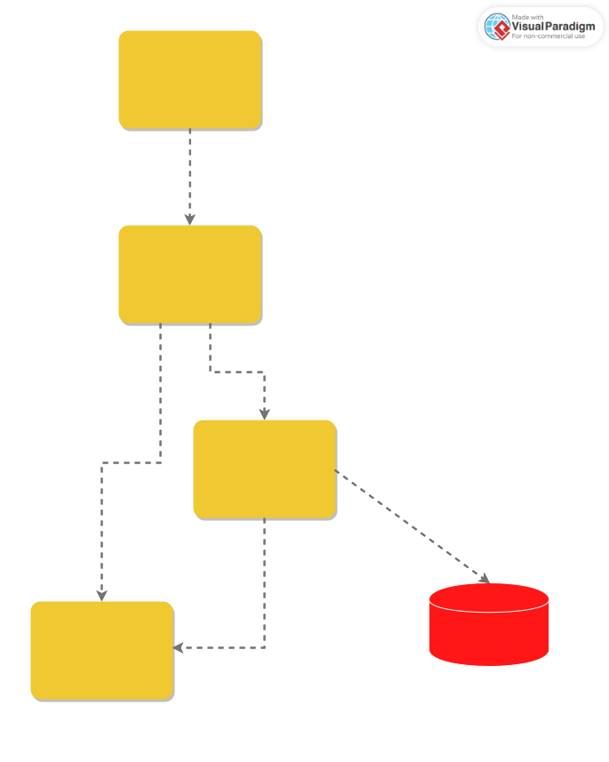 

#### 4.2.1.6. Bounded Context Software Architecture Code Level Diagrams

En este apartado se presentan los diagramas que ofrecen un mayor nivel de detalle sobre la implementación de los componentes del **IAM Bounded Context**. Estos diagramas están diseñados para ilustrar cómo se estructuran las clases, interfaces y relaciones dentro de las capas del contexto, proporcionando una visión técnica que facilita el desarrollo, mantenimiento y evolución del sistema.

##### 4.2.1.6.1. Bounded Context Domain Layer Class Diagrams

El diagrama de clases correspondiente a la **Domain Layer** del **IAM Bounded Context** incluye las clases principales, como agregados, entidades y objetos de valor, así como las interfaces y enumeraciones que definen el comportamiento del dominio. También se destacan las relaciones entre estos elementos, como asociaciones, composiciones y dependencias.

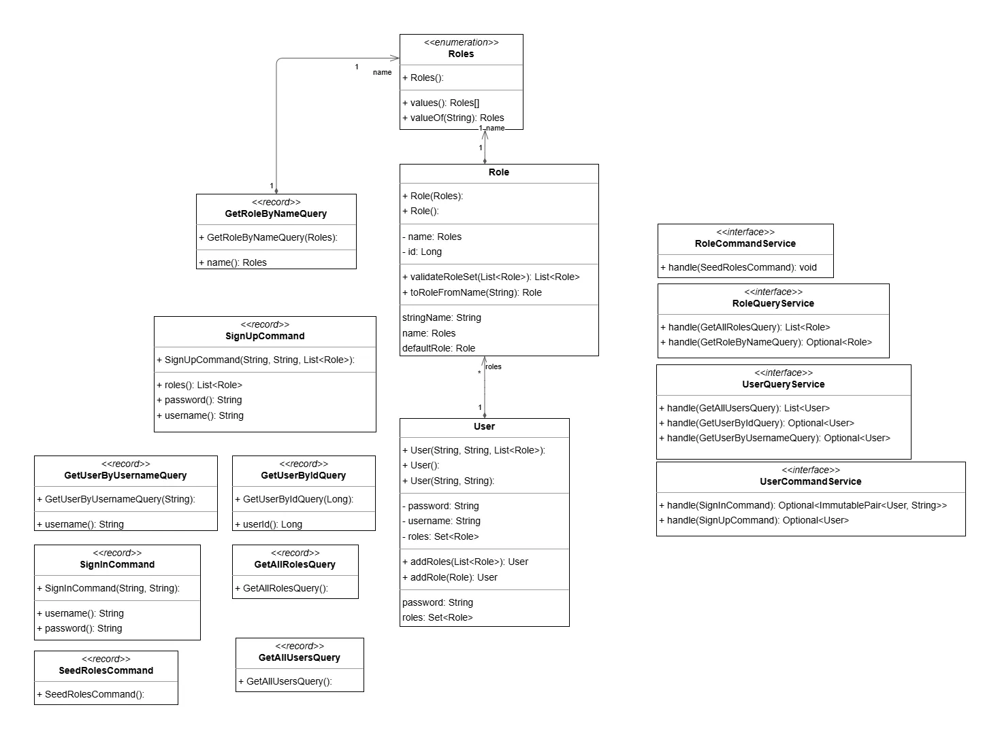 

**Elementos principales del diagrama:**

1. **Aggregates**:
   - `User`: Agregado principal que encapsula la lógica de negocio relacionada con la autenticación y la gestión de usuarios. Incluye atributos como `username`, `password` y `roles`.
     - **Atributos**:
       - `username`: Identificador único del usuario.
       - `password`: Contraseña almacenada de forma segura.
       - `roles`: Lista de roles asignados al usuario.
     - **Métodos**:
       - `addRole(Role role)`: Agrega un rol al usuario.
       - `addRoles(List<Role> roles)`: Agrega múltiples roles al usuario, validando que sean válidos.

2. **Entities**:
   - `Role`: Representa los roles que pueden ser asignados a los usuarios.
     - **Atributos**:
       - `id`: Identificador único del rol.
       - `name`: Nombre del rol.
     - **Métodos**:
       - `getDefaultRole()`: Devuelve el rol predeterminado (`ROLE_USER`).
       - `validateRoleSet(List<Role> roles)`: Valida un conjunto de roles asignados.

3. **Value Objects**:
   - `Roles`: Enumeración que define los roles disponibles en el sistema (`ROLE_ADMIN`, `ROLE_SUPERVISOR`, `ROLE_USER`).
   - `Password`: Representa la contraseña del usuario, asegurando que cumpla con las políticas de seguridad.
   - `Token`: Representa un token de autenticación generado para un usuario.

**Relaciones destacadas:**
- El agregado `User` gestiona las relaciones con la entidad `Role`, asegurando que los usuarios tengan roles válidos asignados.
- Los objetos de valor encapsulan datos inmutables y validaciones específicas, como la seguridad de contraseñas y la unicidad de roles.
- La entidad `Role` define los permisos y responsabilidades que pueden ser asignados a los usuarios.

##### 4.2.1.6.2. Bounded Context Database Design Diagram.

El diseño de la base de datos para el **IAM Bounded Context** refleja la estructura del dominio, asegurando que las entidades y relaciones definidas en la **Domain Layer** se representen de manera eficiente en el modelo relacional. 

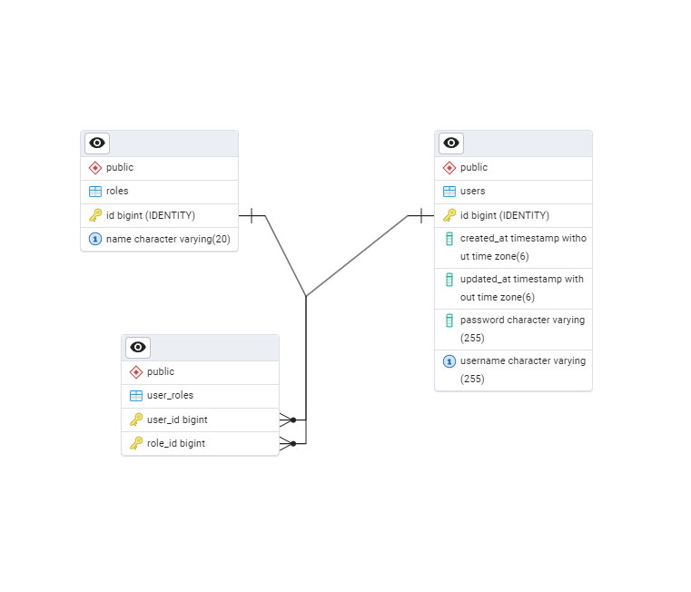 

**Este diseño incluye las siguientes tablas principales:**

1. **Users**:
   - Representa los usuarios registrados en el sistema.
   - **Atributos principales**:
     - `id`: Identificador único del usuario.
     - `username`: Nombre de usuario único.
     - `password`: Contraseña almacenada de forma segura.
     - `created_at`: Fecha de creación del usuario.

2. **Roles**:
   - Representa los roles disponibles en el sistema.
   - **Atributos principales**:
     - `id`: Identificador único del rol.
     - `name`: Nombre del rol.

3. **UserRoles**:
   - Representa la relación entre usuarios y roles.
   - **Atributos principales**:
     - `user_id`: Identificador del usuario.
     - `role_id`: Identificador del rol.

Este diseño asegura que las operaciones relacionadas con la autenticación y la gestión de usuarios sean eficientes y consistentes, facilitando la integración con la lógica de negocio definida en la **Domain Layer**.

### 4.2.3 Bounded Context: Branching Bounded Context

El **Branching Bounded Context** es responsable de gestionar la información de las sedes (headquarters) del sistema Tavolo. Este contexto asegura que las sedes puedan ser registradas, actualizadas y gestionadas de manera eficiente, incluyendo detalles como horarios de atención, ubicación geográfica, información de contacto y dirección. Este contexto es clave para garantizar que las operaciones relacionadas con las sedes sean consistentes y cumplan con los estándares de calidad y precisión requeridos.

#### 4.2.3.1. Domain Layer

La **Domain Layer** del Branching Bounded Context encapsula la lógica de negocio relacionada con la gestión de sedes. En esta capa, se definen los elementos principales del dominio, como agregados, entidades y objetos de valor, que representan los conceptos clave del sistema.

La **Domain Layer** del Branching Bounded Context encapsula la lógica de negocio relacionada con la gestión de sedes. En esta capa, se definen los elementos principales del dominio, como agregados, entidades y objetos de valor, que representan los conceptos clave del sistema.

##### **Aggregates**
1. **Headquarter**
   - **Propósito**: El agregado principal es la sede (`Headquarter`), que encapsula la lógica de negocio relacionada con la gestión de información de las sedes.
   - **Atributos**:
     - `name`: Nombre de la sede, representado como un objeto de valor `NameHeadquarter`.
     - `contactNumbers`: Números de contacto de la sede, representados como un objeto de valor `ContactNumbers`.
     - `coordinates`: Coordenadas geográficas de la sede, representadas como un objeto de valor `Coordinates`.
     - `schedule`: Horarios de atención de la sede, representados como una entidad `Schedule`.
     - `address`: Dirección de la sede, representada como un objeto de valor `StreetAddress`.
   - **Métodos**:
     - `getOpeningTime()`: Devuelve la hora de apertura de la sede.
     - `getClosingTime()`: Devuelve la hora de cierre de la sede.
     - `getIntervalMinutes()`: Devuelve el intervalo de tiempo en minutos entre reservas.
   - **Características**:
     - Extiende `AuditableAbstractAggregateRoot`, lo que permite auditar cambios en las sedes.
     - Gestiona la relación entre los horarios, la dirección y los datos de contacto de la sede, asegurando consistencia y validación.

##### **Entities**
1. **Schedule**
   - **Propósito**: Representa los horarios de atención de una sede.
   - **Atributos**:
     - `businessHours`: Horarios de apertura y cierre, representados como un objeto de valor `BusinessHours`.
     - `intervalMinutes`: Intervalo de tiempo en minutos entre reservas.
   - **Características**:
     - Permite definir y validar los horarios de atención de la sede.
     - Incluye validaciones para garantizar que los horarios sean consistentes (por ejemplo, la hora de apertura no puede ser posterior a la hora de cierre).

##### **Value Objects**
1. **BusinessHours**
   - **Propósito**: Representa los horarios de apertura y cierre de una sede.
   - **Atributos**:
     - `openingTime`: Hora de apertura.
     - `closingTime`: Hora de cierre.
   - **Validaciones**:
     - La hora de apertura no puede ser nula.
     - La hora de cierre no puede ser nula.
     - La hora de apertura no puede ser posterior a la hora de cierre.

2. **ContactNumbers**
   - **Propósito**: Representa los números de contacto de una sede.
   - **Atributos**:
     - `landlinePhone`: Número de teléfono fijo.
     - `mobilePhone`: Número de teléfono móvil.
   - **Validaciones**:
     - Ambos números deben ser válidos y no nulos.

3. **Coordinates**
   - **Propósito**: Representa las coordenadas geográficas de una sede.
   - **Atributos**:
     - `latitude`: Latitud de la sede.
     - `longitude`: Longitud de la sede.
   - **Validaciones**:
     - La latitud y la longitud no pueden ser nulas.

4. **NameHeadquarter**
   - **Propósito**: Representa el nombre de una sede.
   - **Atributos**:
     - `name`: Nombre de la sede.
   - **Validaciones**:
     - El nombre no puede ser nulo ni vacío.
     - El nombre debe cumplir con un formato válido (solo letras y espacios).

5. **StreetAddress**
   - **Propósito**: Representa la dirección de una sede.
   - **Atributos**:
     - `street`: Calle.
     - `number`: Número de la dirección.
     - `city`: Ciudad.
     - `postalCode`: Código postal.
     - `country`: País.
   - **Validaciones**:
     - Los campos `street`, `city`, `postalCode` y `country` no pueden ser nulos ni vacíos.
     - La calle debe cumplir con un formato válido (solo letras, espacios y puntos).

#### **Relaciones entre componentes**
- El agregado `Headquarter` actúa como el núcleo del dominio, gestionando las relaciones con los objetos de valor (`NameHeadquarter`, `ContactNumbers`, `Coordinates`, `StreetAddress`) y la entidad `Schedule`.
- Los objetos de valor encapsulan datos inmutables y validaciones específicas, asegurando consistencia en el dominio.
- La entidad `Schedule` permite modelar horarios complejos, incluyendo intervalos de tiempo entre reservas.

Esta estructura asegura que la lógica de negocio relacionada con la gestión de sedes sea robusta, consistente y fácil de mantener, cumpliendo con los requisitos del sistema.

#### 4.2.3.2. Interface Layer

La **Interface Layer** del Branching Bounded Context expone los puntos de entrada al sistema a través de controladores REST y una ACL (Access Control Layer). Esta capa permite la interacción con las entidades del dominio mediante solicitudes HTTP, facilitando la comunicación entre los clientes y el sistema. Además, incluye recursos y transformadores que aseguran una representación adecuada de los datos y su conversión entre las capas de la aplicación.

#### **Access Control Layer (ACL)**

1. **HeadquarterContextFacade**
   - **Propósito**: Proporciona una interfaz simplificada para interactuar con el dominio del Branching Bounded Context desde otros contextos. Permite consultar información clave de las sedes, como horarios de apertura y cierre, intervalos de servicio y existencia de una sede.
   - **Métodos principales**:
     - `getOpeningTime(Long headquarterId)`: Devuelve la hora de apertura de una sede.
     - `getClosingTime(Long headquarterId)`: Devuelve la hora de cierre de una sede.
     - `getIntervalMinutes(Long headquarterId)`: Devuelve el intervalo de servicio en minutos de una sede.
     - `existsHeadquarter(Long headquarterId)`: Verifica si una sede existe en el sistema.
   - **Dependencias**:
     - `HeadquarterQueryService`: Servicio encargado de manejar las consultas relacionadas con las sedes.

#### **Controllers**

Los controladores son responsables de manejar las solicitudes HTTP y delegar la lógica de negocio a los servicios correspondientes. A continuación, se describen los principales controladores:

1. **HeadquarterController**
   - **Propósito**: Gestiona las operaciones relacionadas con las sedes.
   - **Endpoints**:
     - `POST /api/v1/headquarters`: Crea una nueva sede.
     - `GET /api/v1/headquarters/{headquarterId}`: Obtiene los detalles de una sede específica por su ID.
     - `GET /api/v1/headquarters`: Obtiene la lista de todas las sedes.
   - **Dependencias**:
     - `HeadquarterCommandService`: Servicio encargado de manejar los comandos relacionados con las sedes.
     - `HeadquarterQueryService`: Servicio encargado de manejar las consultas relacionadas con las sedes.

#### **Resources**

Los recursos representan los datos que se exponen a través de la API REST. Estos recursos son utilizados para estructurar las respuestas de los controladores y asegurar una representación clara y consistente de los datos. A continuación, se describen los principales recursos:

1. **CreateHeadquarterResource**
   - **Propósito**: Representa los datos necesarios para crear una nueva sede.
   - **Atributos**:
     - `name`: Nombre de la sede.
     - `landlinePhone`: Número de teléfono fijo.
     - `mobilePhone`: Número de teléfono móvil.
     - `latitude`: Latitud de la sede.
     - `longitude`: Longitud de la sede.
     - `street`: Calle de la dirección.
     - `number`: Número de la dirección.
     - `city`: Ciudad.
     - `postalCode`: Código postal.
     - `country`: País.
     - `openingTime`: Hora de apertura.
     - `closingTime`: Hora de cierre.
     - `intervalMinutes`: Intervalo de servicio en minutos.

2. **HeadquarterResource**
   - **Propósito**: Representa una sede en el sistema.
   - **Atributos**:
     - `id`: Identificador único de la sede.
     - `name`: Nombre de la sede.
     - `landlinePhone`: Número de teléfono fijo.
     - `mobilePhone`: Número de teléfono móvil.
     - `latitude`: Latitud de la sede.
     - `longitude`: Longitud de la sede.
     - `streetAddress`: Dirección completa de la sede.
     - `openingTime`: Hora de apertura.
     - `closingTime`: Hora de cierre.
     - `intervalMinutes`: Intervalo de servicio en minutos.

#### **Transformers**

Los transformadores son responsables de convertir las entidades del dominio en recursos y viceversa. Esto asegura que los datos expuestos a través de la API REST sean consistentes y estén en el formato esperado. A continuación, se describen los principales transformadores:

1. **CreateHeadquarterCommandFromResourceAssembler**
   - **Propósito**: Convierte un recurso `CreateHeadquarterResource` en un comando `CreateHeadquarterCommand`.
   - **Método principal**:
     - `toCommandFromResource(CreateHeadquarterResource resource)`: Transforma los datos de creación de una sede en un comando.

2. **HeadquarterResourceFromEntityAssembler**
   - **Propósito**: Convierte una entidad `Headquarter` en un recurso `HeadquarterResource`.
   - **Método principal**:
     - `toResourceFromEntity(Headquarter entity)`: Transforma una sede del dominio en un recurso.

#### **Relaciones entre componentes**

- El **HeadquarterController** utiliza los servicios de comandos (`HeadquarterCommandService`) y consultas (`HeadquarterQueryService`) para delegar la lógica de negocio.
- La **ACL (HeadquarterContextFacade)** proporciona una interfaz simplificada para consultar información clave de las sedes desde otros contextos.
- Los transformadores convierten las entidades del dominio en recursos para las respuestas HTTP y viceversa para las solicitudes entrantes.
- Los recursos estructuran los datos expuestos a los clientes, asegurando una representación clara y consistente.

Esta estructura asegura que la **Interface Layer** sea modular, reutilizable y fácil de mantener, facilitando la interacción entre los clientes y el sistema.

#### 4.2.3.4. Infrastructure Layer

La **Infrastructure Layer** del Branching Bounded Context proporciona las implementaciones técnicas necesarias para soportar las operaciones del sistema relacionadas con la gestión de sedes. Esta capa incluye repositorios para la persistencia de datos y componentes que conectan la lógica de negocio con los recursos externos, como bases de datos. Su objetivo principal es garantizar que las operaciones de almacenamiento y recuperación de información sean eficientes, consistentes y seguras.

#### **Persistencia (JPA Repositories)**

1. **HeadquarterRepository**
   - **Propósito**: Proporciona métodos para interactuar con la base de datos de sedes.
   - **Métodos principales**:
     - `existsByName(NameHeadquarter name)`: Verifica si existe una sede con un nombre específico.
     - `existsByCoordinates(Coordinates coordinates)`: Verifica si existe una sede en una ubicación geográfica específica.
   - **Características**:
     - Extiende `JpaRepository`, lo que permite realizar operaciones CRUD (Crear, Leer, Actualizar, Eliminar) sobre las entidades `Headquarter`.
     - Facilita la validación de unicidad para nombres y coordenadas de sedes, asegurando que no haya duplicados en el sistema.

#### **Relaciones entre componentes**

- **Persistencia**: El repositorio `HeadquarterRepository` proporciona acceso a los datos almacenados en la base de datos, permitiendo a las capas superiores (como la **Application Layer**) interactuar con las entidades del dominio.
- **Validación**: Los métodos `existsByName` y `existsByCoordinates` son utilizados para validar la unicidad de las sedes durante las operaciones de creación o actualización, asegurando la consistencia de los datos.

La **Infrastructure Layer** del Branching Bounded Context asegura que las operaciones relacionadas con la persistencia de datos sean robustas y confiables. Al proporcionar un repositorio especializado para las sedes, esta capa facilita la integración con la base de datos y garantiza que las reglas de negocio, como la unicidad de nombres y ubicaciones, se cumplan de manera eficiente. Esta estructura modular y reutilizable permite que el sistema sea escalable y fácil de mantener.

#### 4.2.3.5. Bounded Context Software Architecture Component Level Diagrams

En esta sección se presenta el diagrama de componentes del **Branching Bounded Context**, el cual detalla los principales módulos y sus interacciones dentro del contexto delimitado. Este diagrama sigue el enfoque del C4 Model para representar los componentes clave, como servicios de aplicación, controladores, repositorios y servicios externos, junto con sus relaciones.

El propósito de este diagrama es proporcionar una visión clara y estructurada de cómo se organizan los componentes dentro del contexto, facilitando la comprensión de su arquitectura y permitiendo identificar puntos de integración y responsabilidades. 

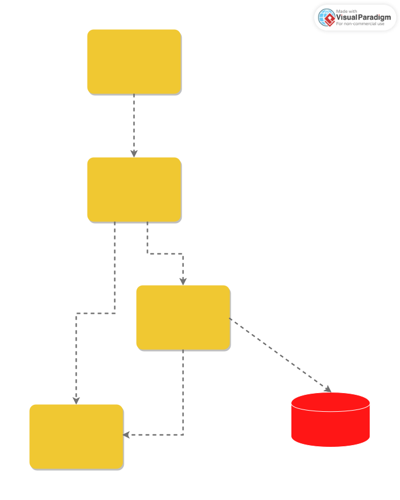 

El **Branching Bounded Context** está compuesto por los siguientes módulos principales:

1. **Application Layer**:
   - Coordina las operaciones de negocio relacionadas con la gestión de sedes.
   - Incluye servicios de comandos y consultas que interactúan con la **Domain Layer** y la **Infrastructure Layer**.
   - Maneja eventos relacionados con la creación y actualización de sedes.

2. **Interface Layer**:
   - Expone los puntos de entrada al sistema a través de controladores REST.
   - Incluye recursos y transformadores que aseguran una representación adecuada de los datos y su conversión entre las capas de la aplicación.

3. **Domain Layer**:
   - Encapsula la lógica de negocio relacionada con la gestión de sedes.
   - Define los agregados, entidades y objetos de valor que representan los conceptos clave del dominio.

4. **Infrastructure Layer**:
   - Proporciona las implementaciones técnicas necesarias para soportar las operaciones del sistema.
   - Incluye repositorios para la persistencia de datos y componentes que conectan la lógica de negocio con los recursos externos, como bases de datos.

#### 4.2.3.6. Bounded Context Software Architecture Code Level Diagrams

En este apartado se presentan los diagramas que ofrecen un mayor nivel de detalle sobre la implementación de los componentes del **Branching Bounded Context**. Estos diagramas están diseñados para ilustrar cómo se estructuran las clases, interfaces y relaciones dentro de las capas del contexto, proporcionando una visión técnica que facilita el desarrollo, mantenimiento y evolución del sistema.

##### 4.2.3.6.1. Bounded Context Domain Layer Class Diagrams

El diagrama de clases correspondiente a la **Domain Layer** del **Branching Bounded Context** incluye las clases principales, como agregados, entidades y objetos de valor, así como las interfaces y enumeraciones que definen el comportamiento del dominio. También se destacan las relaciones entre estos elementos, como asociaciones, composiciones y dependencias.

El objetivo de este diagrama es proporcionar una representación detallada de la lógica de negocio encapsulada en la capa del dominio, asegurando que las reglas del negocio estén claramente definidas y alineadas con los requisitos del sistema.

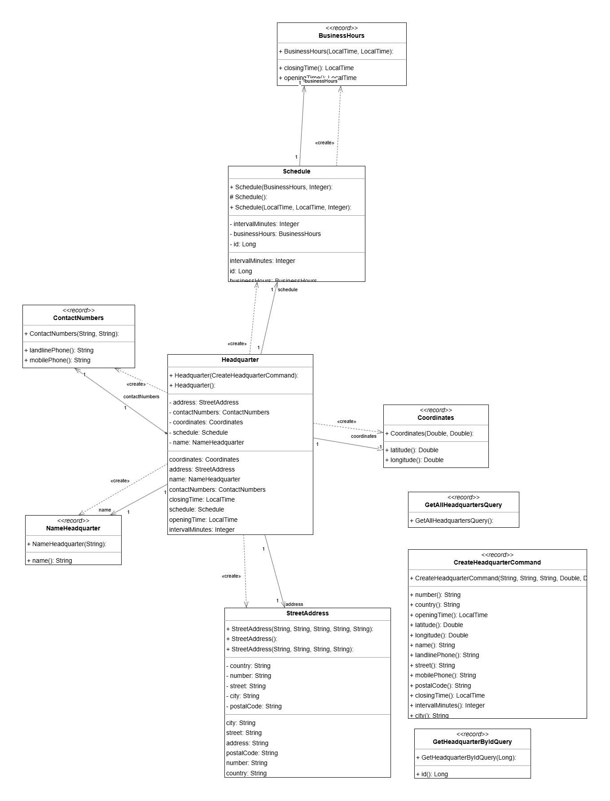 

**Elementos principales del diagrama:**

1. **Aggregates**:
   - `Headquarter`: Agregado principal que encapsula la lógica de negocio relacionada con la gestión de sedes. Incluye atributos como `name`, `contactNumbers`, `coordinates`, `schedule` y `address`.

2. **Entities**:
   - `Schedule`: Representa los horarios de atención de una sede, incluyendo atributos como `businessHours` e `intervalMinutes`.

3. **Value Objects**:
   - `NameHeadquarter`: Representa el nombre de una sede.
   - `ContactNumbers`: Representa los números de contacto de una sede.
   - `Coordinates`: Representa las coordenadas geográficas de una sede.
   - `StreetAddress`: Representa la dirección de una sede.
   - `BusinessHours`: Representa los horarios de apertura y cierre de una sede.

**Relaciones destacadas:**
- El agregado `Headquarter` actúa como el núcleo del dominio, gestionando las relaciones con los objetos de valor (`NameHeadquarter`, `ContactNumbers`, `Coordinates`, `StreetAddress`) y la entidad `Schedule`.
- Los objetos de valor encapsulan datos inmutables y validaciones específicas, asegurando consistencia en el dominio.
- La entidad `Schedule` permite modelar horarios complejos, incluyendo intervalos de tiempo entre reservas.

##### 4.2.3.6.2. Bounded Context Database Design Diagram.

##### 4.2.3.6.2. Bounded Context Database Design Diagram

El diseño de la base de datos para el **Branching Bounded Context** refleja la estructura del dominio, asegurando que las entidades y relaciones definidas en la **Domain Layer** se representen de manera eficiente en el modelo relacional. 

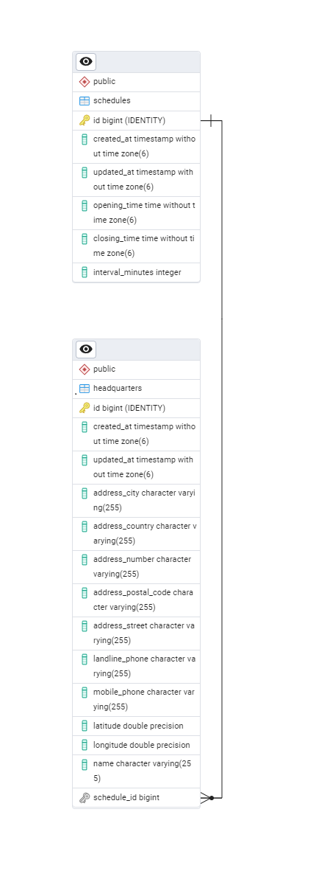 

**Este diseño incluye las siguientes tablas principales:**

1. **Headquarters**
   - **Propósito**: Representa las sedes registradas en el sistema.
   - **Atributos principales**:
     - `id`: Identificador único de la sede.
     - `name`: Nombre de la sede.
     - `landline_phone`: Número de teléfono fijo de la sede.
     - `mobile_phone`: Número de teléfono móvil de la sede.
     - `latitude`: Latitud de la ubicación de la sede.
     - `longitude`: Longitud de la ubicación de la sede.
     - `address_street`: Calle de la dirección de la sede.
     - `address_number`: Número de la dirección.
     - `address_city`: Ciudad donde se encuentra la sede.
     - `address_postal_code`: Código postal de la sede.
     - `address_country`: País donde se encuentra la sede.
     - `schedule_id`: Relación con la tabla `Schedules`.

2. **Schedules**
   - **Propósito**: Representa los horarios de atención de las sedes.
   - **Atributos principales**:
     - `id`: Identificador único del horario.
     - `opening_time`: Hora de apertura de la sede.
     - `closing_time`: Hora de cierre de la sede.
     - `interval_minutes`: Intervalo de tiempo en minutos entre reservas.

Este diseño asegura que las operaciones relacionadas con la gestión de sedes sean eficientes y consistentes, facilitando la integración con la lógica de negocio definida en la **Domain Layer**.

### 4.2.4 Bounded Context: Booking Bounded Context

El **Booking Bounded Context** es responsable de gestionar las reservas de mesas en el sistema Tavolo. Este contexto asegura que los usuarios puedan realizar reservas de manera eficiente, gestionando la disponibilidad de mesas, horarios y slots de tiempo. Además, permite a los administradores supervisar y gestionar las reservas activas, asegurando que las operaciones relacionadas con las reservas sean consistentes y cumplan con los estándares de calidad y precisión requeridos.

#### 4.2.4.1. Domain Layer

La **Domain Layer** del Booking Bounded Context encapsula la lógica de negocio relacionada con la gestión de reservas. En esta capa, se definen los elementos principales del dominio, como agregados, entidades, objetos de valor, comandos, consultas y eventos, que representan los conceptos clave del sistema.

#### **Aggregates**

1. **Booking**
   - **Propósito**: Representa una reserva realizada por un cliente para una mesa específica en una fecha y horario determinado.
   - **Atributos**:
     - `userId`: Identificador del cliente que realiza la reserva, representado como un objeto de valor `UserId`.
     - `tableId`: Mesa reservada, representada como una referencia a la entidad `Table`.
     - `bookingDate`: Fecha de la reserva.
     - `bookingSlots`: Conjunto de intervalos de tiempo reservados, representados como una colección de entidades `BookingSlot`.
   - **Características**:
     - Extiende `AuditableAbstractAggregateRoot`, lo que permite auditar cambios en las reservas.
     - Gestiona la relación entre el cliente, la mesa y los slots reservados, asegurando consistencia y validación.

2. **Table**
   - **Propósito**: Representa una mesa en una sede específica, incluyendo su disponibilidad y detalles.
   - **Atributos**:
     - `tableDetails`: Detalles de la mesa, como número de mesa y cantidad de asientos, representados como un objeto de valor `TableDetails`.
     - `headquarterId`: Identificador de la sede a la que pertenece la mesa, representado como un objeto de valor `HeadquarterId`.
     - `status`: Estado actual de la mesa (`AVAILABLE`, `RESERVED`, `OCCUPIED`), representado como un objeto de valor `TableStatus`.
     - `availabilitySlots`: Conjunto de slots de disponibilidad generados para la mesa, representados como una colección de entidades `AvailabilitySlot`.
   - **Características**:
     - Extiende `AuditableAbstractAggregateRoot`, lo que permite auditar cambios en las mesas.
     - Gestiona la generación y actualización de slots de disponibilidad.

#### **Entities**

1. **AvailabilitySlot**
   - **Propósito**: Representa un intervalo de tiempo disponible para una mesa en una fecha específica.
   - **Atributos**:
     - `dateOfSlot`: Fecha del slot.
     - `timeInterval`: Intervalo de tiempo del slot, representado como un objeto de valor `TimeSlot`.
     - `status`: Estado del slot (`AVAILABLE`, `RESERVED`), representado como un objeto de valor `ScheduleSlotStatus`.
   - **Métodos**:
     - `updateStatus(ScheduleSlotStatus status)`: Actualiza el estado del slot.

2. **BookingSlot**
   - **Propósito**: Representa un intervalo de tiempo reservado por un cliente.
   - **Atributos**:
     - `timeInterval`: Intervalo de tiempo reservado, representado como un objeto de valor `TimeSlot`.

#### **Value Objects**

1. **UserId**
   - **Propósito**: Representa el identificador único de un cliente.
   - **Validaciones**:
     - El identificador no puede ser negativo.

2. **HeadquarterId**
   - **Propósito**: Representa el identificador único de una sede.
   - **Validaciones**:
     - El identificador no puede ser nulo ni negativo.

3. **TableDetails**
   - **Propósito**: Representa los detalles de una mesa, como su número y cantidad de asientos.
   - **Validaciones**:
     - El número de mesa no puede ser negativo.
     - La cantidad de asientos debe ser mayor a cero.

4. **TableStatus**
   - **Propósito**: Enumera los estados posibles de una mesa (`AVAILABLE`, `RESERVED`, `OCCUPIED`).

5. **TimeSlot**
   - **Propósito**: Representa un intervalo de tiempo con una hora de inicio y una hora de fin.
   - **Validaciones**:
     - La hora de inicio y la hora de fin no pueden ser nulas.
     - La hora de inicio debe ser anterior a la hora de fin.

6. **ScheduleSlotStatus**
   - **Propósito**: Enumera los estados posibles de un slot de disponibilidad (`AVAILABLE`, `RESERVED`).

7. **MaximumDuration**
   - **Propósito**: Representa la duración máxima permitida para una reserva.
   - **Validaciones**:
     - La duración debe ser un número positivo.
     - La duración no puede exceder las 5 horas.

#### **Commands**

1. **CreateBookingCommand**
   - **Propósito**: Representa la solicitud para crear una nueva reserva.
   - **Atributos**:
     - `clientId`: Identificador del cliente.
     - `tableId`: Identificador de la mesa.
     - `bookingDate`: Fecha de la reserva.
     - `slotIds`: Lista de identificadores de slots reservados.

2. **CreateTableCommand**
   - **Propósito**: Representa la solicitud para crear una nueva mesa.
   - **Atributos**:
     - `tableNumber`: Número de la mesa.
     - `seats`: Cantidad de asientos.
     - `headquartersId`: Identificador de la sede.

3. **CreateTableScheduleCommand**
   - **Propósito**: Representa la solicitud para generar los slots de disponibilidad de una mesa.
   - **Atributos**:
     - `tableId`: Identificador de la mesa.

#### **Queries**

1. **GetAllBookingsQuery**
   - **Propósito**: Recupera todas las reservas registradas en el sistema.

2. **GetAllTablesQuery**
   - **Propósito**: Recupera todas las mesas registradas en el sistema.

3. **GetBookingByIdQuery**
   - **Propósito**: Recupera una reserva específica por su identificador.

4. **GetTableByIdQuery**
   - **Propósito**: Recupera una mesa específica por su identificador.

5. **GetTableScheduleByIdAndDateQuery**
   - **Propósito**: Recupera los slots de disponibilidad de una mesa para una fecha específica.

#### **Events**

1. **SingleTableAvailabilitySlotsGeneratedEvent**
   - **Propósito**: Evento que se dispara cuando se generan los slots de disponibilidad para una mesa.
   - **Atributos**:
     - `tableId`: Identificador de la mesa.

#### **Relaciones entre componentes**

- El agregado `Booking` actúa como el núcleo del dominio, gestionando las relaciones con las entidades `BookingSlot` y `Table`.
- El agregado `Table` gestiona la generación y actualización de los slots de disponibilidad (`AvailabilitySlot`).
- Los objetos de valor encapsulan datos inmutables y validaciones específicas, asegurando consistencia en el dominio.
- Los comandos y consultas permiten interactuar con el sistema de manera estructurada, facilitando la creación de reservas y la recuperación de información.
- Los eventos aseguran que las operaciones críticas, como la generación de slots de disponibilidad, sean comunicadas de manera eficiente a otros componentes del sistema.

Esta estructura asegura que la lógica de negocio relacionada con la gestión de reservas sea robusta, consistente y fácil de mantener, cumpliendo con los requisitos del sistema.

#### 4.2.4.2. Interface Layer

La **Interface Layer** del Booking Bounded Context expone los puntos de entrada al sistema a través de controladores REST. Esta capa permite la interacción con las entidades del dominio mediante solicitudes HTTP, facilitando la comunicación entre los clientes y el sistema. Además, incluye recursos y transformadores que aseguran una representación adecuada de los datos y su conversión entre las capas de la aplicación.

#### **Controllers**

Los controladores son responsables de manejar las solicitudes HTTP y delegar la lógica de negocio a los servicios correspondientes. A continuación, se describen los principales controladores:

1. **BookingController**
   - **Propósito**: Gestiona las operaciones relacionadas con las reservas.
   - **Endpoints**:
     - `POST /api/v1/bookings`: Crea una nueva reserva.
     - `GET /api/v1/bookings/{id}`: Obtiene los detalles de una reserva específica por su ID.
     - `GET /api/v1/bookings`: Obtiene la lista de todas las reservas.
   - **Dependencias**:
     - `BookingCommandService`: Servicio encargado de manejar los comandos relacionados con las reservas.
     - `BookingQueryService`: Servicio encargado de manejar las consultas relacionadas con las reservas.

2. **TableController**
   - **Propósito**: Gestiona las operaciones relacionadas con las mesas.
   - **Endpoints**:
     - `POST /api/v1/tables`: Crea una nueva mesa.
     - `GET /api/v1/tables/{tableId}`: Obtiene los detalles de una mesa específica por su ID.
     - `GET /api/v1/tables`: Obtiene la lista de todas las mesas.
     - `GET /api/v1/tables/{tableId}/schedule`: Obtiene los slots de disponibilidad de una mesa para una fecha específica.
   - **Dependencias**:
     - `TableCommandService`: Servicio encargado de manejar los comandos relacionados con las mesas.
     - `TableQueryService`: Servicio encargado de manejar las consultas relacionadas con las mesas.

#### **Resources**

Los recursos representan los datos que se exponen a través de la API REST. Estos recursos son utilizados para estructurar las respuestas de los controladores y asegurar una representación clara y consistente de los datos. A continuación, se describen los principales recursos:

1. **AvailabilitySlotResource**
   - **Propósito**: Representa un slot de disponibilidad de una mesa.
   - **Atributos**:
     - `id`: Identificador único del slot.
     - `date`: Fecha del slot.
     - `startTime`: Hora de inicio del slot.
     - `endTime`: Hora de fin del slot.
     - `status`: Estado del slot (`AVAILABLE`, `RESERVED`).

2. **BookingResource**
   - **Propósito**: Representa una reserva en el sistema.
   - **Atributos**:
     - `id`: Identificador único de la reserva.
     - `clientId`: Identificador del cliente que realizó la reserva.
     - `tableId`: Identificador de la mesa reservada.
     - `bookingDate`: Fecha de la reserva.
     - `bookingSlots`: Lista de slots reservados.

3. **BookingSlotResource**
   - **Propósito**: Representa un slot reservado por un cliente.
   - **Atributos**:
     - `startTime`: Hora de inicio del slot reservado.
     - `endTime`: Hora de fin del slot reservado.

4. **CreateBookingResource**
   - **Propósito**: Representa los datos necesarios para crear una nueva reserva.
   - **Atributos**:
     - `clientId`: Identificador del cliente.
     - `tableId`: Identificador de la mesa.
     - `bookingDate`: Fecha de la reserva.
     - `slotIds`: Lista de identificadores de slots reservados.

5. **CreateTableResource**
   - **Propósito**: Representa los datos necesarios para crear una nueva mesa.
   - **Atributos**:
     - `headquarterId`: Identificador de la sede a la que pertenece la mesa.
     - `tableNumber`: Número de la mesa.
     - `seats`: Cantidad de asientos.

6. **TableResource**
   - **Propósito**: Representa una mesa en el sistema.
   - **Atributos**:
     - `id`: Identificador único de la mesa.
     - `headquarterId`: Identificador de la sede a la que pertenece la mesa.
     - `tableNumber`: Número de la mesa.
     - `seats`: Cantidad de asientos.
     - `status`: Estado actual de la mesa (`AVAILABLE`, `RESERVED`, `OCCUPIED`).

#### **Transformers**

Los transformadores son responsables de convertir las entidades del dominio en recursos y viceversa. Esto asegura que los datos expuestos a través de la API REST sean consistentes y estén en el formato esperado. A continuación, se describen los principales transformadores:

1. **AvailabilitySlotResourceFromEntityAssembler**
   - **Propósito**: Convierte una entidad `AvailabilitySlot` en un recurso `AvailabilitySlotResource`.
   - **Métodos principales**:
     - `toResourceFromEntity(AvailabilitySlot entity)`: Transforma un slot de disponibilidad en un recurso.
     - `toResourceListFromEntities(List<AvailabilitySlot> entities)`: Transforma una lista de slots de disponibilidad en una lista de recursos.

2. **BookingResourceFromEntityAssembler**
   - **Propósito**: Convierte una entidad `Booking` en un recurso `BookingResource`.
   - **Método principal**:
     - `toResourceFromEntity(Booking booking)`: Transforma una reserva en un recurso.

3. **CreateBookingCommandFromResourceAssembler**
   - **Propósito**: Convierte un recurso `CreateBookingResource` en un comando `CreateBookingCommand`.
   - **Método principal**:
     - `toCommandFromResource(CreateBookingResource resource)`: Transforma los datos de creación de una reserva en un comando.

4. **CreateTableCommandFromResourceAssembler**
   - **Propósito**: Convierte un recurso `CreateTableResource` en un comando `CreateTableCommand`.
   - **Método principal**:
     - `toCommandFromResource(CreateTableResource resource)`: Transforma los datos de creación de una mesa en un comando.

5. **TableResourceFromEntityAssembler**
   - **Propósito**: Convierte una entidad `Table` en un recurso `TableResource`.
   - **Método principal**:
     - `toResourceFromEntity(Table entity)`: Transforma una mesa en un recurso.

#### **Relaciones entre componentes**

- Los controladores (`BookingController`, `TableController`) utilizan los servicios de comandos y consultas para delegar la lógica de negocio.
- Los transformadores convierten las entidades del dominio en recursos para las respuestas HTTP y viceversa para las solicitudes entrantes.
- Los recursos estructuran los datos expuestos a los clientes, asegurando una representación clara y consistente.

Esta estructura asegura que la **Interface Layer** sea modular, reutilizable y fácil de mantener, facilitando la interacción entre los clientes y el sistema.

#### 4.2.4.3. Application Layer

La **Application Layer** del Booking Bounded Context actúa como un intermediario entre la **Domain Layer** y las capas externas, como la **Interface Layer** y la **Infrastructure Layer**. Su propósito principal es coordinar las operaciones de negocio, manejar comandos y consultas, orquestar la lógica de aplicación y garantizar que las reglas del dominio se cumplan de manera consistente. Además, esta capa incluye manejadores de eventos y servicios externos (ACL) para interactuar con otros contextos delimitados.

#### **Command Services**

Los servicios de comandos son responsables de ejecutar operaciones que modifican el estado del sistema. A continuación, se describen los principales servicios de comandos:

1. **BookingCommandServiceImpl**
   - **Propósito**: Gestiona las operaciones relacionadas con la creación de reservas.
   - **Métodos principales**:
     - `handle(CreateBookingCommand command)`: Crea una nueva reserva, validando la disponibilidad de los slots y asegurando que las reglas de negocio, como la duración máxima de la reserva, se cumplan.
   - **Validaciones**:
     - Verifica que el cliente exista utilizando el servicio externo `ExternalUserService`.
     - Valida que los slots solicitados estén disponibles y sean consecutivos.
     - Asegura que la duración total de la reserva no exceda las 2 horas.
   - **Dependencias**:
     - `BookingRepository`: Persistencia de reservas.
     - `TableRepository`: Gestión de mesas y sus slots de disponibilidad.
     - `ExternalUserService`: Verifica la existencia del cliente.

2. **TableCommandServiceImpl**
   - **Propósito**: Gestiona las operaciones relacionadas con la creación de mesas y la generación de slots de disponibilidad.
   - **Métodos principales**:
     - `handle(CreateTableCommand command)`: Crea una nueva mesa en una sede específica, validando que la sede exista y que no haya duplicados.
     - `handle(CreateTableScheduleCommand command)`: Genera los slots de disponibilidad para una mesa, basándose en los horarios y el intervalo de la sede.
   - **Validaciones**:
     - Verifica que la sede exista utilizando el servicio externo `ExternalHeadquarterService`.
     - Asegura que no existan mesas duplicadas en la misma sede.
   - **Dependencias**:
     - `TableRepository`: Persistencia de mesas y sus slots de disponibilidad.
     - `ExternalHeadquarterService`: Obtiene información de la sede, como horarios y intervalos.

#### **Query Services**

Los servicios de consultas son responsables de recuperar información del sistema sin modificar su estado. A continuación, se describen los principales servicios de consultas:

1. **BookingQueryServiceImpl**
   - **Propósito**: Gestiona las consultas relacionadas con las reservas.
   - **Métodos principales**:
     - `handle(GetBookingByIdQuery query)`: Recupera una reserva específica por su ID.
     - `handle(GetAllBookingsQuery query)`: Recupera todas las reservas registradas en el sistema.
   - **Dependencias**:
     - `BookingRepository`: Persistencia de reservas.

2. **TableQueryServiceImpl**
   - **Propósito**: Gestiona las consultas relacionadas con las mesas y sus slots de disponibilidad.
   - **Métodos principales**:
     - `handle(GetTableByIdQuery query)`: Recupera una mesa específica por su ID.
     - `handle(GetAllTablesQuery query)`: Recupera todas las mesas registradas en el sistema.
     - `handle(GetTableScheduleByIdAndDateQuery query)`: Recupera los slots de disponibilidad de una mesa para una fecha específica.
   - **Dependencias**:
     - `TableRepository`: Persistencia de mesas y sus slots de disponibilidad.

#### **Event Handlers**

Los manejadores de eventos son responsables de reaccionar a eventos específicos del sistema. A continuación, se describe el principal manejador de eventos:

1. **SingleTableAvailabilitySlotsGeneratedEventHandler**
   - **Propósito**: Maneja el evento `SingleTableAvailabilitySlotsGeneratedEvent`, que se dispara cuando se generan los slots de disponibilidad para una mesa.
   - **Método principal**:
     - `on(SingleTableAvailabilitySlotsGeneratedEvent event)`: Genera los slots de disponibilidad para una mesa específica.
   - **Dependencias**:
     - `TableCommandService`: Servicio encargado de manejar los comandos relacionados con las mesas.

#### **Outbound Services (ACL)**

Los servicios externos proporcionan funcionalidades auxiliares que no forman parte del dominio principal. A continuación, se describen los principales servicios externos:

1. **ExternalHeadquarterService**
   - **Propósito**: Interactúa con el Branching Bounded Context para obtener información de las sedes.
   - **Métodos principales**:
     - `getHeadquarterOpeningTime(Long headquarterId)`: Obtiene la hora de apertura de una sede.
     - `getHeadquarterClosingTime(Long headquarterId)`: Obtiene la hora de cierre de una sede.
     - `getHeadquarterIntervalMinutes(Long headquarterId)`: Obtiene el intervalo de servicio en minutos de una sede.
     - `existsHeadquarter(Long headquarterId)`: Verifica si una sede existe.

2. **ExternalUserService**
   - **Propósito**: Interactúa con el IAM Bounded Context para verificar la existencia de usuarios.
   - **Método principal**:
     - `existUserById(Long userId)`: Verifica si un usuario existe en el sistema.

#### **Relaciones entre componentes**

- Los **Command Services** interactúan con los repositorios para modificar el estado del sistema y con los servicios externos (ACL) para validar información de otros contextos.
- Los **Query Services** interactúan únicamente con los repositorios para recuperar información del sistema.
- Los **Event Handlers** reaccionan a eventos del dominio para ejecutar lógica adicional, como la generación de slots de disponibilidad.
- Los **Outbound Services** (ACL) permiten la integración con otros contextos delimitados, como el Branching Bounded Context y el IAM Bounded Context.

La **Application Layer** del Booking Bounded Context asegura que las operaciones relacionadas con la gestión de reservas y mesas sean robustas, consistentes y fáciles de mantener. Al coordinar la lógica de negocio, manejar eventos y facilitar la integración con otros contextos, esta capa garantiza que las reglas del dominio se cumplan de manera eficiente y que el sistema sea escalable y extensible.

#### 4.2.4.4. Infrastructure Layer

La **Infrastructure Layer** del Booking Bounded Context proporciona las implementaciones técnicas necesarias para soportar las operaciones del sistema relacionadas con la gestión de reservas y mesas. Esta capa incluye repositorios para la persistencia de datos y componentes que conectan la lógica de negocio con los recursos externos, como bases de datos. Su objetivo principal es garantizar que las operaciones de almacenamiento y recuperación de información sean eficientes, consistentes y seguras.

#### **Persistencia (JPA Repositories)**

1. **BookingRepository**
   - **Propósito**: Proporciona métodos para interactuar con la base de datos de reservas.
   - **Características**:
     - Extiende `JpaRepository`, lo que permite realizar operaciones CRUD (Crear, Leer, Actualizar, Eliminar) sobre las entidades `Booking`.
     - Facilita la persistencia y recuperación de reservas, asegurando que las operaciones relacionadas con las reservas sean eficientes y confiables.

2. **TableRepository**
   - **Propósito**: Proporciona métodos para interactuar con la base de datos de mesas y sus slots de disponibilidad.
   - **Métodos principales**:
     - `existsByHeadquarterIdAndTableDetails_TableNumber(HeadquarterId headquarterId, Integer tableDetails_tableNumber)`: Verifica si existe una mesa con un número específico en una sede.
     - `findAvailabilitySlotsByTableIdAndDate(Long tableId, LocalDate date)`: Recupera los slots de disponibilidad de una mesa para una fecha específica.
     - `findByIdWithSlotsForUpdate(Long id)`: Recupera una mesa junto con sus slots de disponibilidad utilizando un bloqueo pesimista para evitar modificaciones concurrentes.
   - **Características**:
     - Extiende `JpaRepository`, lo que permite realizar operaciones CRUD sobre las entidades `Table`.
     - Incluye consultas personalizadas para manejar la relación entre mesas y sus slots de disponibilidad.
     - Utiliza un bloqueo pesimista (`PESSIMISTIC_WRITE`) para garantizar la consistencia de los datos durante las operaciones críticas, como la creación de reservas.

#### **Relaciones entre componentes**

- **Persistencia**: Los repositorios `BookingRepository` y `TableRepository` proporcionan acceso a los datos almacenados en la base de datos, permitiendo a las capas superiores (como la **Application Layer**) interactuar con las entidades del dominio.
- **Validación**: Los métodos personalizados en `TableRepository` son utilizados para validar la existencia de mesas y recuperar información específica, como los slots de disponibilidad, asegurando la consistencia de los datos durante las operaciones de negocio.

La **Infrastructure Layer** del Booking Bounded Context asegura que las operaciones relacionadas con la persistencia de datos sean robustas y confiables. Al proporcionar repositorios especializados para las reservas y mesas, esta capa facilita la integración con la base de datos y garantiza que las reglas de negocio, como la validación de slots de disponibilidad y la unicidad de mesas, se cumplan de manera eficiente. Esta estructura modular y reutilizable permite que el sistema sea escalable y fácil de mantener.

#### 4.2.4.5. Bounded Context Software Architecture Component Level Diagrams

En esta sección se presenta el diagrama de componentes del **Booking Bounded Context**, el cual detalla los principales módulos y sus interacciones dentro del contexto delimitado. Este diagrama sigue el enfoque del C4 Model para representar los componentes clave, como servicios de aplicación, controladores, repositorios y servicios externos, junto con sus relaciones.

El propósito de este diagrama es proporcionar una visión clara y estructurada de cómo se organizan los componentes dentro del contexto, facilitando la comprensión de su arquitectura y permitiendo identificar puntos de integración y responsabilidades.

 

El **Booking Bounded Context** está compuesto por los siguientes módulos principales:

1. **Application Layer**:
   - Coordina las operaciones de negocio relacionadas con la gestión de reservas y mesas.
   - Incluye servicios de comandos y consultas que interactúan con la **Domain Layer** y la **Infrastructure Layer**.
   - Maneja eventos relacionados con la creación de reservas y la generación de slots de disponibilidad.

2. **Interface Layer**:
   - Expone los puntos de entrada al sistema a través de controladores REST.
   - Incluye recursos y transformadores que aseguran una representación adecuada de los datos y su conversión entre las capas de la aplicación.

3. **Domain Layer**:
   - Encapsula la lógica de negocio relacionada con la gestión de reservas y mesas.
   - Define los agregados, entidades y objetos de valor que representan los conceptos clave del dominio.

4. **Infrastructure Layer**:
   - Proporciona las implementaciones técnicas necesarias para soportar las operaciones del sistema.
   - Incluye repositorios para la persistencia de datos y componentes que conectan la lógica de negocio con los recursos externos, como bases de datos.

#### 4.2.4.6. Bounded Context Software Architecture Code Level Diagrams

En este apartado se presentan los diagramas que ofrecen un mayor nivel de detalle sobre la implementación de los componentes del **Booking Bounded Context**. Estos diagramas están diseñados para ilustrar cómo se estructuran las clases, interfaces y relaciones dentro de las capas del contexto, proporcionando una visión técnica que facilita el desarrollo, mantenimiento y evolución del sistema.

##### 4.2.4.6.1. Bounded Context Domain Layer Class Diagrams

El diagrama de clases correspondiente a la **Domain Layer** del **Booking Bounded Context** incluye las clases principales, como agregados, entidades y objetos de valor, así como las interfaces y enumeraciones que definen el comportamiento del dominio. También se destacan las relaciones entre estos elementos, como asociaciones, composiciones y dependencias.

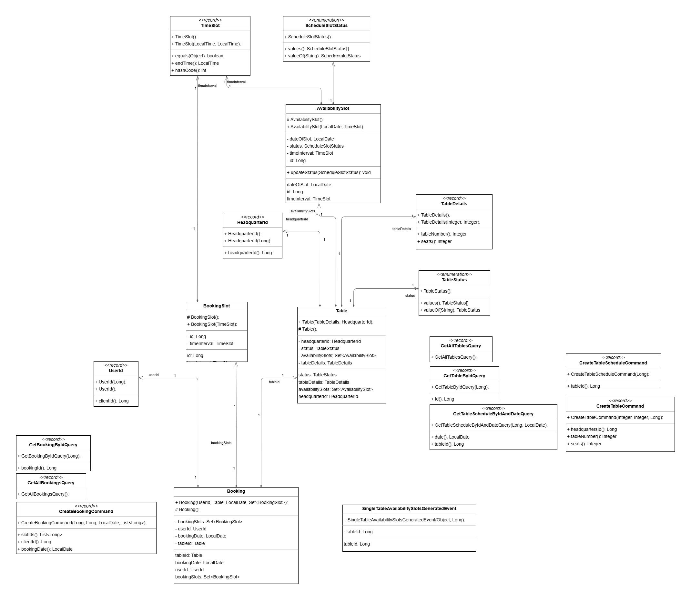 

**Elementos principales del diagrama:**

1. **Aggregates**:
   - `Booking`: Agregado principal que encapsula la lógica de negocio relacionada con las reservas. Incluye atributos como `userId`, `tableId`, `bookingDate` y `bookingSlots`.
   - `Table`: Agregado que representa una mesa en una sede específica, incluyendo su disponibilidad y detalles.

2. **Entities**:
   - `AvailabilitySlot`: Representa un intervalo de tiempo disponible para una mesa en una fecha específica.
   - `BookingSlot`: Representa un intervalo de tiempo reservado por un cliente.

3. **Value Objects**:
   - `UserId`: Representa el identificador único de un cliente.
   - `HeadquarterId`: Representa el identificador único de una sede.
   - `TableDetails`: Representa los detalles de una mesa, como su número y cantidad de asientos.
   - `TimeSlot`: Representa un intervalo de tiempo con una hora de inicio y una hora de fin.
   - `TableStatus`: Enumera los estados posibles de una mesa (`AVAILABLE`, `RESERVED`, `OCCUPIED`).
   - `ScheduleSlotStatus`: Enumera los estados posibles de un slot de disponibilidad (`AVAILABLE`, `RESERVED`).

**Relaciones destacadas:**
- El agregado `Booking` gestiona las relaciones con las entidades `BookingSlot` y `Table`.
- El agregado `Table` gestiona la generación y actualización de los slots de disponibilidad (`AvailabilitySlot`).
- Los objetos de valor encapsulan datos inmutables y validaciones específicas, asegurando consistencia en el dominio.

##### 4.2.4.6.2. Bounded Context Database Design Diagram.

El diseño de la base de datos para el **Booking Bounded Context** refleja la estructura del dominio, asegurando que las entidades y relaciones definidas en la **Domain Layer** se representen de manera eficiente en el modelo relacional. 

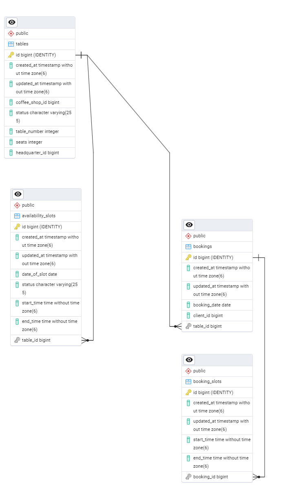 

**Este diseño incluye las siguientes tablas principales:**

1. **Bookings**:
   - Representa las reservas realizadas por los clientes.
   - Atributos principales:
     - `id`: Identificador único de la reserva.
     - `user_id`: Identificador del cliente que realizó la reserva.
     - `table_id`: Identificador de la mesa reservada.
     - `booking_date`: Fecha de la reserva.

2. **Tables**:
   - Representa las mesas disponibles en las sedes.
   - Atributos principales:
     - `id`: Identificador único de la mesa.
     - `headquarter_id`: Identificador de la sede a la que pertenece la mesa.
     - `table_number`: Número de la mesa.
     - `seats`: Cantidad de asientos.
     - `status`: Estado actual de la mesa.

3. **AvailabilitySlots**:
   - Representa los slots de disponibilidad de las mesas.
   - Atributos principales:
     - `id`: Identificador único del slot.
     - `table_id`: Identificador de la mesa asociada.
     - `date_of_slot`: Fecha del slot.
     - `start_time`: Hora de inicio del slot.
     - `end_time`: Hora de fin del slot.
     - `status`: Estado del slot (`AVAILABLE`, `RESERVED`).

4. **BookingSlots**:
   - Representa los slots reservados por los clientes.
   - Atributos principales:
     - `id`: Identificador único del slot reservado.
     - `booking_id`: Identificador de la reserva asociada.
     - `start_time`: Hora de inicio del slot reservado.
     - `end_time`: Hora de fin del slot reservado.

# Capítulo V: Solution UI/UX Design
## 5.1. Style Guidelines
### 5.1.1. General Style Guidelines
### 5.1.2. Web, Mobile and IoT Style Guidelines
## 5.2. Information Architecture
### 5.2.1. Organization Systems
### 5.2.2. Labeling Systems
### 5.2.3. SEO Tags and Meta Tags
### 5.2.4. Searching Systems
### 5.2.5. Navigation Systems
## 5.3. Landing Page UI Design
### 5.3.1. Landing Page Wireframe
### 5.3.2. Landing Page Mock-up
## 5.4. Applications UX/UI Design
### 5.4.1. Applications Wireframes
### 5.4.2. Applications Wireflow Diagrams
### 5.4.3. Applications Mock-ups
### 5.4.4. Applications User Flow Diagrams
## 5.5. Applications Prototyping

# Capítulo VI: Product Implementation, Validation & Deployment
## 6.1. Software Configuration Management
### 6.1.1. Software Development Environment Configuration
### 6.1.2. Source Code Management
### 6.1.3. Source Code Style Guide & Conventions
### 6.1.4. Software Deployment Configuration
## 6.2. Landing Page, Services & Applications Implementation.

### 6.2.1. Sprint 1
#### 6.2.1.1. Sprint Planning 1.
| **Sprint #1** 	| Sprint 1 	|
|---	|---	|
| **Sprint Planning Background** 	|  	|
| Date 	| 9/5/2025 	|
| Time 	| 11:00 am 	|
| Location 	| REunion virtual vía Discord 	|
| Prepared By 	| Jimena Cama 	|
| Attendees (to planning meeting) 	| - Baldeon Fabian, Aldo Alberto          - Cama Salvatierra, Jimena Tamara        - Castillo Castillo, Jair Alexander      - La Torre Valle, Franz Jair             - Quezada Portalatino, Barbara Susana 	|
| **Sprint Goal & User Stories** 	|  	|
| Sprint 1 Goal 	| En este sprint la meta a cumplir fue desarrollar el backend de la plataforma, la aplicación web funcional y la landing page. 	|
| Sprint 1 Velocity 	| 17 	|
| Sum of Story Points 	| 81 	|

#### 6.2.1.2. Aspect Leaders and Collaborators.
#### 6.2.1.3. Sprint Backlog 1.

#### 6.2.1.4. Development Evidence for Sprint Review.
#### 6.2.1.5. Testing Suite Evidence for Sprint Review.
#### 6.2.1.6. Execution Evidence for Sprint Review.
#### 6.2.1.7. Services Documentation Evidence for Sprint Review.
#### 6.2.1.8. Software Deployment Evidence for Sprint Review.
#### 6.2.1.9. Team Collaboration Insights during Sprint.

### Conclusiones Generales del Proyecto

* El proyecto TAVOLO se enfoca en optimizar la experiencia en cafeterías peruanas mediante una solución tecnológica IoT que gestiona la ocupación de mesas y reservas. Para los comensales, ofrece visualización del menú, disponibilidad de mesas en tiempo real y reservas; para los administradores, permite la gestión de mesas y reservas de la sede asignada. El objetivo es mejorar la experiencia del cliente y la eficiencia operativa del negocio.
* La investigación y análisis de requerimientos identificaron la problemática de la incertidumbre sobre la disponibilidad de mesas en cafeterías, especialmente en horas pico, lo que afecta la experiencia del cliente. Se definieron segmentos objetivo claros (comensales y administradores) y se analizaron competidores como Eat App y OpenTable, destacando la ventaja de TAVOLO en la detección automática de ocupación en tiempo real mediante sensores IoT.
* El equipo demostró un liderazgo compartido y colaborativo, asumiendo responsabilidades específicas en cada capítulo y utilizando herramientas como GitHub y metodologías como Gitflow para una gestión eficiente del proyecto. Se establecieron metas claras, se planificaron tareas según las fortalezas individuales y se mantuvo una comunicación constante, lo que permitió cumplir los objetivos y fortalecer la cohesión del equipo.

### Bibliografía
1.  **Las MIPYME en cifras 2022:** Publicado por la Oficina General de Evaluación de Impacto y Estudios Económicos (OGEIEE) de Produce. ([Ver publicación](https://ogeiee.produce.gob.pe/index.php/en/shortcode/oee-documentos-publicaciones/publicaciones-anuales/item/1170-las-mipyme-en-cifras-2022))
2.  **Memoria Institucional del Ministerio de la Producción 2022:** Documento oficial que resume las acciones y logros del ministerio en ese año. ([Ver Memoria](https://transparencia.produce.gob.pe/images/stories/Repositorio/transparencia/planeamiento/memoria-anual/2022.pdf))
3.   **Informe de ComexPerú (basado en datos oficiales)**: Las micro y pequeñas empresas en el Perú Resultados en 2022. ([Ver Informe Comex](https://www.comexperu.org.pe/upload/articles/reportes/reporte-mypes-2022.pdf))
   
### Anexos
* **Video de Exposicion TB1:** `https://drive.google.com/drive/u/0/folders/1YN0UBGC28osxHvRTsBrLSjwX2CAVLHlt`
* **Repositorio del Proyecto en GitHub:** `https://github.com/orgs/upc-pre-202510-1asi0572-2952-tavolo/repositories`
* **Organización del Proyecto en GitHub:** `https://github.com/upc-pre-202510-1asi0572-2952-tavolo`
* **Informe del Proyecto:** `https://github.com/upc-pre-202510-1asi0572-2952-tavolo/tavolo-report`
* **Backend del Proyecto:** `https://github.com/upc-pre-202510-1asi0572-2952-tavolo/tavolo-backend`
* **Landing Page del Proyecto:** `https://github.com/upc-pre-202510-1asi0572-2952-tavolo/tavolo-landing-page`
* **Fronten Web del Proyecto:** `https://github.com/upc-pre-202510-1asi0572-2952-tavolo/tavolo-web`
* **Fronten Movil del Proyecto:** `https://github.com/upc-pre-202510-1asi0572-2952-tavolo/tavolo-mobile`
* **Registro de Entrevista #1 (Propietarios/Cliente - Diego Morales/Elias Yauri Paucar):** `https://drive.google.com/file/d/1CVDQx8Ue15xk7yt8oukkN1S87bAc7TeB/view?usp=sharing`
* **Registro de Entrevista #2 (Propietarios - Jenna Vasquez):** `https://drive.google.com/file/d/1WTxiDxw4vaabZhFvibL8mHLINcrJR0_9/view?usp=sharing`
* **Registro de Entrevista #2 (Clientes - Aleshka Fernández):** `https://youtu.be/QGSisj7iF-k`
