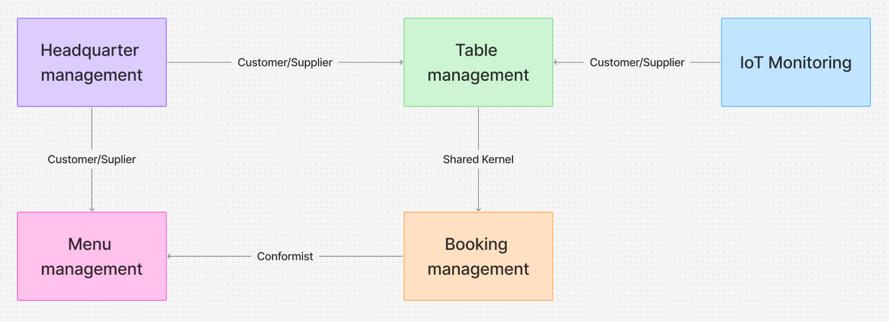
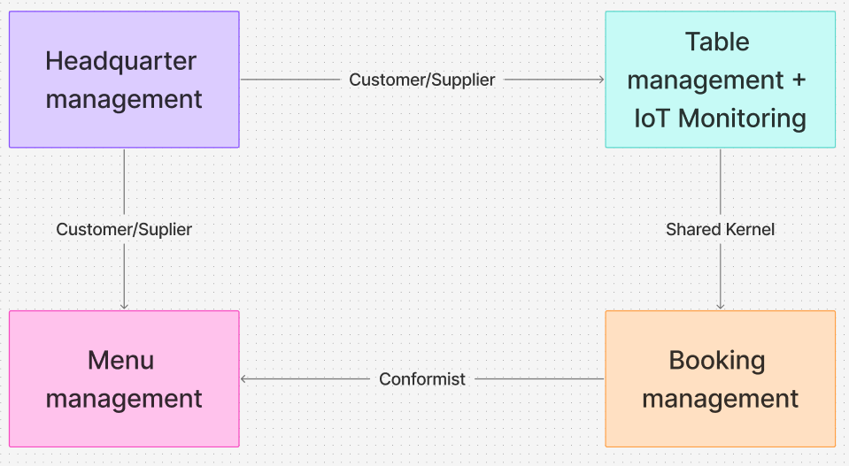
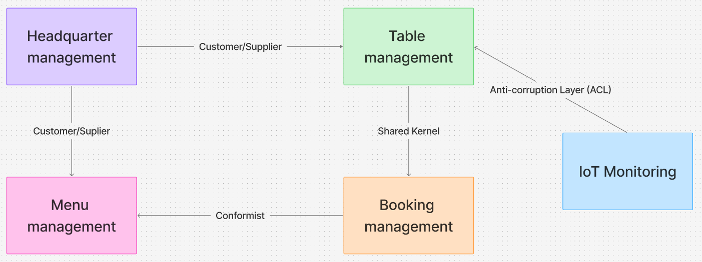

    <h3>Universidad Peruana de Ciencias Aplicadas</h3>
    </img> 
    <strong>Ingeniería de Software - 7mo Ciclo</strong> 
    <strong>Desarrollo de Soluciones IOT</strong> 
    <strong>1ASI0572</strong> 
    <strong>Profesor: Marco Antonio León Baca</strong> 
     <strong>Report</strong> 
     <strong>Tavolo</strong> 
    <!--<strong>name startup</strong>-->

<h3> Team Members: </h3>

| Member                              |    Code    |
| :---------------------------------- | :--------: |
| Baldeon Fabian, Aldo Alberto        | u202122633 |
| Cama Salvatierra, Jimena Tamara     | u202210778 |
| Castillo Castillo, Jair Alexander   | u202211390 |
| La Torre Valle, Franz Jair          | u202012378 |
| Quezada Portalatino, Barbara Susana | u202211800 |

<h3 align="center">Abril, 2025</h3>

  

## Registro de Versiones del Informe

El objetivo de esta sección es resumir las modificaciones relevantes que se realizan al informe durante el ciclo de vida del proyecto. Esta sección inicia en una página nueva e incluye un cuadro con la siguiente estructura:

<table>
  <thead>
    <tr>
      <th>Versión</th>
      <th>Fecha</th>
      <th>Autor</th>
      <th>Descripción de modificación</th>
    </tr>
  </thead>
  <tbody>
    <tr>
      <td>0.1</td>
      <td>-</td>
      <td>-</td>
      <td>-</td>
    </tr>
    
  </tbody>
</table>

## 4.1. Strategic-Level Domain-Driven Design.

### 4.1.1. EventStorming.

Con el objetivo de comprender en profundidad el dominio de Tavolo, se llevó a cabo una sesión de Event Storming de aproximadamente 1 hora. Esto permitió que nosotros como equipo organizaramos nuestras ideas y pensamientos sobre sistema desde múltiples perspectivas: negocio, usuario final, administración y experiencia. A través de esta dinámica, identificamos eventos clave, comandos, usuarios y agregados que nos ayudaron a esbozar una primera visión integral del sistema.

 

**Se vieron los siguientes puntos en la reunión:**

- Exploración del dominio general

Se partió desde la experiencia del visitante en la landing page, avanzando por el flujo de registro e inicio de sesión como comensal o administrador, hasta la reserva de mesas, visualización en tiempo real y gestión desde el panel administrativo.

- Identificación de eventos y comandos clave

Se colocaron notas naranjas para eventos, y se complementaron con comandos en azul. EL equipo seguío de las User Stories previamente realizadas, lo que aseguró la coherencia y el flujo de ña solución. 

- Asignación de roles y responsables

Se diferenciaron los actores como: comensal, administrador, superadmin, visitante, para asociar claramente qué parte del sistema controlan o en qué puntos interactúan. Al dividirlo de esta manera es más fácil detectar posibles conflictos o áreas de mejora en la experiencia. 

- Evidencia de lo relizado en la reunion

#### 4.1.1.1 Candidate Context Discovery.
Identificar contextos candidatos es un paso clave para gestionar la complejidad en el desarrollo de sistemas. Se trata de un análisis minucioso que busca entender los elementos centrales del sistema y sus interconexiones. A partir de ahí, se procede a agrupar estos elementos en 'contextos delimitados' lógicos y coherentes. Esta separación no solo facilita el diseño y la implementación, sino que también tiene como meta principal potenciar la escalabilidad, el desempeño y la mantenibilidad del sistema resultante.

#### 4.1.1.2 Domain Message Flows Modeling.
Para analizar y diseñar sistemas de software, se usa el Modelado de Flujos de Mensajes de Dominio, un método que ilustra la transferencia de información entre componentes mediante mensajes. Este proceso se centra en especificar los mensajes enviados y recibidos por los diferentes actores del sistema y en descifrar sus relaciones. El uso de esta metodología aporta claridad para entender y representar las vías de información del sistema, permitiendo detectar problemas potenciales más fácilmente y optimizar la estructura del diseño. A modo de ejemplo, mostraremos a continuación algunos diagramas aplicados a nuestro sistema.

#### 4.1.1.3 Bounded Context Canvases.

### Booking Management

### Table Management

 

### Menu Management

### IoT Monitoring

 

### Headquarter Management

### 4.1.2. Context Mapping.
En esta sección desarrollamos un conjunto de *context maps* para visualizar las relaciones entre los *bounded contexts* del sistema. A partir de la información recolectada, exploramos distintas alternativas de diseño, cuestionando cómo cambiaría la estructura si reubicamos, dividimos o agrupamos *capabilities*. Finalmente, evaluamos cada propuesta considerando patrones como *Anti-corruption Layer*, *Conformist*, *Customer/Supplier* y *Shared Kernel*, con el fin de definir la mejor aproximación para la arquitectura del dominio. A continucación presentaremos las opciones que contemplamos para Tavolo y la estructura final.

**Opción 1**

En esta estructura mantenemos los cinco bounded contexts separados con relaciones claramente definidas. Las ventajas de este tipo de contexto son por un lado la clara separación de responsabilidades y por otro lado, se especifica que cada contexto se enfoca en una funcionalidad específica. Una de las principales desventajas es que hay una mayor complejidad en la sincronización entre contextos.

 

**Opción 2**

Esta alternativa propone unir los contextos de IoT Monitoring y Table Management en un solo bounded context. Al hacerlo, se elimina la necesidad de sincronización externa entre ambos, manteniendo relaciones similares con los demás contextos del sistema.   Esta combinación presenta ventajas como la simplificación de la arquitectura al disminuir la cantidad de bounded contexts, una comunicación más directa entre la detección de ocupación y la gestión de mesas.   No obstante, una desventajas es la combinación de responsabilidades distintas, ya que una parte se enfoca en la infraestructura de sensores y la otra en procesos administrativos. Esto podría dificultar que el personal de cafetería realice la instalación del sistema en menos de una hora sin ayuda técnica, y además genera el riesgo de que un solo contexto asuma demasiadas funciones.

 

**Opcion 3** 

Esta alternativa propone una arquitectura compuesta por cinco bounded contexts bien definidos, con relaciones claras entre ellos. La estructura busca equilibrar la separación de responsabilidades, para permitir que el sistema escale y se mantenga con facilidad. Además, facilita la instalación sin asistencia técnica y asegura tiempos de respuesta adecuados, lo que contribuye directamente a mejorar la experiencia del cliente en el uso del sistema Tavolo.

* Headquarter Management se comunica con Menu Management y Table Management, proporcionando la información de las sedes. Menu Management adapta su contenido según cada sede, y Table Management utiliza la información organizativa que viene de Headquarter. En ambos casos, la relación es del tipo Customer/Supplier, donde Headquarter es el proveedor.

* Table Management y Booking Management comparten el modelo de “mesa” y su disponibilidad. Por eso, tienen una relación de tipo Shared Kernel, lo que asegura que ambos usen los mismos conceptos para evitar errores o confusión.

* Booking Management también se relaciona con Menu Management, pero en este caso la relación es Conformist. Booking utiliza información del menú, pero se adapta a su estructura sin modificarla.

* IoT Monitoring se conecta con Table Management mediante una Anti-corruption Layer. Esta capa traduce los datos que vienen de los sensores a un formato que Table Management pueda entender. Así, se protege el sistema de los detalles técnicos del IoT y se facilita la instalación del sistema sin ayuda especializada.

 

**Elección**  
Elegimos la **opción 3**, ya que proporciona el mejor equilibrio entre la separación de responsabilidades, la fácil de implementación y el cumplimiento de los requisitos del sistema.  
Al definir cinco bounded contexts con relaciones claras, se facilita la evolución independiente de cada parte del sistema, lo que mejora su escalabilidad y mantenibilidad. Además, al separar gestiones, como la de gestión de IoT mediante una Anti-corruption Layer, se simplifica la instalación. Asimismo, esta estructura garantiza tiempos de respuesta rápidos y optimiza la gestión de mesas, reservas y menús, brindando una experiencia más fluida y eficiente para los usuarios y el personal.

### 4.1.3. Software Architecture.
En esta sección, se presenta y explica la representación de la arquitectura de software para Tavolo utilizando el C4 Model. A través de estos diagramas, se busca proporcionar una comprensión clara y accesible de la arquitectura de Tavolo, permitiendo a los miembros del equipo, stakeholders y futuros desarrolladores entiendan cómo se organiza y comunica el sistema a diferentes niveles.

#### 4.1.3.1. Software Architecture System Landscape Diagram.
Este diagrama muestra que Tavolo opera en un ecosistema compuesto por tres tipos de usuarios (Comensales, Administradores de Cafeterías y Super Administradores) que interactúan directamente con el sistema principal Tavolo App. El sistema se conecta con un servicio externo: Google Maps API para mostrar ubicaciones de cafeterías. Los Comensales usan Tavolo para reservar mesas y consultar menús, los Administradores de Cafeterías proporcionan información sobre menús y gestionan sus mesas, mientras que los Super Administradores (equipo de desarrollo) mantienen y actualizan el sistema. 
 
#### 4.1.3.2. Software Architecture Context Level Diagrams.
Este diagrama muestra que el sistema Tavolo (representado como una única entidad) interactúa con tres tipos de usuarios: Comensales que utilizan el sistema para encontrar cafeterías, ver menús y realizar reservas; Administradores de Cafeterías que actualizan la información de menús y mesas; y Super Administradores que gestionan el mantenimiento general del sistema. Tavolo también se comunica con dos sistemas externos: Google Maps para mostrar ubicaciones geográficas de cafeterías y un sistema de Sensores IoT que proporciona datos en tiempo real sobre la ocupación de mesas en los establecimientos. 
 
#### 4.1.3.2. Software Architecture Container Level Diagrams.
Este diagrama muestra que el sistema Tavolo está compuesto por cuatro contenedores principales: una aplicación web accesible desde navegadores, una aplicación móvil para dispositivos portátiles, una API que gestiona toda la lógica de negocio y una base de datos que almacena la información del sistema. Además, incluye un módulo de sensores encargado de procesar los datos provenientes de dispositivos Arduino ubicados en las mesas. Por último, la API también se conecta con Google Maps, una aplicación externa, permitiendo que el comensal acceda a un mapa interactivo con las ubicaciones de las distintas sedes de la cafetería. 
 
#### 4.1.3.3. Software Architecture Deployment Diagrams.
Este diagrama muestra que el sistema Tavolo se despliega en tres entornos principales: Microsoft Azure Cloud, Dispositivos Cliente y Cafeterías físicas. En Azure, el sistema utiliza App Service para alojar la aplicación web frontend (WebStorm), otro App Service para la API (Spring Boot/Java) con documentación Swagger, Azure Database for PostgreSQL para los datos, y Azure IoT Hub para gestionar comunicaciones con dispositivos IoT. Los usuarios acceden al sistema a través de navegadores web o dispositivos Android. En cada cafetería, se instalan sensores Arduino en las mesas que envían datos de ocupación a un Gateway Arduino local, el cual transmite esta información al IoT Hub en Azure. Todas las comunicaciones entre componentes utilizan protocolos seguros como HTTPS, MQTT/TLS o conexiones PostgreSQL. 
 
## 4.2. Tactical-Level Domain-Driven Design

### 4.2.1. Bounded Context: Menu Management
Este contexto se encarga de la gestión del menú digital de las cafeterías. Permite al administrador crear, modificar y clasificar los productos que estarán disponibles para los comensales en cada sede.

#### 4.2.1.1. Domain Layer.
 `Producto` (Entity)
- Propósito: Representa un ítem del menú (comida o bebida).
- Atributos:
  - `productoId: ProductoId`
  - `nombre: String`
  - `descripcion: String`
  - `precio: double`
- Métodos:
  - `updatePrecio(nuevoPrecio: double)`
  - `updateDescripcion(nuevaDescripcion: String)`

 `Categoria` (Value Object)
- Propósito: Clasifica un conjunto de productos.
- Atributos:
  - `productos: List<Producto>`
  - `horario: String` (ej. desayuno, almuerzo)
  - `visible: boolean`

 `Menu` (Aggregate Root)
- Propósito: Actúa como agregado principal que agrupa productos y define operaciones sobre ellos.
- Métodos:
  - `crearProducto(command: CrearMenuCommand)`
  - `actualizarProducto(command: ActualizarProductoCommand)`

#### 4.2.1.2. Application Layer.
 `CrearMenu` (Command Handler)
- Propósito: Ejecuta el proceso de creación de un nuevo producto en el menú.
 `AdministrarProductoCommandHandler` (Service)
- Propósito: Apoya la orquestación de operaciones de mantenimiento del menú.
- Métodos:
  - `crearMenu()`
  - `actualizarProducto()`

#### 4.2.1.3. Interface Layer.
 `CrearMenuCommand` (Command)
- Propósito: Representa la solicitud para agregar un nuevo producto al menú.
 `MenuController` (Controller)
- Métodos:
  - `crearMenu()`
  - `actualizarProducto()`

#### 4.2.1.4. Infrastructure Layer.
 `MenuRepository` (Interface)
- Propósito: Contrato definido para almacenar objetos `Menu`.
- Métodos:
  - `save(menu: Menu)`
 `MenuRepositoryImpl` (Repository)
- Propósito: Implementación concreta de `MenuRepository`, encargada de interactuar con la base de datos.
- Métodos:
  - `crearMenu()`
  - `actualizarProducto()`

### 4.2.2. Bounded Context: Table Management
Este contexto se encarga del registro y configuración de las mesas en cada sede.

#### 4.2.2.1. Domain Layer.
 `Mesa` (Entity)
- Atributos:
  - `mesaId: UUID`
  - `cantidadSillas: int`
  - `estado: Estado`
  - `sedeId: UUID`
  - `reservaActiva: boolean`
 `Estado` (Value Object)
- Atributos:
  - `estadoId: UUID`
  - `nombre: String`

#### 4.2.2.2. Application Layer.
 `MesaService`
- Métodos:
  - `registrarMesa(command: RegistrarMesaCommand)`
  - `cambiarEstadoMesa(command: CambiarEstadoCommand)`

#### 4.2.2.3. Interface Layer.
 `MesaController`
- Métodos:
  - `POST /mesas`
  - `PUT /mesas/{id}/estado`
 `RegistrarMesaCommand`

#### 4.2.2.4. Infrastructure Layer.
 `MesaRepository`
- Métodos:
  - `save(mesa)`
  - `findBySede(sedeId)`

### 4.2.3. Bounded Context: Headquarter Management
Administra la información de cada sede del negocio: ubicación, contacto y horarios.

#### 4.2.3.1. Domain Layer.
 `Sede` (Aggregate Root)
- Atributos:
  - `sedeId: UUID`
  - `usuarioAdminId: UUID`
  - `nombre: String`
  - `latitud: double`
  - `longitud: double`
  - `telefono: String`
  - `horaApertura: LocalTime`
  - `horaCierre: LocalTime`

#### 4.2.3.2. Application Layer.
 `SedeService`
- Métodos:
  - `crearSede(command: CrearSedeCommand)`
  - `editarHorario(command: EditarHorarioCommand)`

#### 4.2.3.3. Interface Layer.
 `SedeController`
- Métodos:
  - `POST /sedes`
  - `PUT /sedes/{id}/horarios`

#### 4.2.3.4. Infrastructure Layer.
 `SedeRepository`
- Métodos:
  - `save(sede)`
  - `findById(sedeId)`

### 4.2.4. Bounded Context:  IoT Monitoring (Mesa Ocupada)
Este contexto se encarga de monitorear la ocupación de las mesas mediante sensores.

#### 4.2.4.1. Domain Layer.
 `Sensor` (Entity)
- Atributos:
  - `sensorId: UUID`
  - `mesaId: UUID`
  - `estado: boolean` (ocupado/libre)
  - `ultimaLectura: LocalDateTime`

#### 4.2.4.2. Application Layer.
 `MonitoreoOcupacionService`
- Métodos:
  - `actualizarEstadoSensor(sensorId, estado)`
  - `obtenerEstadoMesa(mesaId)`

#### 4.2.4.3. Interface Layer.
 `SensorController`
- Métodos:
  - `PUT /sensores/{id}`
  - `GET /sensores/mesa/{mesaId}`

#### 4.2.4.4. Infrastructure Layer.
 `SensorRepository`
- Métodos:
  - `save(sensor)`
  - `findByMesaId(mesaId)`

#### 4.2.X.5. Bounded Context Software Architecture Component Level Diagrams.

#### 4.2.X.6. Bounded Context Software Architecture Code Level Diagrams.

##### 4.2.X.6.1. Bounded Context Domain Layer Class Diagrams.

##### 4.2.X.6.2. Bounded Context Database Design Diagram.
